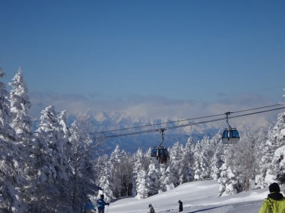
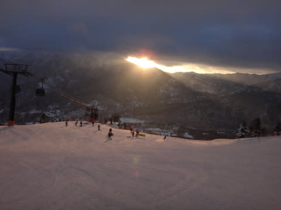
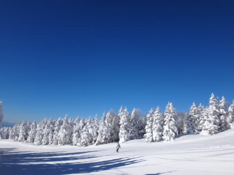
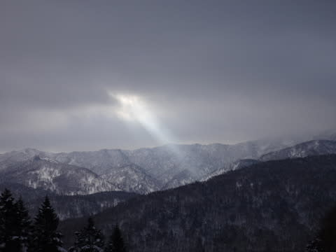

# この正月休みを振り返ると…

📅 投稿日時: 2014-01-10 02:06:21

えー．

この正月休みも．

7泊8日間と言う長きに渡って

志賀高原に滞在したわけですが．

例年より天気が良い日が多くて，良かったですね～！

…だけども．

人は例年より少なかった気がしますね～．

例年の正月休みなら，かなり待ち時間が発生する焼額第1ゴンドラ．

…今年，駅舎の外まで長い列がつくことはほとんど無かったし…

焼額のプリンスホテルも，大晦日や元日にも空室が

あったみたいですし…

うーん．景気は回復しているはずなんですけどね～．

とはいえ．

去年も，毎日見かけた[あの方](e688bd85b36410d46aaf4ffc7117e2c63.md)やら[この方](http://www.skiline.cc/profile/user5f418/info)．

…今年もいらっしゃいましたね～．

＃まぁ，この方々は正月休みに限らず，いつでもお見かけしますが(笑)

しかし．

私は意外と恥ずかしがりやなので，←ここに対して突っ込みをいれないこと

「あ，あの人，毎日いるよ…スキーバカだね～っ！」

って，思われないように，

今年も，ウェアを複数着替えて滑っていたんですけど…←バカなのを，いまさら隠そうとしていたのかっ？？

だというのに．

滞在中に何度か，背後や遠くから，

「あれ…？ブログ書いてる人かな？？」

みたいなささやきを聞いたような気がするので．

「…まずい．こ…これは．

焼額で悪いことはできないな(汗)…」

と，思った，

この正月休みだったのでした…

＃毎回，「そーです」って答えようかな…って思ったけど．

＃もしかしたら，自分以外の人のことを言っているのかも…

＃と考えて，反応できなかった私です

## 💬 コメント一覧

### 💬 コメント by (ZENKO)
**タイトル**: バレます！
**投稿日**: 2014-01-10 16:08:54

Skier_S様なら、焼額で滑っていれば、すぐに正体バレますね！！

1年に1回ぐらいしか、志賀に行かない私ですら、すぐに見つけることが出来るぐらいですから！！（笑）

今年も焼額でお会いしたものですね。

### 💬 コメント by (Skier_S)
**タイトル**: ZENKOさま
**投稿日**: 2014-01-10 23:00:05

いやー．

また今年も焼額でお会いしたいですね！

志賀にやってくる予定はあるのですか？

私はいつもどおり，毎週志賀にいますので，

またお会いしましょう～！

