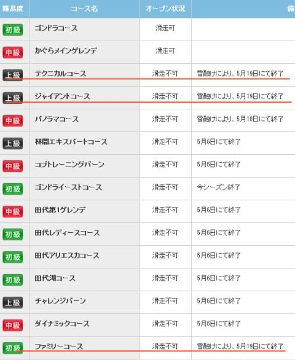
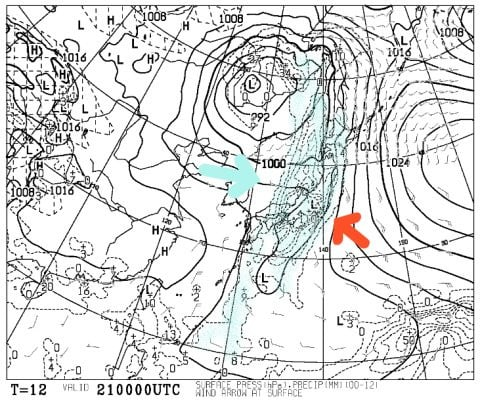
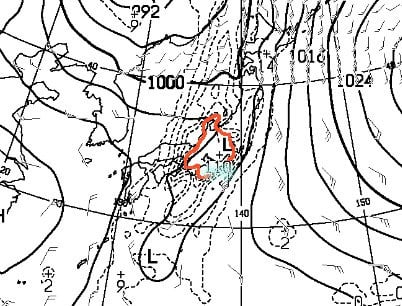
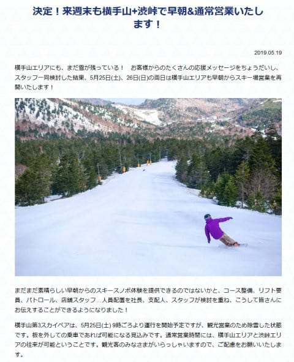

# かぐらスキー場は日曜でテクニカル・ジャイアント，そしてみつまたコース終了（涙）．横手山は今週末第2高速リフトで早朝からの営業決定！

📅 投稿日時: 2019-05-21 02:48:14

ってことで．

この週末までは，

パノラマ・メイン・テクニカル・ジャイアントが

滑れて．

ゴンドラ・みつまたファミリーゲレンデも

下山用に滑れたという．

かなり頑張っていた感のあるかぐらですが．

18日の土曜にパノラマコースが終了してしまい（涙）．

みつまたもそろそろヤバかったし．

いつまでみつまたが滑って降りられる

のかなぁ…

と，思っていたら．

今日，かぐらのウェブページを見たところ…

（[かぐらHPゲレンデ状況ページ](http://www2.princehotels.co.jp/ski/kagura/coursemap/guide.html/)より）

うぎゃぎゃぎゃーーー！！

なんだって～？？？？

19日で．

・テクニカルコース

・ジャイアントコース

・みつまたコース

の3コースがクローズですか…っ！！！（泣）

うううううーーーん．

みつまたコースはダメだろうなぁ…

と思っていたけど．

まさか，ジャイアントもテクニカルも

日曜で終わっちゃうとは！！（激涙）

で．

さらに21日ですが．

すごいです．

たぶん，いろいろヤバい感じです．

こんな地上天気図見たことないってくらい，

激しい雨が降りそうな天気図です（涙）

とりあえず，低気圧に吹き込む寒気（水色矢印）と，

高気圧から噴き出す暖かい空気（赤矢印）が，

日本上空でどっかんどっかんぶつかって．

ありえないほどの雨と強烈な風が

吹き荒れます…（激涙）

なんてったって．

この図を拡大すると…

赤枠で囲われた部分．

12時間で70mm以上の降水量が

予想されてるエリアですが．

こんな広い範囲にわたって，

70mm以上の降水がある天気図って

初めて見た気がするんですが…（驚愕）

水色でマークした，110って数字．

このあたりは，最大110mmの降水量って

ことなので…

21日の火曜は．

朝から昼すぎくらいまで．

すごい量の雨が降りそうです（泣）

おそらく，ゴンドラコースもこの雨で

トドメを刺されるでしょう（泣）

ってことで．

かぐらファイナルの週末は，

滑れるのはメインバーンのみ．

それより下は，ゴンドラで下りて，

リフトかピスラボを滑って下山に

なりますね…

まぁ．

でも．

ファイナルの前の週末まで，

みつまたまで滑れたので．

まぁ，上出来かな～←だから，どうしていつもそんな上から目線？

で．

一方の志賀高原．

なんと．

横手山第2リフト．

この週末営業することに決まったようです！

今週末は，渋峠だけじゃなくて，

横手山第2リフトも動きますよ～！！

（[横手山HP](https://yokoteyama2307.com/news/)より）

…それも，朝6時からの早朝営業もやる

ようですね…！！

雪がいい朝のうちに滑れるなんて…

素晴らしい！！

…ってなことで．

最新情報を書いていたら．

これだけでかなり長い記事になってしまい．

日曜のかぐら詳細レポートを書く

時間が無くなってしまいました（泣）

ってなことで．

すみませんが．

日曜のかぐらスキー場の詳細レポートは，

明日までお待ちください～！

## 💬 コメント一覧

### 💬 コメント by (naoちゃんねる)
**タイトル**: Unknown
**投稿日**: 2019-05-21 14:30:08

雨は関東程では無いと思いますが、こちらも午前中降り続けました…

横手山のHPでは「雪は大丈夫です！」の投稿があり安心しました💨

かぐらも無事だといいですね😫

### 💬 コメント by (Skier_S)
**タイトル**: Unknown
**投稿日**: 2019-05-22 08:07:58

>naoちゃんねるさま

残念ながら、かぐらはかなり雪が減りました(涙)

まあ、それでもまだ例年より多いので、又は高速リフト問題なく滑れそうですが…

頑張れば来週まで滑れそうなくらい雪があるので、今週末で終わりって

ちょっともったいない感じです…

