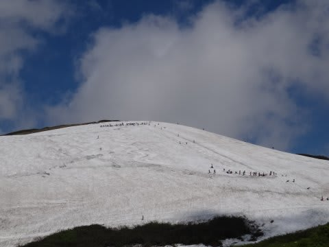
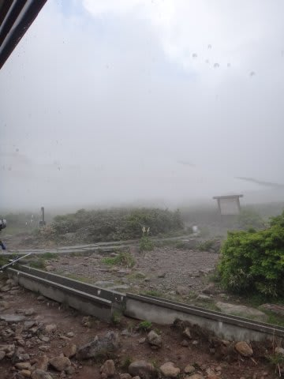
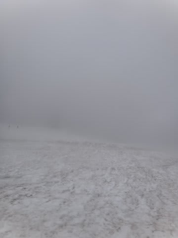
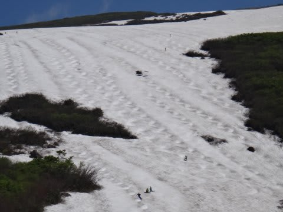
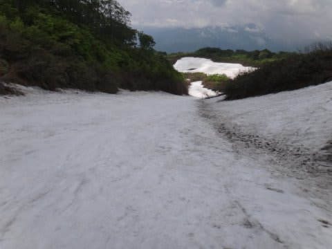
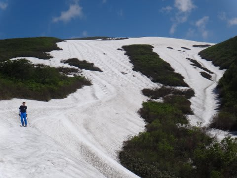

# 6月30日，月山速報

📅 投稿日時: 2013-07-01 01:30:13

🏷️ カテゴリ: [2013スキー滑走日記](c91dbe557f9a69230b1600e48622fdd61.md)

うー．

恐怖のヒトリスト日帰り月山，強行してきました…

朝(というか深夜)2時に出発して．

ひたすら一人で運転．

リフトストップまで滑って，

帰宅は深夜1時近く…

活動時間23時間．

23時間，寝てません．

死にそうですので，今日はあっさり速報モードで…

＃それでも速報を書くところがえらい！←誰も褒めないので，自分で褒めておく

今日は，基本的には晴れでしたが…

昼過ぎに，いきなり30分ほど激しく降ったり．

時折ガスったり…

とめまぐるしい天気．

大斜面はまだ2本ほどラインが生き残ってますし．

沢コースも狭くなったけど，まだ滑れます．

明日から7月というのに．

藪こぎすることなく，まだリフトが滑れるとは…っ！

まだ来週は，リフト滑れるんじゃないかな～．

今シーズンの月山，恵まれてるよっ！

## 💬 コメント一覧

### 💬 コメント by (komu)
**タイトル**: おかえりなさい
**投稿日**: 2013-07-01 23:02:25

まだまだ雪ありますね…

まさか（；゜０゜）ノ

もう一回行こうと考えてますか？

### 💬 コメント by (Skier_S)
**タイトル**: komuさま
**投稿日**: 2013-07-01 23:19:02

そうなんですよ．

まじめに「もう一回，行こうか？」

って思うほど，雪がありましたね～．

でも．

さすがにもう一回はやめておこうかと思ってます…

＃往復交通費が痛い…

