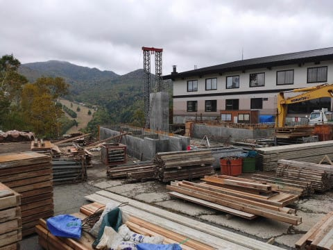
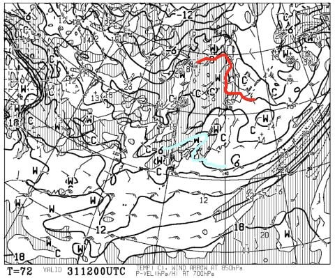

# 今週末Yetiオープン！10月31，11月1日の週末は天気いいよ！…そして，11月3日はスキー場に雪が積もりそう…！

📅 投稿日時: 2020-10-29 03:30:03

えー．

読者の皆様におかれましては．

本来なら，本日は物欲選手権の続きだと

思われたことかと思います．

…でも．

あの記事，書くのに時間がかかるんです…（涙）

今日はちと忙しくて，

あんな気合の入った記事は書けない

ということで，Yetiオープンの今週末の

天気予想を簡単に…

…でも，その前に．

12月19日から営業開始とアナウンスされている，

志賀高原に新しくできるパルスゴンドラ．

（[志賀高原中央エリアホームページ](http://shigakogen.co.jp/archives/6604)より）

10月11日に見に行った時は，まだこの程度

しかできておらず．

12月にオープン間に合うのか？？

と思ってましたが…

本日，志賀高原リゾートのFacebookを

見てみると…

うむ？

なんだか工事が一気に進んでいる！

（以上2枚，[志賀高原リゾート開発株式会社Facebook](https://www.facebook.com/ShigaKogen.Ski/posts/3382584588524387)より）

…しかし．

この2枚目の写真，山頂駅側を見てみると．

なんだか，横にリフト小屋みたいな小さな

小屋が立っているので…

これ，もしかすると，

ゴンドラ駅舎に屋根や壁が無しなの？？

リフトと同じく，乗り場，降り場が野ざらし？？

…でも，スキーを履いて乗り降りするリフトと

ちがって，ゴンドラは乗り場・降り場に

雪があると乗り降り危ないから，

さすがに屋根と壁は付けるよね…

じゃないと，ゴンドラ搬器もずっと

野ざらしになっちゃうし．

…駅舎に屋根と壁をちゃんと作るなら

なんで降り場に係員小屋みたいな

小屋があるんだろう…？

と．

疑問は尽きませんが…

とりあえず，

駅舎での減速機構が不要のパルスゴンドラ．

駅舎設備がシンプルなので，設置も

それほど難しくなさそうだし．

駅舎設備や，支柱がすべてそろって，

一気に工事が進んだ感がありますね…！

…ってなことで本題へ．

イエティ―がついにオープンする，

今週末の天気ですが…

えー．まず，31日土曜日．

地上天気図を見ると…

見事に高気圧に覆われるので．

この日は文句なく晴れ！

絶好の初滑り日和ですね！

気温も水色の+6℃線が近づく

くらいだから…

真冬に比べるとずっと暖かいですが．

でも，このくらいの気温なら，雪が

一気にドロドロに溶けちゃうことは

なさそうかな…

そして，11月1日の日曜日ですが．

この日も日本は高気圧に覆われて，

天気は晴れそう！

気温も前日とそれほど変わらず…

昼間は気温上昇＋日差しで雪はしっとり

しそうだけど．

+10℃超えというわけじゃなく，雪は

そこまで壊滅的に溶けることは

なさそう…

ということで．

まとめると．

10月31日，11月1日の土日とも，

天気はよくて晴れ！

日差しで雪が緩むものの，

そこまで壊滅的に気温は上がらない

という予想ですね…！

絶好の初滑り日和の週末かと．

…でも，私は滑りに行けない…

…そして．

その次11月3日は祭日なわけですが．

この日の850hpa気温図を見ると…

…えええええ！

すごい！赤い0℃線が関東近辺まで

下がってます！

そして，地上天気図を見ると．

天気図は冬型で，日本海側に

降水域の網掛がかかっているので…

これは，11月3日，

長野や新潟のスキー場，雪がそこそこ降って

積もるかも！！！

軽井沢は，天然雪が乗った形で

スタートする可能性が…っ！！！

…3日の直前になったら，また

詳細予想しますが．

3日から4日朝にかけて，山は一気に白くなり，

スキーシーズンに近づきそう…

とりあえず．

私は30，1日は滑りに行けませんが．

Yetiは雨にたたられることのない，

いいオープン週末になりそうです！

## 💬 コメント一覧

### 💬 コメント by (西舘)
**タイトル**: Unknown
**投稿日**: 2020-10-29 05:50:17

それでは11月3日に、念願の、そう首をどこまでも長く、長くして待ち続けた今シーズン初滑りに、出掛けるのですね！

我が家の息子は学生特権を活かして11月中旬に狭山へ出掛ける計画してます。ええなぁ

### 💬 コメント by (Goku)
**タイトル**: パルスゴンドラより・・・
**投稿日**: 2020-10-29 18:29:43

一の瀬ファミリーに設置される、新しい降雪機が気になります。

ファミリーも11月22日にオープンするって凄いですね。

最近の中央エリアは元気がなかっただけに期待しています。

### 💬 コメント by (レインボー73)
**タイトル**: Unknown
**投稿日**: 2020-10-29 19:40:41

物欲選手権、楽しみにしていたのですが。

無理せずに更新してくださいね。

3日前に全山見てきたら、奥志賀リフトと渋峠リフトだけには搬器が取り付けてありました。万座を３泊満喫してきましたが、やっぱり湯田中が落ち着きます。

今朝は凍結で渋峠はアウト。高山村から須坂経由で湯田中に帰ってきました。多分20日くらいから参戦です。今年もよろしくお願いいたします。

### 💬 コメント by (Skier_S)
**タイトル**: 早朝スキーが2ゴンとは…（涙）
**投稿日**: 2020-10-30 01:45:21

＞西舘さま

なんと．この土日の予定がキャンセルになったので．

10月31日にイエティに行けます！

明後日初滑りです！

で，11月中旬なら，志賀の熊の湯・横手がオープンするころじゃないですか？

シーズン券があるなら，狭山より志賀の方がいいかも（笑）．

＞Gokuさま

横手山と同じく，地域振興の補助金で着けたんですかね…

このファミリーの降雪機．

これで11月22日にホントにオープンできればいいですね～…

＞レインボー73さま

あ，もう湯田中入りされたんですね！

お帰りなさい，でしょうか（笑）．

また11月下旬から志賀に通おうと思いますので，

よろしくお願いします！

### 💬 コメント by (同じ車に乗ってるおバカスキーヤー)
**タイトル**: Unknown
**投稿日**: 2020-10-31 10:07:23

イエティに来ました❗

8本滑って休憩です☺️

混んできて、ついにリフト待ち発生です❗

まるで、雪上障害物レースです。

### 💬 コメント by (Skier_S)
**タイトル**: ＞同じ車に乗ってるおバカスキーヤーさま
**投稿日**: 2020-11-01 02:15:06

今日はお疲れ様でした～！

月山に続き，またお会いするとは（笑）．

午後は混みましたよ…

またYetiでお会いしましょう～！

