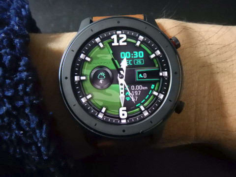
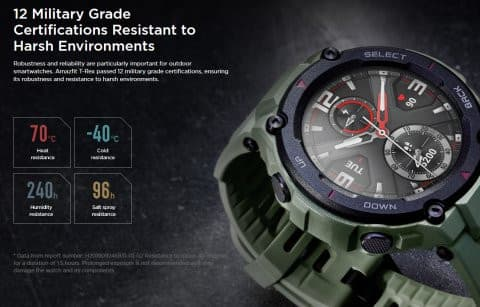

# Amazfit GTRを買ったというのに，スマートウォッチAmazfit PACEが気になるのだが…って，え？？まさか？？

📅 投稿日時: 2020-05-09 05:05:59

🏷️ カテゴリ: [PC,カメラ&小物](c0d8caed13e597efe97b661a8ae56bed0.md)

えー．

本日の志賀高原の渋峠スキー場．

ちょっと気温が上がったようですが，

雲一つない晴天だったようです！

なので，昨日は渋峠だけだったのが，

今日は急遽横手第2スカイが運転になりました！！

…そして，明日の週末は．

横手山第3スカイが営業するようです！！

（[横手山・渋峠スキー場ホームページ](https://yokoteyama2307.com/news/8799/)より）

これで，渋峠から横手山が繋がりますね…

ただ，志賀高原の麓在住の特派員の報告によると，

横手山はあと1週間もつかどうか，微妙な感じの

ようです（残念）

渋峠はもう1週間以上はもちそうな感じ

らしいですが…

とりあえず．

スキー場が開いているというのに，関東在住の私は

滑りに行けず，かなり残念な感じではありますが．

…最近，あんまりいいニュースが無いので，

スキー場が開いているというだけで，

今後に期待ができて，何か救われた気分になる

今日この頃．

あぁ…早く感染症が一区切りついて，私も

滑りに行けますように…（祈）

ってな感じで，

本題へ．

これまで，

その1．[購入レポート，](e07b216ec3b426f7a5a1462a3b6fd1c02.md)

その2．[開封＆試してみた感じ，](edd1205f6bd9cd6dadb50e4fc6316b747.md)

その3．[アクティビティーログ](ecd7317c7980728b41dae1a21fe835803.md)

その4．[スマホアプリのインストール＆設定](eb88e9293dae421d12f27fe8b5b363344.md)

その5．[スマホアプリを使ってみた](e031a6cc94592b655560de20fc58cacf1.md)

番外．[常時点灯機能追加！](ec221351f854b20de445e565d66acdf55.md)

その6．[GPS精度が低いのが欠点](eef49f5206ed798087941af71eebf0dee.md)

その7．[GPS精度，ちょっと改善したかも](e9f927972612f60570f5a704fb48030f8.md)

その8．[スキーモードを使ってみた](e29f3f0e50c4f1facc44bbff6d4859de6.md)

その9．[スマホアプリでログを見る](e759b2c876cb9c8b604ea08e152e39c20.md)

その10．[Auto pauseを切ったらどうだったのか？](e6095de159b336f431785b0cbbad1f6ab.md)

その11．[スキーでしばらく使ってみて](e4de6cfa5a1f3cd4b4d3410691b1d2a05.md)

その12．[GPS精度はそれほど高くないみたい](eeb684c478255cfab52c0b4bc023f3d47.md)

と，報告してきたように，スマートウォッチの

（フィットネストラッカーと言うべきか…？）

Amazfit GTRをスキー用に使ってきて．

GPS精度がちょいと低めという以外，

概ね気に入ってるのですが…

…そうそう，こいつ，半年使ってみてたけど．

さすがセラミックスベゼル＆ゴリラガラスの

タフネス組合せ．

半年間，ほぼ24時間着けっぱなしで，

職場からスキーまで酷使したというのに，

ガラスもベゼルも全く傷ついておらず，

チタンボディ+サファイヤガラスの高級腕時計より

頑丈な感じです…

ホントに半年間酷使して，ガラスにもベゼルにも

傷ひとつついてません！！すごい！！

ちなみに今週末まで，Gearbestだと，

$139.99 - $16クーポンで実質$123.99，

普段より2000円ほど安い，￥13,000くらいで

買えるようなので，お買い得かも…

（なんかステマみたいになってきた…Amazfitから別にお金もらってませんから（笑））

（[Gearbest通販ページ](https://www.gearbest.com/smart-watches/pp_009713994362.html?wid=1349303)より）

そして，最近．

 Amazfit GTR Lite

ってのが出てますね．

（[Gearbest通販ページ](https://www.gearbest.com/smart-watches/pp_009593032851.html?wid=1349303)より）

お値段も普通のGTRよりかなり安めの

$100切り，1万円くらいとお手頃ですが…

これは，肝心なスキーモードが無くなっており，

スキーヤーに使えないモデルです！

詳しく説明すると．

このモデル，ボディはGTRと全く同じだけど，

GTRからGPS機能を省いた簡易版で,

スポーツモードが13モードから8モードに減っており，

GPSが必須なスキーや登山など，

私が欲しいモードが無くなってます…

([Gearbest](https://www.gearbest.com/smart-watches/pp_009593032851.html?wid=1349303)より）

スキーヤーの皆さん，間違ってLiteを

買わないようにご注意を…

さらに，最近，Amazfitの新シリーズとして，

Amazfit T-REXってのが出ましたね．

([Amazfit T-rex商品紹介ページ](https://en.amazfit.com/t-rex.html)より）

これは，G-shockライクな武骨なデザインと

温度・衝撃などの耐環境性に優れているってのが

売りですが…

GPSも内蔵，Amazfit GTRよりちょっと解像度は

落ちるものの，高精細な有機EL画面で．

スキーモードもちゃんとありますし．

なかなか魅力的ではあるものの．

どうやら，気圧計を持っていない様子．

高度計測はGPSのみとなるので，

GPSでの高度が正確ならいいけど，

GPSが無いところでの高度が測れないのは

どうなんだろう…

お値段も，Amazfit GTRとほとんど同じなので．

やっぱり，Amazfit GTRが一番いい感じだよね…

と，概ね満足しているAmazfit GTRではあるものの．

[以前の記事](eeb684c478255cfab52c0b4bc023f3d47.md)に書いたように，

・GPSの精度がちょっと低い

・スキーモードにすると，画面をフリックしないと

　時間が見れないので，グローブをしていると

　時計として使えない

という，ちと残念なところが2点ほどあるのが，惜しい．

…特に，一の瀬ダイヤモンドスキー場は，なぜか

GPS電波が弱いのか，ほぼ全くGPSを電波を拾ってくれず．

ダイヤナイターで標高差が記録できないというのは，

ちょっと私にとっては致命的…

（赤丸が途中でGPS信号が切れて奇跡がちょん切れてるところ）

うーん．

もう少しGPS精度が高くて，安いスマートウォッチがあれば

いいんだけど…

と，思っていたら．

同じAmazfitブランドの，Amazfit PACEという

スマートウォッチ．

こいつのGPS精度がかなり高いという話じゃないですか！

（[Amazfit Pace商品紹介ページ](https://en.amazfit.com/pace.html)より）

こいつは，Amazfit GTRよりかなり前，

2016年に発売されたモデルで，

【いいとこ】

・反射型液晶で，常時表示！

（Amazfit GTRは有機ELで，普段は画面消灯…

腕を持ち上げたり，ボタンを押さないと

こんな感じで画面真っ暗．

でも，腕の動きに対する反応が早いので，

画面消灯はあまり気にならなくなってきたけど）

・使った人のレポートではGPS精度は高いらしく，スキーモードもちゃんとある！

・内蔵メモリが大きく，GPSログをGPXファイルで取り出すことが可能！

　音楽も内蔵メモリに入れて，Bluetooth経由で聴ける！

・心拍計測，スマホとの連携，メッセージ受信などの機能は，

　Amazfit GTRと同等！

って感じで，デザインに関してはGTRがすぐれてるけど，

実はAmazfit PACEの方が機能が優れてそうな感じ…

【ちょっとどうかな？ってとこ】

・電池もちが最大5日と短め（Amazfit GTRは24日という驚異の電池もち）

・フォーマルなところに着けていくにはちょっと微妙なデザイン

・防水・防滴ではあるけど，GTRみたいに50m防水じゃない

・LINEメッセージやメール着信は日本語表示されるが，

　操作メニュー自体は英語のみ…（私は英語表記の方がスマートで好きだけど…）

…ってくらいで．

GPS精度が高くて，

画面常時点灯で，

スキーモードでも時刻が画面に表示されて，

機能はAmazfit GTRと同等かそれ以上…

とくれば．

スキー用はAmazfit PACEの方が良いのでは？？？

でも．

やっぱり，すでに持っているスマートウォッチを

買い足すのはもったいないなぁ…

と，つらつら考えていたわけですが．

ある日．

Amazfit GTRを買った通販サイト，Gear Bestを

覗いていたら…

なぬ？？？

Amazfit PACE，＄79.99？？？

8000円ちょいで買えるってこと？？？

日本のAmazonだと，13000円～15000円

位しちゃうけど．

端的に言って，これだけの機能を持った

スマートウォッチが8000円ちょいってのは，

激安では…？？？

…と．

なぜかこんなところで物欲大魔王っぷりを発揮し，

ついついポチってしまったのでした…

（続く）

## 💬 コメント一覧

### 💬 コメント by (ほっぽ)
**タイトル**: 物欲全開
**投稿日**: 2020-05-09 10:26:31

Ｓさん

時間に余裕があると色々眺めてしまって危険ですね。

この勢いでスキー板も逝ってしまいましょう！(^^;

20-21モデルはコロナの影響で正常に入荷するかわからないようですし

ここは19-20モデルを早いうちにGETしておいた方が安心だと思います。(^^;

私も既に19-20モデルの板をGETしてあります。

### 💬 コメント by (Skier_S)
**タイトル**: ＞ほっぽさま
**投稿日**: 2020-05-10 06:17:53

来シーズンの板，どうしようか悩み中です…

とりあえず，今シーズンは物欲選手権を開催しなかったという

珍しいシーズンだったので，次は買おうかと思っているのですが…

