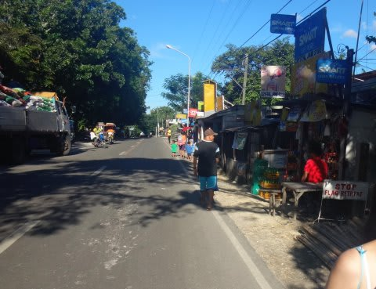
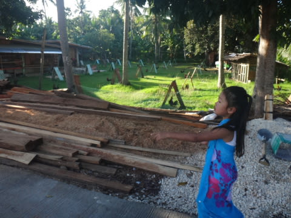

# 2014年8月　オスロブagain…再び，子連れでジンベエザメと泳ぐぞ！　その23

📅 投稿日時: 2014-10-07 00:33:43

Yetiオープンまであと2週間を切ったというのに．

…まだ，夏休みPart1のオスロブ旅行記が書きあがって

ないのですがっ！？

…それに続く，夏休みPart2の石垣子連れダイビング旅行記は，

全く手がついていないのですがっ！？？

それなのに…今週末から，秋休みパラオダイビングという…

…パラオ旅行記の運命や，いかに！？？

＃来年の，スキーシーズンが終了後になりそうな予感がひしひしと…

ということで．

とりあえず，今は必死に，

オスロブ旅行記を続けるのだ…

----

という感じで．

街中観光が続いてますが．

教会観光を終えて．

教会の前にでると，もうメインストリートです．

ふむ．

教会の向かいには，立派な小学校もありますね～

「自分の行っている学校と，かなり違うなぁ…」

とか思ってるんだか何だか．

しばらく学校と，そこで遊ぶ子供たちを

じっと眺めていた娘．

そのあとは．

学校の並びに建っている，ガイドさん

おすすめのパン屋さんに寄ってみました…

パン屋さんを覗くと…

をを！

すごい．

パン一個，5ペソ．12円くらい！！

ありえないくらい，安い！

んで，予想よりおいしいじゃないか…．

娘も気に入った様子．

パン屋さんの後は，素朴な商店をいくつか

ぶらぶらと覗いてみて…

そして，お店でアイスクリームを購入．

アイスクリームを食べながら，お散歩を続けます．

メインストリートを外れて，裏道に入ると…

なんだか，三角屋根の下で飼われているニワトリとか…

ヤギさんとかがいる，かなり素朴な感じの

田舎町ですね～…

お散歩道としては，ちょうどいい感じ．

旅行先で，こういうところをぶらつくの，

大好きです．

そんな田舎町を歩いていると．

スナックというかなんというか…

飲食店的なものがありました．

中に入ってみると…

お，意外ときれい！

で，冷えたビールが売ってるよ！

…ビール1本35ペソと，結構安かったので．

冷え冷えビールを買って，ホテルに持って

帰ろうかと思ったところ．

「持ち帰りはビンのデポジット5ペソかかるよ～」

と言われたので．

ここでゆっくり飲んでいくことに．

お店の中で，みんなで乾杯！

スナックで，ビールを飲んでくつろいで．

お店を出ると…

どうやら，ちょうど学校の下校時間だったらしく．

中学生か高校生くらいの生徒が

いっぱい通っていきます…

うん．

なんだか，治安はすごく良さそうな街だなっ！！

とりあえず，教会とかも見て，

ゆっくりと散歩して，街中の雰囲気も

満喫したし．

ビールも飲んでくつろいだし．

そろそろ，ホテルに戻りましょうか…

と，道端に成っているバナナの木を見つけたりしつつ…

ホテルへ向かう，海に向かう坂道を

降りていきます．

そして，ホテルへ戻ってきました．

いやー．

のどかで，いい感じの街だったな～！！

ルビリゾートに宿泊する人は，ぜひ一度は

街中をお散歩することをお勧めっ！！
