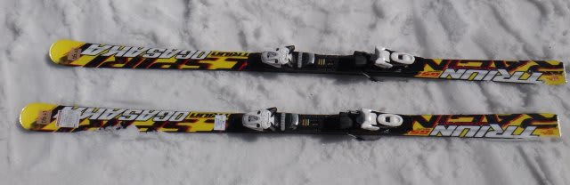
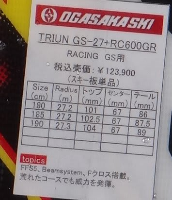
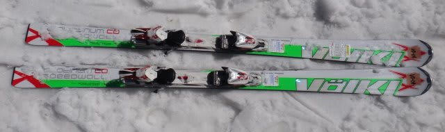
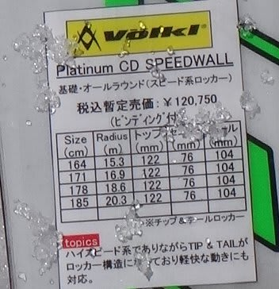

# 2014シーズンモデルのスキー試乗レポートその5…OGASAKA＆VOLKL編

📅 投稿日時: 2013-04-01 00:04:09

えー．

金曜に日帰りスキーに行ってきたわけですが．

その報い(？)というか，なんというか…

土日はスキーに行ってないんですね～

ってことで．

「あり？週末スキー場レポートがないぞ？」

って，思った人もいるかもしれませんが．

今日は残念ながら　スキー試乗インプレッションです．

＃ぜんぜん残念じゃない！スキー場レポートよりこっちのほうがイイ！って人が多かったりして…←一応，このBlogのメインはスキー場レポートですから

今度は，オガサカのGS板とフォルクルのCDです．

では，試乗インプレッションどうぞ～．

---

○OGASAKA TRIUN GS-27 + RC600GRプレート 185cm 

GS競技用．

R＞27の板は，普段のゲレンデ履き大回り用に使えるのか？

…って興味で履いてみました．

…

…

結論：ゲレンデ履きは無理(涙)．

なんとなーく想像はしていたんですが．

というより，当たり前の結果かもしれませんが．

気楽に履ける板ではないですね～．

サイドカーブで曲がってくる板ではありません．

常に板の迎え角を作り，乗り手が迎え角をしっかりコントロール

して曲がっていく板です．

オールマニュアル操作．

ターンのすべての局面で，乗り手が板を操作し続けなくてはならないので，

気を抜ける時間がない…．

これは…楽しくない…

気楽にゲレンデを楽しもうというレジャースキーヤーが履いていい板ではない，

ということがよーく分かりました(涙)．

○VOLKL PLATINUM CD 171cm

基礎オールラウンド．

今シーズンモデルからはコスメチェンジのみ，

中身はまったく変わってないとのことでしたが…

…

…確かに，まったく変わってませんでした．

とりあえず，非常に軽く．軽快な板．

軽いので，板をどうにでも動かせます．

でも，張りの強いフレックスとかなりしっかりしたエッジグリップで，

高速安定性もいい．

センター～テールより荷重でニュートラルを作っていくと，自然に長い谷回りが取れる感じ．

長さは171cmでも，ロングターンベースですね～．

ロング～ミドルが得意です．

でも，ショートもできなくはない感じ．

あと，特筆すべきは振動吸収性．

軽快なのに，春のグサ雪の細かな凸凹なんかで，板がたたかれてラインがずらさることがないので，

そこそこの荒地を滑っても，荒れていることをあまり感じさせずに滑っていけます．

軽いのに安定しているという，不思議な板です．

とりあえず，詳細は[今シーズンの私の板のインプレッション](eec1cf9a5dc6ca80d2cc00927ae82b791.md)を参考にしてください…

…でも，デザインは今シーズンモデルのほうがいい気がするんだけど…

気のせいかな…
