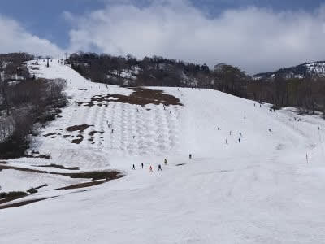
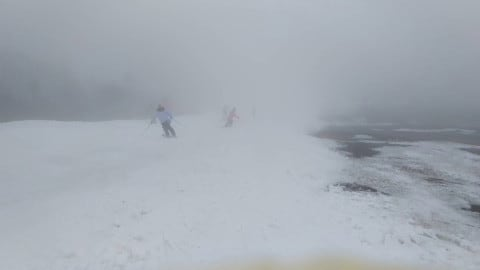

# 2021/5/22(土)の志賀高原渋峠と，かぐらスキー場の特派員レポート！…志賀は晴れ，かぐらはガスのち雨

📅 投稿日時: 2021-05-23 00:13:58

ということで．

本日は私は家で過ごしていたわけですが．

今日の22日土曜日も，かぐらと渋峠から

優秀な特派員のレポートが届きました～！

まずは，かぐらから…

朝のうちは日差しもあったようですが．

基本的に曇り空．

…って，なんだこりゃ～っ！！！！

メインバーンの雪が，一気に減ってるん

ですが…！！（涙）

先週と全然違う…

（先週の写真）

わずか一週間でここまで雪が消えるとは…（泣）

和田小屋からクワッド乗り場までも

かなり雪が減り，最後は結構土が

出てきていたという話も…

で．午後2時半ごろからは雨だったようで．

さらにこのころには，メインバーンの

クワッドリフトをくぐるあたりより下，

幅も狭くなり人も多く，かなり雪が削れて，

昼ごろには人と石を避けてなんとか

下りていく…

って感じだったようです(泣）

ただ，先週と違ってリフト待ちはほとんど

無かったのが救いだったようですが…

うーん．

明日，かぐらに行くつもりなんだけど…

楽しめるかどうか微妙な感じ…

で．

一方の志賀高原は渋峠．

今朝のレポートに書いたように．

早朝の営業開始直後から晴れたみたいで．

早朝の時はウエイバーコースは開いて

なかったようですが…

午前10時ごろ，無事コースもつながり．

ゲミュートコースだけじゃなく，

ウエイバーコースも滑れるように

なったようです！

いろんなところから雪出ししたり．

雪を運んだりしたみたいですね…

そんなこんなでなんとかつないだ

ウエイバーコースですが．

おそらく明日の日曜で今シーズン最後に

なるんじゃないかな…という話．

まぁ，ゲミュートコースは一部

細くなってるところはあるモノの…

こちらはもう少しもちそうですよ！

こちらも，今日の土曜日はリフト待ちは

ほとんどなかったようです…

ゲレンデも，かぐらよりすいてるように

見えますね…

うーむ．

明日は，早朝営業をやる渋峠の方が

コンディションが良いかも…

とりあえず．

明日はかぐらファイナル．

…そして．

渋峠も，来週までもつかどうか？？

もしかすると．

どちらのスキー場も，今週末がラストの

週末になる可能性が高いかも（涙）

…いや．でも．

確か，明日までに1mほどパウダーが積もって

くれるはずだから，渋峠はもう少しもつかも？←そんなわけはない
