# 4月18(火)の志賀高原スキー場は，朝はトップシーズン並み！！でも19日(水)は高温の貼りつき雪…そして週末は曇り⇒晴れで，土日ともそこそこの冷え込み！

📅 投稿日時: 2023-04-20 02:43:38

えー．

昨日はBlogが更新されなかったので．

「またSkier_Sは床で寝てるんだろうなぁ…」

と思った方が多いと思いますが．

はい．

床で寝てました…

というか，

ほぼ気を失っていた

というのが正解の寝かたでした．

ダメだ，もう意識を保っていられない…

と朦朧となったところまで覚えているのですが．

気づいたら床で寝ていて，朝になって

ました…(泣)

朝起きてから，今日締切の仕事が終わってないのに

気を失っていたという事実に愕然として，

始業時間までに宿題をやっつけていたので，

とてもBlog更新どころではなかったという…

あぁ…安息の時間が欲しい…

ってか．

床で電気も点けたまま気を失うなら．

どうせならゆっくり布団に入って同じ時間寝たかった

という，激しい後悔が…

とりあえず．

今日も夜遅い時間ですが，気を失ってないので

更新！！←なにか基準がおかしい

で．

昨日…というか，もう一昨日となった18日火曜と，

昨日19日水曜の特派員情報です！！

まずは，18日の火曜ですが．

この日は前日に雪が積もったおかげで…

なんと，サンバレーまで真っ白になってます！

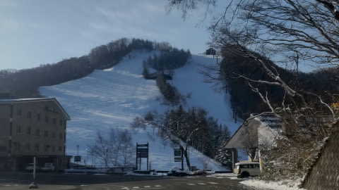

そして，前日の雪降りの天気とうってかわって，

見事な晴天で…

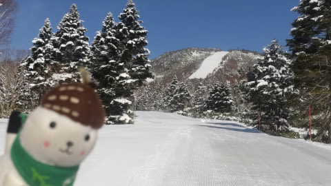

あさイチは最高のシマシマっ！！！！

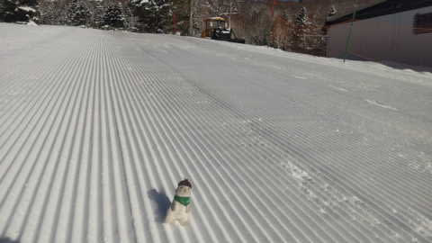

早朝はかなり冷え込んだみたいで，

ゴンドラ営業開始時もまだマイナスキープ

だったので…

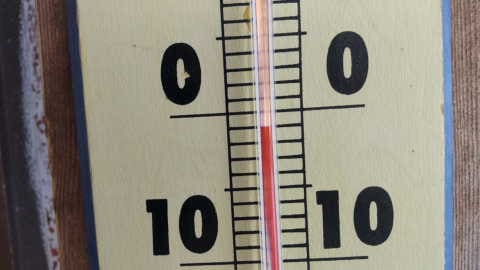

朝のゲレンデは，トップシーズン並みの

いい雪だったようです！！！

…うらやましい…

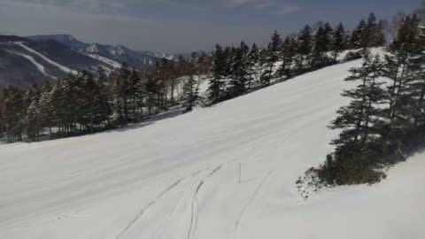

いや…完全にトップシーズンみたいに

見えますよ！

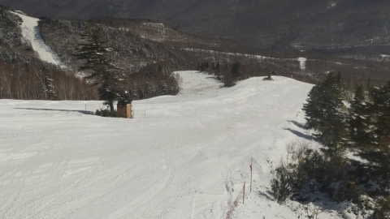

ただ，日差しがあり，気温もプラスになったので，

雪が緩んで滑りが悪くなり始めたようですが…

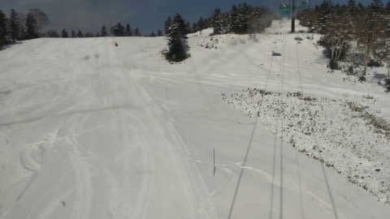

写真には無いですが，このあとの9時過ぎには

曇りはじめ，板の滑りも良くなり，

10時過ぎには雪が降り始めたようです…

とりあえずこの日は全体的に気温が低めで，

結構いい一日だったようです！！

明けて19日の水曜日．

前日とはうってかわって…

朝から+10℃！？？（涙）

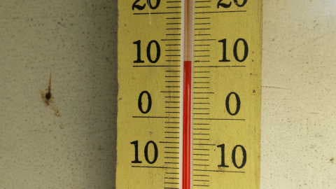

だもんで，朝から雪はユルユルというか，

ザブザブで…

おこみんも不機嫌そうに転がってます

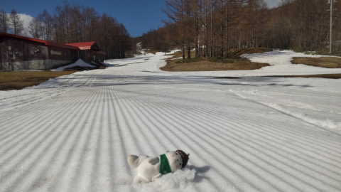

そして，あさイチから妖怪板掴みが

大量に発生する，激烈に滑りが悪い雪で，

来たのを公開するレベルだったみたいです…(涙)

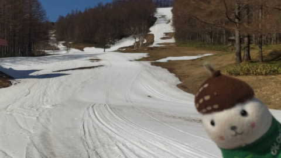

でも，

月・火にちょっと雪が積もったせいか．

一見，高天ヶ原の土のエリアが減っている

ように見えますね…

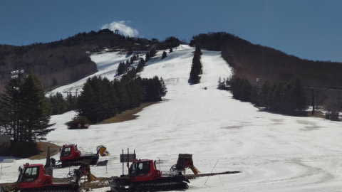

ってなことで．

火曜は冷え冷えのいい感じ，水曜は激烈高温

だったようですが…

木曜20日は，もっと高温になります．

ありえないほど高温になります（涙)

[前回の記事](ed20c08cb14693d52abf333c986b1e9c2.md)で，

　20日の850hpa図は，水色の+15℃線が志賀高原に

　かかるという，

　「真夏か！？？？」

　という激烈高温になります（強烈涙）

と予告した通り，真夏並みの気温です(泣)

そして，晴れそうなので…高温＆強烈な日差しで，

雪がかなりやられそう（涙）

そして，21日の金曜も…

気温はかなり高め．ただ，天気は曇りそうかな…

もしかすると一瞬雨がぱらつく可能性も？？

で，肝心の週末は…

21日の土曜は…850hpaの赤い0℃線が，

ちょうど志賀高原にかかりそうなので，

降っても雪の，この時期としてはそこそこの

冷え込み！！

…ただ，この日は降らずに晴れてくれそう！！

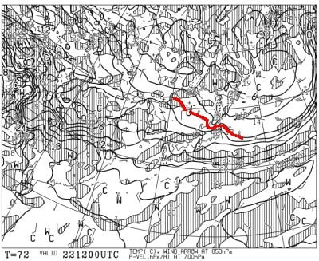

で，22日の日曜も…850hpaの赤い0℃線は，

わずかに志賀高原より南に下がってくれて

いて…

この日もそこそこ冷えそう！！

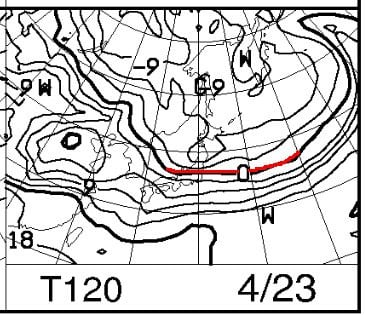

20日(木)：朝から+10℃越え．昼間は

　15℃を越えて…

　20℃近くまで行くかも？？

　そのうえ晴れて日差しが降り注ぎ…

　雪はドロドロに溶け，板は全く滑らない

　レベル．

　天気は良いので，Tシャツで滑れる

　夏スキーだと思って行くべし

21日(金)：朝は+5℃くらい？

　でも，昼間はそんなに気温が上がらず，

　夕方は0℃近くまで冷えていく．

　雪は朝から緩め．日も射すので滑りは

　悪め．

22日(土)：朝は-2~3℃，時折雲が多いかも

　しれないけど，終日晴れそう…

　雪が融けるから晴れなくていいんだけど．

　早朝はバーンは硬めのシマシマ！！

　昼間はプラス5℃くらいまで気温が

　上がりそうなので，焼額は朝のうちに

　雪は緩み始める．

　でも，昼くらいまではザブザブに

　ならずにもってくれるかな？

　午後はちょっと荒れて滑りが悪く

　なるか…

23日(日)：朝は-3℃くらい？

　早朝は硬めの締まったバーン！

　朝10時ごろまで締まり気味のいい

　バーンコンディションかも…

　天気は晴れ~曇り．

　曇ってくれれば，昼近くまで

　そこまでひどく雪は緩まなさそう．

　一の瀬は結構長い時間硬めのバーンを

　キープするかな？

　午後は日が射すとわずかに滑りが

　悪くなるかもだけど，

　気温も終日低めなので，そこまでひどく

　バーンは荒れない感じ．

…ってな感じでしょうか…

20日の高温に耐えて雪がもってくれれば，

意外とこの週末はそこまで悪くなさそう…！！

で．

その後…

水色矢印で示したように，週末22日から

来週の26日までは，冷えそうな予想です…！！

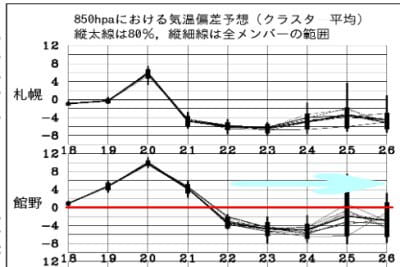

いや…

必至に3月ごろに踊り続けた冷え冷え踊りが，

今になって効いてきたか！？？

これは…

上手くいけば，

29，30日のGW前半くらいまでは

志賀高原も雪がもってくれるかも！？？？

26日以降も数日冷え込みが続きそうなので，

ここは大期待…！

とりあえず．

GWに滑りに行ける可能性が出てきたので．

滑りに行きたい人は，必死に冷え冷え踊りを

踊り続けましょう…！！
