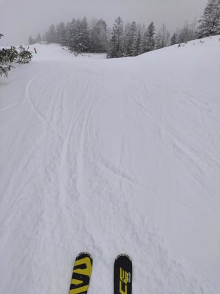
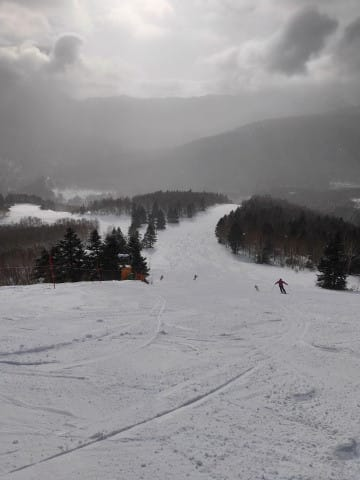
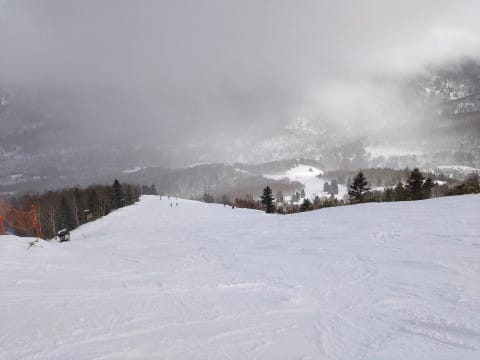

# 2020/1/13(月・祝)，3連休最終日の志賀高原スキー場，速報レポート！…相変わらず積雪ほぼ無しだけど，冷え冷えで雪はGood！午後はガラガラ快適バーン！

📅 投稿日時: 2020-01-14 01:40:36

ということで．

本日，3連休を終えて志賀高原から

帰ってきましたが．

相変わらず，帰宅後の片づけやら

何やらをやっていると，もう深夜

1時…（涙）

なので．

帰宅した日のいつものパターンで，

今日の志賀高原，速報モードです！

えー．

まず，朝は曇り空で始まった本日．

昨晩からの積雪は1cmもない，

ごく微小レベル（涙）

…だけど．

朝の気温は-7℃程度と冷えて，

雪質は中日の12日よりGood！

ただ．

GSコースの一部は，朝のうちは

コロコロ成分多め（泣）

うーん．

あさイチの快適度はちょい低めです…

さらに，さすがの3連休，

午前中は，ゲレンデの人口密度も

ちょい高め（涙）

とはいえ．

第1ゴンドラ待ちは，午前中の

ピーク時でも，せいぜいゲートから

ちょっと外にあふれる程度．

そして，気温は低く，

ところどころ，硬めの下地が

出ているところもあったものの．

昼になっても雪質は冷え冷えGood ！

さらに．

3連休最終日，みんな速く帰るからか．

午後になると，ゲレンデはガラガラに！

昨日から積雪が無かったのに，

人も少なかったため，

コース整備で埋めたブッシュエリアが

ひどく掘り返されることもなく．

浮石エリアは数か所あったものの，

昨日よりはマシでした…！！

積雪が無かったので，

今日はコース上，ブッシュエリアが

かなり広がるだろうなぁ…と思って

いたのに．

ブッシュエリアが昨日より減っていたのは，

嬉しい誤算！

天気は，午前中は曇ったり…

雪がぱらついたりでしたが．

午後になると，徐々に明るなってきて．

午後3時以降は，いい感じに晴れ上がって

来てました～！

ラストは，いい感じに晴れ上がった

太陽のもと，ガラガラの誰もいない

ゲレンデを，リフト営業終了まで

滑りまくってきたのでした…

うーむ．

やっぱりもう少し積雪が欲しいけど．

3連休最終日．

人が少なかったのもあり，

3連休中日よりコンディション良かったなぁ…

取りあえず．

詳細レポートは，また明日！

## 💬 コメント一覧

### 💬 コメント by (西舘)
**タイトル**: Unknown
**投稿日**: 2020-01-14 07:08:43

S様(で、よろしいでしょうか？)、凄い体力ですね、今日も仕事ですよね？。

私は、余りの状況の悪さに早々帰途についてしまいました。

名古屋からの参戦で、公共交通機関利用ですが、乗り継ぎが悪過ぎて片道6～7時間掛かるのもあって。

S様の御家族も毎回同じ行動ですか？

若かりし頃、一人ど滑った時には何回か経験してますが、既にフル充電できないバッテリー搭載の身体なので、ゴンドラ＆リフト(のみ)が休憩時間というのは私には無理。(同行者は若いけど無理なんでないかな？)

今週末も志賀高原入りしますよね？、天気予報お願いします！

私、雪女(というか、天気と仲良しで志賀高原入りする少し前に降雪して当日は曇り)の筈が今シーズンは流石に今ひとつで、そのため天気予報を探していてS様を知りました。その意味では良かったのかも。勿論今週末も行きますよ！

志賀高原愛もあるつもりで10月3週目に紅葉を見るため、と言いながら、キノコ食べに行ったんですよ、ニアミスしてましたね。

そして夏は駆け出しダイバーです。

夏記事合わせてこれから読みますね。

### 💬 コメント by (Northfox)
**タイトル**: 満喫しました
**投稿日**: 2020-01-14 07:39:37

13日は連休最終日にしてゲレンデコンディション良かったですね。

滑るのが楽しくてまず一の瀬ファミリー、焼額、奥志賀をひたすら滑り続けました。

この3連休、ゆみりんさん御夫妻に偶然にも遭遇出来たりと思わぬこともあって楽しかったです。

次行く時を楽しみにしています。

### 💬 コメント by (かず)
**タイトル**: Unknown
**投稿日**: 2020-01-14 10:42:02

雪降らないてすね…自分は毎年恒例の3連休仕事して木曜から状況次第で月曜までの予定です！明日も雪あまり期待できなさそう…Sさん夕食宿だと思いますが  どこか志賀で車で行けて安めなとこ知ってますか？

### 💬 コメント by (ももも)
**タイトル**: Unknown
**投稿日**: 2020-01-14 17:55:15

昨日はありがとうございました。本日の一の瀬は、終日素晴らしいお天気でした。朝は晴れ、夕方から雪が降り始めましたよ！

Ｓ様のコメント欄からで申し訳ありませんが、Kon Suke様に質問です。本日、私と娘は金のお札を頂ける滑りでしたか??

娘のスマホは調子が良くないので主人とのリフト差を数えて本数はこなしたと思います。疲れました…

### 💬 コメント by (ももた)
**タイトル**: Unknown
**投稿日**: 2020-01-14 18:03:18

はじめまして。もももの夫のももたです。

ブログをいつも家族全員で楽しく拝見させていただいています。書き込みは初めてですが、昨年は家族全員で集合写真を撮らせてもらったり、今年もご挨拶させてもらったりしています。

S様に触発され、本日、家族3人で20000mにチャレンジしました。

たまたまKon Suke様立ち会いの元、無事に達成することができ、金のお札をいだだきました。これで、皆さんのお仲間入りができたと思うと喜ばしい限りです。

途中、滑りにきたのかリフトに乗りにきたのか自問自答する中、お昼も食べずに頑張りました。自分は最初で最後と思っていますが、こんな滑りを毎回普通にされているのかと思うと信じられません。

Kon Suke様、お札ありがとうございます。私も布教活動にいそしみたいと思います。

### 💬 コメント by (しんちゃん)
**タイトル**: お世話になりました
**投稿日**: 2020-01-14 23:28:12

連休中、大変お世話になりました。

Ｓさんから新しい滑走技術解説が聞けて、勉強になりました。

また、連休中スキー板の試乗インプレッションを生で聞けて、自分の感覚との照らし合わせができ、大変有意義でした。

今後ともいろいろ教えてくださいね～。

### 💬 コメント by (Skier_S)
**タイトル**: 15日夕方の雪は積もってほしい…
**投稿日**: 2020-01-15 03:53:51

＞西舘さま

うちの家族は，さすがに毎週は一緒に滑りません(笑)．

家族が着いてくるのは2-3回に1回ですし，家族は普通に昼ごはんを食べます…

今週末の天気予想は，明日の深夜の記事をお待ちください～！

毎週水曜深夜の記事が，週末の予想になります．

で，すごい志賀高原愛にあふれているのですね(笑)．

今週も志賀高原にいらっしゃるのなら，ぜひ，

焼額にお越しください．

おそらく，私を発見できるかと…

…そして，ダイビングもされるんですね．

夏は読者が一気に減るこのBlogですが，夏もご愛読のほど…

＞Northfoxさま

13日は良かったですね～！！

…しかし，どうしてYumiさんを発見できたのでしょうか？？

ちょっと不思議です(笑)．

とりあえず，志賀高原はいろんな面白い人がいるので，

また滑りに来てください．

…今度は焼額1ゴン恒例の朝礼に参加してみるのもありですよ(笑)．

＞もももさま＆ももたさま

えええええええええええええ！！！！！

3人で20000m達成ですか！？？

娘さんも含めて，3人ともゴールドですかっ！？？

まさか本当にやっちゃうとは…

これで，終わった人の仲間入りですね…

いや．驚きました．

びっくりです．

それも，KonSukeさんから直にゴールドステッカーを受け取られるとは…

とりあえず，20000m達成おめでとうございます！！

また今度お会いした時，いろいろ体験談を教えてください．

今度はいつ志賀にいらっしゃる予定ですか？

＞しんちゃんさま

こちらこそ，お世話になりました～！！

…って，あんまり滑走技術解説をした思い出が無いのですが…．

私が解説したのは，大勝軒ではつけ麺を頼むのが基本というところだったかと(笑)．

### 💬 コメント by (KonSoke)
**タイトル**: 20000メートル　達成　祝
**投稿日**: 2020-01-15 13:05:43

ももたさま

２００００メートル達成おめでとうございます。

ほとんど直滑降で危なくて見ていられませんでしたが、とにかく早かった。

maeさんがかなわないと言っていましたよ。

今までの達成者の中で断トツの怖いもの知らずです。

皆さん真似だけはやめましょう。

もももさま

ナイターのペアリフトで、第３クワッドで、ももたさんに抜かれた数の３倍の本数を乗っていれば達成していると思いますが、記録上は?

達成していましたらもちろんゴールドホルダーです。

娘さんは最年少記録更新ですよ。

今度、一ノ瀬に来た時声を掛けてください。

Ｓさま

場所をお借りしました。

### 💬 コメント by (mae)
**タイトル**: 20000メートル倶楽部
**投稿日**: 2020-01-15 19:21:45

ももた様

20000メートルGoldメンバ加入、おめでとうございます!!

後をついて行こうにも、あのスピードには私も恐怖を感じました。上には上がいるなと....

20000メートル倶楽部の布教活動も宜しくお願いします。

次回はお知り合いもお誘いいただき志賀高原に毎週足を運んで下さい。

志賀高原を盛り上げていただき、昔の志賀高原の活気を取り戻していきましょう!!

S様、お借りしました(^^;

### 💬 コメント by (Skier_S)
**タイトル**: コメントスペースは，ご自由に会話にお使いください（笑）
**投稿日**: 2020-01-16 07:10:14

＞KonSukeさま

KonSukeさんが怖いもの知らずというからには，かなりすごかったのかと…

### 💬 コメント by (ももた)
**タイトル**: Unknown
**投稿日**: 2020-01-16 21:22:20

KonSuke様、mae様、コメントありがとうございます。あの日の滑りは後にも先にもあの日だけですよ。スキーは楽しく滑るものですよね。次に行った時は、普通の一般人スキーヤーとして楽しみます。リフト上での授与式、ありがとうございました。

S様、さらに場所をお借りし、ありがとうございました。

### 💬 コメント by (Skier_S)
**タイトル**: ＞ももたさま
**投稿日**: 2020-01-17 02:40:04

いえいえ～．

このコメントスペース，皆さんのコミュニケーションに

ご自由にお使いください～！

20000mおめでとうございます！

