# 2月23，24日の週末の志賀高原スキー場の天気は…土曜は曇り空，日曜は晴れそうながら，土日とも見事なアイスバーンになりそう（涙）

📅 投稿日時: 2019-02-21 07:47:54

ダメだ…

昨日も帰宅後倒れたように寝てしまったので．

朝の出社前に急いで更新…

とりあえず．

昨日水曜日，夜から雪になったようで．

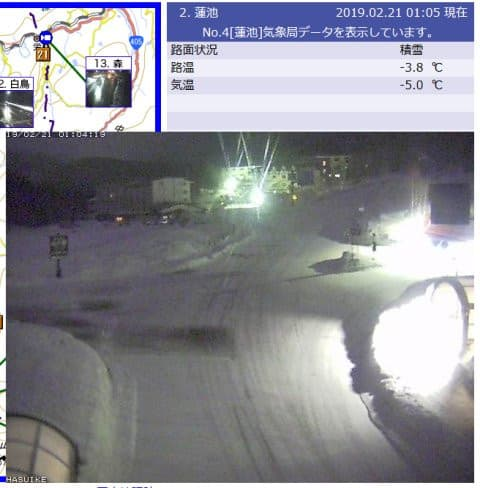

…これは，雪が積もってゲレンデ状況が改善するか？

と思ったけど．

今朝の状況を見ると．

ほとんど雪が積もっておらず，

氷の上にうっすら雪

という状況のようですね（激涙）

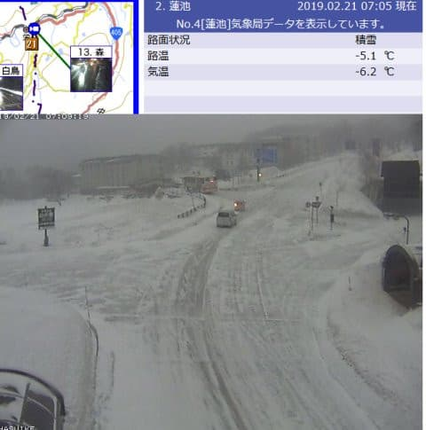

どうやら，本日のゲレンデ状況は．

ガチガチアイスバーン

をお楽しみいただけそうです（涙）

あぁ…

やっぱり，いい雪で楽しめたのは先週が

ラストだったのか…（悲）．

このあと．

22日金曜の天気図を見ても．

すっかり高気圧に覆われて，

雪が降りそうにないので．

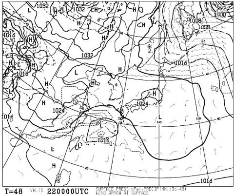

…木曜，金曜と．

エキサイティングがアイスバーンが

「アイスバーンはもういいよ…」

ってほど，おなか一杯楽しめそうです(泣）

木，金と気温は平年より上がるものの．

0℃線は志賀より南で．

昼間もギリギリ氷点下をキープしそうな感じなので．

…アイスバーンは緩みそうもありません（涙）

ただ，低気圧が接近してきて．

雨になるかも？？

と危惧されていた，22日金曜の夜は．

冷え冷え踊りの効果で，

0℃線は志賀高原より南の予想に変わりました！

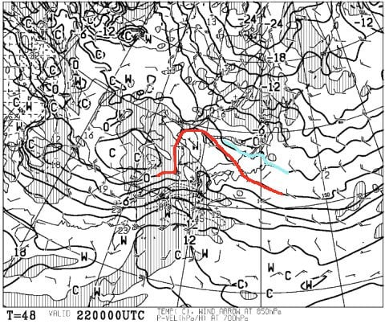

これで，22日金曜夜の雨の危険は

無くなったわけですが…

…その代り，低気圧がかなり南にずれたので，

志賀高原に降水量が無く．

雪も降らなさそう…

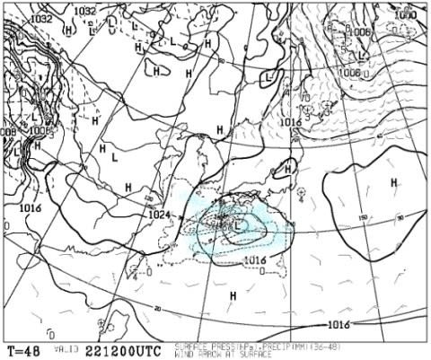

これは，雨も降らないけど．

雪も降ってくれないので，

アイスバーンが隠れてくれないということですね（涙）

そして．

肝心な週末．

23日土曜の850hpa図を見てみると．

うむ．

この日は水色の-9℃線が志賀に近づく

程なので．

かなり冷えそうですね．

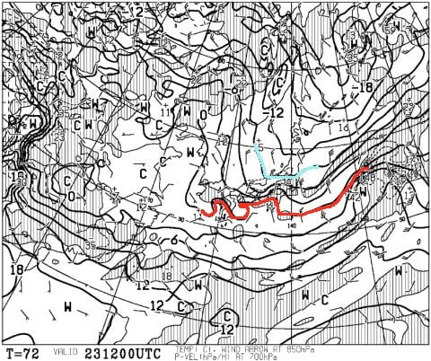

で．

地上天気図を見ると…

22日金曜の夜9時から，23日土曜の夜9時までの

降水予想の水色領域が，志賀に全く

かかってないので．

…志賀高原，土曜も雪が積もらなさそうです．

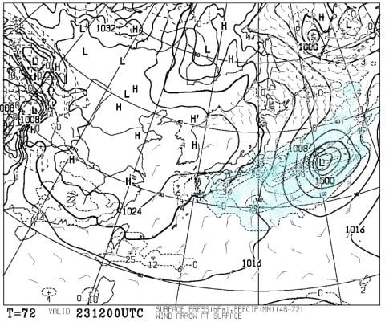

やっぱり，この日もアイスバーンが

雪で隠れてくれないので．

土曜は朝から終日，

ガチガチアイスバーン確定です（激烈な涙）

…ただ，この予想よりもわずかにでも低気圧が

北にずれてくれれば．

降水域が志賀にかかりそうなので．

…まだ，分からない．

まだ，希望はある！！

で．

日曜の850hpa図を見ると…

西から0℃線が志賀に近づいているけど．

この日も終日，ほぼ氷点下をキープしそうで．

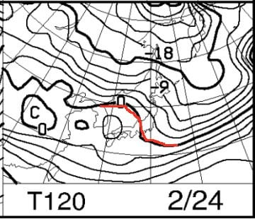

そして，地上天気図は…

すっかり高気圧に覆われ，

晴れますね．

ええ．

にくいほど晴れそうですね（涙）

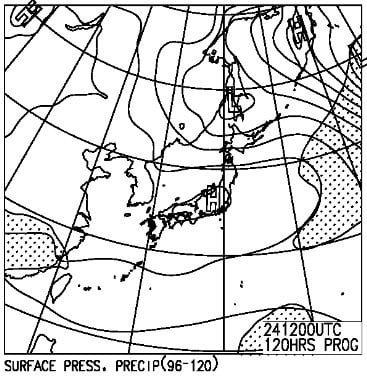

普通なら晴れれば嬉しいんですが…

この日も全く雪が積もってくれそうにないので．

アイスバーン確定です（泣）．

ただ，日が当たる斜面は，わずかにアイスバーンが

緩んで，昼間はちょっとはマシかも…

ってなことで．

まとめると．

23日土曜：朝は小雪がぱらついてるかも…

　でも，昨日からの積雪はほとんど0．

　あったとしても数mmレベル（涙）．

　朝の気温は-5℃を下回る程度の冷え．

　ゲレンデは朝からガチガチアイスバーン．

　道路も登り坂はツルツル氷だと

　思うので，運転に注意！！

　昼間も気温はそれほど上がらず，

　むしろ下がっていき，昼間も-5℃程度をキープ．

　天気は終日曇り．

　もしかすると，午後遅くは日も射すかも…

　ゲレンデは終日ガチガチの，見事な

　アイスバーン．

　午後は，多くの人に削られるバーンは

　見事ツルツルになっていくでしょう…（悲）

24日日曜：朝から晴れ．

　朝の気温は-7～8℃くらいか？

　放射冷却が入ればもっと冷えそう．

　全く雪が降らないうえ，ガッツリ冷えるので．

　この日も全山アイスバーン祭り絶賛開催状態（激泣）

　昼間は0℃近くまで気温は上がりそう．

　日が当たる東斜面は，昼近くにはわずかに

　アイスバーン表面は緩んでくれるか…

　…でも，ほとんどの斜面はガチガチツルツル

　アイスバーンを終日キープ．

　晴天の元，見事なアイスバーンを

　終日楽しめる一日となるでしょう（泣）

という感じで．

ガチガチアイスバーンが大好きという

一部特殊な嗜好を持っている方以外．

楽しめなさそうなバーン状況です．

…せっかく晴れそうなのに…（涙）

とりあえず，冷え冷え踊りは激烈に効いたようで．

22日から23日は，当初予想よりガッツリ冷えて，

液体が降ってくる危険は全く全然すっかり無くなったけど．

冷えたおかげで，19～20日の雨がしっかり固まって

アイスバーンになるという，この皮肉．

あぁ…

冷え冷え踊りではなく．

冷え冷え降れ降れ踊り

を踊っておけばよかった…←なんだ，その踊りは

ただ．

まだわからない．

まだ，土曜の低気圧がわずかに北にずれると，

雪になる可能性も残っているので…

これからでも遅くない．

冷え冷え降れ降れ踊りを踊り，

アイスバーンが隠れてくれるように

祈るのだ！！！

…さらに．

悲劇はこれだけで終わらない．

週明けの26日，火曜の天気図は…

うむ？？？

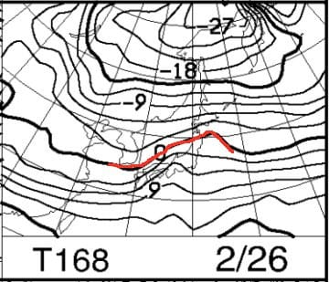

なぬ？？？

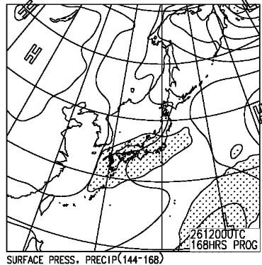

…このままだと．

これから，全く雪が降らないのに．

次の火曜に．また液体が降ってきそうです（涙）

なぜ．

なぜ，雪がほとんど降ってくれないのに．

液体ばっかり降ってくるのか…

## 💬 コメント一覧

### 💬 コメント by (タカ)
**タイトル**: Unknown
**投稿日**: 2019-02-21 10:39:56

冷え冷え降れ降れ踊りは3シーズン前にも踊った気がしますね。あの時の雪や気温は・・・う❗頭が痛い❗

### 💬 コメント by (はっち)
**タイトル**: Unknown
**投稿日**: 2019-02-21 20:30:46

間違ってもアイスバーンに喧嘩を売らないようにしませう。。。

### 💬 コメント by (若杉勲71)
**タイトル**: Unknown
**投稿日**: 2019-02-21 21:45:44

志賀高原情報

本木曜日はバーンは硬めだけどゲレンデはまずまず。だけどガスが。でも結構楽しめました

もう贅沢を言っておれるような時期ではないんですね。

こんな日でも某H多名人は、オリンピックポールポジションを今日も当たり前のごとくゲット。奥志賀良かったよ、一ノ瀬良かったよって、一人躍動しておられました。

私はまだ63日のみ。今年も90日台になりそうです。

あすは野沢で遊んできます。

### 💬 コメント by (Skier_S)
**タイトル**: アイスバーンは好きじゃない
**投稿日**: 2019-02-22 03:06:10

＞タカさま

3シーズン前…

それは恐ろしい記憶ですね（涙）．

とりあえず，そうならないように歌って踊るしかありません！！

＞はっちさま

アイスバーンと喧嘩して，ケガしないように注意します…

治療の具合はいかがでしょうか？

予定通り，ゲレンデに復活できそうでしょうか…？

>若杉さま

あら？

硬いけど，意外と良かったんですね…

ガチガチツルツルアイスバーンではなかったのでしょうか．

だとすると，週末もツルツルアイスバーンでないのかな…？？？

H夫妻は，今日もオリンピック一番乗りを成し遂げたのですね(笑)．

しかし，奥志賀良かったよって…

全面アイスバーンではなく，結構楽しめたのでしょうか？

