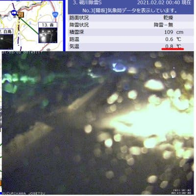

# なぬ！？緊急事態宣言延長？（涙）…まぁ想定の範囲内ではあったけど（泣）．こんな中だから，ちょっとスキー業界に経済貢献してみるか…

📅 投稿日時: 2021-02-02 02:17:06

えー．

空から液体が降る危機

を予告していた今晩．

只今の志賀高原の道路気象状況カメラを見ると…

うーむ．

蓮池は…気温がプラス3.4℃と高いけど…

降ってるのかな？

（[北信建設事務所道路気象状況より](http://hokushin.pref-nagano-roadcamera.jp/)）

と，硯川のカメラを見ると…

…

…硯川でも気温がプラスで．

さらに，カメラに水滴が…！？？

3号トンネルも…

気温が+1.9℃だし．

このカメラの水滴の着き方をみると…

…みなさん．

大変残念なお知らせです．

志賀高原，現在空から液体が落ちてきています

ええ．

大変残念なことに．

空から落ちて生きているのは，

個体ではなく，液体のようです…（泣）

（追記）3:30に蓮池のライブカメラを確認したところ…

雪になったようです！！

…が．

しばらくの間は間違いなく雨だったので，

果たしてゲレンデの雪がどうなっていることやら…

ってな感じで．

…悪いニュースは続くもので．

このほかにも，皆さんご存知のように．

今日のニュースでは…

緊急事態宣言の1か月延長

が，高らかに宣言されてしまいました（激泣）

あぁ…3月までの延長って…

宣言が解除される頃には，トップシーズンが

終わってるんですが！？？？

…あぁ…トップシーズンが終わっていく…（止まらぬ涙）

なにか…

どこかに，いいニュースは無いのか…？？？

…あれ？？

なんだ，これはっ！？？

こ，これは…

スキーパンツ！？？

それも，2本も？？

…どうやら，スキーに行けない週末．

あまりもの絶望感に気を失っている間に，

無意識のうちに購入してしまったいた

ようです…！

って，こちらの方は厳密にはボードウェアの

パンツですが．

でも…

ついついこのお値段を見て，正気を失って

いたようです…

このパンツも，半額近い値引きだったので．

無意識に買ってしまっていたようです…！

うむ．

スキーに行けないこの状態でも．

無意識のうちにスキー業界に貢献している

自分，偉い！！！

（単に今シーズンもいつも通り，[滑りすぎて
スキーパンツに穴が開いたから](e705da137b37e26824f3f8fcf240f42c1.md)買っただけという説が有力）

…しかし．

このコロナ禍で，スキーに行こうという人が

減ったからか．

スキー用具，かなりの投げ売りになっていのが，

嬉しいようでもあり，寂しいようでもあり…

という，スキー業界への貢献の話をした後は，

定例の本日の志賀高原特派員情報を…

本日1日（月）は，朝はすっきりくっきり

見事な晴天！

そして，朝イチの山頂の気温は-8℃近くと，

意外と冷えた，冷え冷え晴天！

…だもんで．

ゲレンデは締まり気味の最高シマシマの

朝だったようです…

そして，天気が良かったうえに，

今日もガラガラで．

かなりの時間，シマシマが残っていたようで．

午前中は，見事な晴天の中，いい感じで

楽しめたようです！

…が．

昼ごろになると，雲が増えて行き…

南風が強まり，気温も-1℃とかなり

上がったうえ…

強風で午後1時ごろに第1ゴンドラは

一旦運休して．

その後運転開始したものの，焼額第1，

第2ゴンドラともかなりの減速運転

だったようです…

ってなことで．

午後はどんよりとした曇り空のした，

雨の前触れの不気味な南風の強風

が吹き，滑っていても風で吹き戻される

かと思うほどだったようです…

ってなことで．

一瞬雨が降ったものの，何とか今は雪に変わり．

その後，気温がぐっと冷えていき，

そこそこ積もってくれそうなので．

明日の2日（火）一日，

ガス＆風＆朝は湿った雪⇒吹雪気味の雪

という天気を我慢すれば，

明後日3日（水）にはまた

冷えた雪がゲレンデを覆ってくれそうです…

…下地はカチカチになってそうですが（涙）

うーん．しかし．

冷え冷えラニーニャのはずのこの冬．

この一番冷える，1月下旬から2月にかけて，

2回も雨にたたられるとは…（涙）

…いや，違いますから．

緊急事態宣言が伸びたから，もう

ゲレンデがどうなってもいいや

という，私の呪いのせいではありません

から…！

## 💬 コメント一覧

### 💬 コメント by (レインボー73)
**タイトル**: Unknown
**投稿日**: 2021-02-02 07:07:15

エス様、完全にエス化？されてますね。あそこの教団ほ危険なので、気がつくと財布の中身が、となりますよ。悪い教祖様です。

それにしても昨日ラスリフ、志賀高原四天王が揃い踏みとは！　すごすぎます。

でも、四天王の一、○口様曰く『僕なんかより、おかしいのはエス様でしょう！』と、力説されてましたよ。みな、『んだんだ』

### 💬 コメント by (レインボー73)
**タイトル**: Unknown
**投稿日**: 2021-02-02 11:20:11

火曜日の志賀高原情報

朝の湯田中は雨。それもかなり。ニゴンパークは新雪8センチ。パノラマからカラマツへ気持ち良く滑り降り、二高リフトへ。右から２番目は油が落ちて危険なので、３番目に乗車。しばらくすると、雪に油が！

慌てて私のウエアを見ると、なんと黒い点々が！

前の搬器には、ウエア新調二日目の仲間が。やばい。

降りて、無数の斑点をティッシュで。次の搬器の人もひどい目に。

皆様、二高リフトは両端をおすすめします。

それですっかり身体も手も冷えきり、まもなくのガスで視界も悪く、重い雪で楽しくない。今シーズン60日目で、楽しくないベスト？、の一日です。やる気なくて、仲間のプリンスの部屋でくつろぎ中。

早くホームセンターで、汚れ落としのパーツクリーナーを買いたーい。新型たまには休みたいウイルスに感染したみたい。隔離される。

### 💬 コメント by (レインボー73)
**タイトル**: Unknown
**投稿日**: 2021-02-02 13:03:53

火曜日の志賀高原情報

昼からいやいや滑り始めたら、な、なんと、リセットされて快適バーンに！

カラマツで時間つぶしのつもりが、白樺も夢の中。

新型滑りたいウイルスに感染したかも？

二高リフトの油攻撃も、朝のうちだけだったみたいで、今はなんともないけと、こんごは要注意！

### 💬 コメント by (かず)
**タイトル**: Unknown
**投稿日**: 2021-02-02 13:58:35

1ヶ月延長なんてSさん大丈夫なんでしょうか？？ボードのパンツスキーブーツ入ります？まさかパウダーのみボードではないですか？笑

### 💬 コメント by (レインボー73)
**タイトル**: Unknown
**投稿日**: 2021-02-02 15:49:16

ちなみに、志賀高原四天王とは、志賀高原生息日数おそらくナンバーワンの、かのレジェンドゆ○○ん様が、すごすぎるスキー好き四人を選抜してくださったことで伝説となった、延々と滑り続けることをやめられない、『スキー○か』四人衆のことです。

今日もその一角をなす山○様の車が、誰もがやめそうな悪条件のなか、帰路、まだ駐められていました。『あの人がやめるわけないよね』『んだんだ』

### 💬 コメント by (Goku)
**タイトル**: 五天王では
**投稿日**: 2021-02-02 21:09:11

四天王＋Skier_Sさんで五天王！

・リフトが動いているから帰れない・・・

・あと二本リフトに乗らなきゃいけないんで・・・

数多くの名言を残している志賀高原レジェンドですね。

いずれにしろ、志賀高原なしでは生きていけない方々です。

### 💬 コメント by (Skier_S)
**タイトル**: コメント回答遅れました
**投稿日**: 2021-02-04 01:43:37

＞レインボー73さま

相変わらずレポートありがとうございます～！

四天王って，上手く名付けましたよね(笑)．

＞かずさま

1か月延長，死にそうです…

でも，どっちにしろ緊急事態宣言が出てなくても仕事が緊急事態なので，

スキーに行けなかった可能性が大です…（涙）

＞Gokuさま

いや…私は普通に滑っていて昼間だけで20000mを日常的に超えるような

方々とは違うので，四天王と同列に語られると恐れ多いです…

### 💬 コメント by (Skier_S)
**タイトル**: ＞かずさま
**投稿日**: 2021-02-04 01:54:30

あ，あと，ボード用のパンツですが．

太めのサイズで，さらに裾がボタンで留めるタイプで

ボタン外すとかなり広がるので

大丈夫でした…

### 💬 コメント by (ikkun)
**タイトル**: Unknown
**投稿日**: 2021-02-04 04:43:53

お久しぶりです(・・;)確かにお金にならない スキー学校ですが…やっと近隣の学校のスキー授業が連日ですありがたいこと一回でも多くリフトに乗せてあげることも目標です❗「楽しかった？上手くなった？」と言って頂けたりカワイイ女の子の笑顔に会うと 幸せな気分になります❗道具？フォルクルがお気に入りに(笑) 来年に向けて元手は皆無(泣)ですがマジ  欲しいなあ😆

### 💬 コメント by (Skier_S)
**タイトル**: ＞ikkunさま
**投稿日**: 2021-02-05 03:27:52

この時期にスキー授業があるんですね！

志賀高原は，軒並み団体さんはキャンセルになっていて，

修学旅行やスキー教室の類はほとんどやってないようです…

VOLKLの板，いいですよね．ぜひ物欲に負けてみてください（笑）

