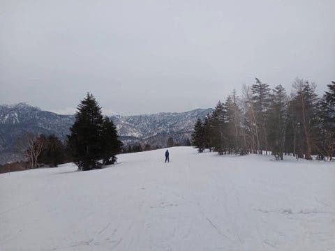
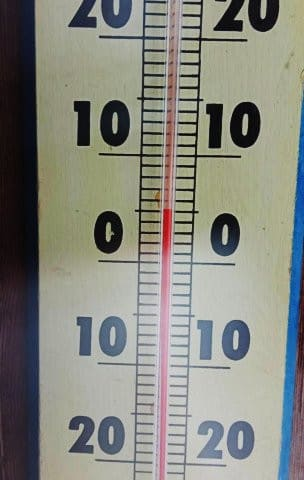
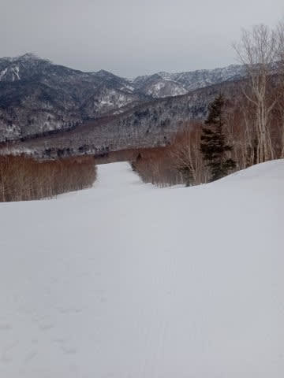
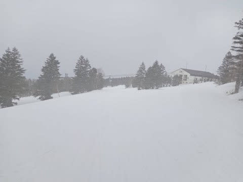
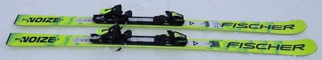
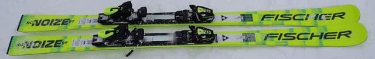
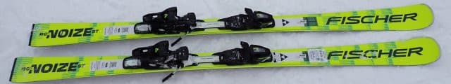
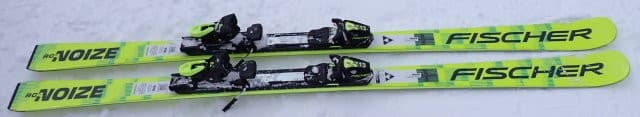
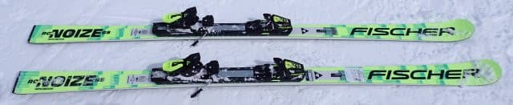

# 2026シーズンモデルのスキー板，試乗レポート速報版！その3…FISCHER編

📅 投稿日時: 2025-04-11 02:32:37

睡眠時間が短い最近，朝起きるのが

かなりムチャクチャ結構つらくて．

朝，いつも

「このまま永久にずっと起きなくて良ければいいのに…」

と思ってしまうけど．

それって死んでるのと変わらないよな…

と気づいて起きる，Skier_Sです．

ってなことで．

本日も，志賀高原特派員から写真が

送られてきましたが…

今日は朝のうちは一瞬だけ晴れてたけど，

午前9時過ぎからは時折日も射すものの

曇り空の一日だったらしく．

朝10時ごろの気温は+5℃と，やはり

予想通り気温が上がった一日で…

人は少なかったけど，昼頃には緩斜面は

かなり滑りの悪い雪になってきてた

みたいです…（泣）

そしてさらに，13時過ぎには山頂付近は

かろうじて雪ではあるものの，

雨がゲレンデに降り注ぎ始めたようです（泣）

うーん…

深夜2時現在も，志賀高原は予想通り

雨が降っているようですが…

明日の午前中まで降り続くかな…？と

予想した雨は，最新の天気図では，意外と

明日の朝までには止んでくれそうかな．

ちなみに，第2高速リフトが営業終了に

なった焼額．

営業終了した白樺・唐松コースの雪を

パノラマコースへ雪出しするようですが…

今シーズンは人工降雪機も設置したし，

そこまでしなくても余裕でGWまで雪が

もちそうだけどなぁ…

この時期になっても，そこまでちゃんと

コース整備するのがすごい…！！

ってなことで，本題へ．

今日は2026モデルのスキー板の試乗速報レポート，

フィッシャー編です！

今日は一気に5種類のレポートを掲載！！

…だけど，板の写真が全部一緒に見えて，

何種類の板のレポートがあるかよくわからない…

〇FISCHER RC4 NOIZE LT PRO 178cm

基礎大回り

今シーズンまでのRCの後継機がこのLTに

なるようですが…

LTも今シーズンのRCと同じく，M-Plate付きの

PROとプレートなしのSuperFlex版の2種類が

出るようで．

こちらはM-Plate付きのLT PROです．

そして長さも，今シーズンは170．175，180…

と，キレのいい5cm刻みだったのが．

173，178，183cm…という長さになるようです．

滑ってみるとかなり良くたわんで，R=18 という

半径よりは良く回る！！

今年のRCよりはちょいとフレックスが優しく

なった感じかな…

フレックスが優しくて，たわみが出やすい

といっても，グリップが強めの板なので，

しっかりグリップした中でかなりいい

感じのたわみが出ます！

キレイに丸く回るけど，バネ感が穏やかで，

返りも大回りの板らしくゆっくり返ってくる

ので，やはり大回り板っぽさはあります．

しっかりしたグリップ感があるのに比較的

小さめの半径で回るので，長めの板で

カービングでクルーズしたい人や

長い板で練習しようという人にはよさそう．

〇FISCHER RC4 NOIZE ST PRO 165cm

基礎小回り．

こちらは今年のSC PROの後継機になる

ST PROです．

これは…いい板ですね！

トップからテールまでしっかりグリップして，

それでいて板が気持ちよくたわんでくれて，

そしてターンの抜けもいいので…

ものすごい深回りができます．

ムチャクチャ傾く快楽の激烈深回り

カービングターンができます．

究極の脳内麻薬系カービング小回り

板かも？？

あまりずらして滑ろうとは思いませんが，

回転弧の自由度が高く，重さのわりに

履いた感じの軽快さがあるので，

結構扱いやすいです．

私は気に入りました！

〇FISCHER RC4 NOIZE ST SuperFlex 165cm

基礎小回り．

こちらはさっきのM-Plateが着いたPROじゃなく，

プレートなしの方．

これは，PROよりはフレックスが柔らかく

感じるけど…

それでもトーションは強めなので，グリップは

かなりしっかりしているので…

PROよりレベルの低い人向けというより，

PROより楽にたわんでより小さく回れる板，

という方がいいかも．

何にしろたわみが出しやすい．

それでいて，NOIZE構造の特性か，スピードを

出しても板のブレが少なくて．

フレックスが柔らかめ（ST PRO比．そこまで

柔らかいわけではない)で，返りもそんなに

強くないのに，スピードを出してもグリップが

抜けず安定性があるという，扱いやすい板．

〇FISCHER RC4 NOIZE  173cm

基礎オールラウンド．

STもLTもつかない，「無印」のNOIZEで，

これは今シーズンのCTの後継機になる

板ですが…

これまでのCTとは全く違います．

これまでのCTはフレックスも結構強くて

高速安定感が高いものの，サイドカーブが

小さめで板の返りも早いので，小回りっぽく

回っていくという，かなり体力が求められる

板でしたが．

来シーズンの無印NOIZEは優しく乗りやすく

なった感じ…！！

かなり上品なゲレンデ板になってます．

フレックスの強さはあるものの，グリップが

少しマイルドになったのか，板の動かしやすさ

が高まったし．

さらにR=15のわりに踏まなければ割とまっすぐ

落ちていけるし，トップがグイグイ入って旋回

していく感じのCTに比べると，かなり素直な板に

なった感じ．

まさにLTとSTの中間で，たわませると小回り，

たわませないと大回りと，どちらでも行ける

素直なオールラウンド板．

〇FISCHER RC4 WORLDCUP NOIZE GS  MASTERS 181cm

GS競技用．

FIS規定のGS板ではなく，R=21とかなり

ラディウスは小さめだけど…

板のフレックスがかなり強く，直進性が高め．

スピードが出ないうちはかなりまっすぐ

行っちゃいます．

この板が本領を発揮するのはスピードを

出していった領域．

スピードを出していくと，ぐっとたわんで

安定したカービングターンでキレて行きます．，

かなりの高速でも全然怖さを感じず，

まだまだ板に余裕がある感じで

安定感・雪面への張り付き感が高く

回っていきます．

この板もNOIZE構造の効果か，多少雪面が

荒れたバーンをハイスピードで飛ばしても，

荒れを全く感じさせずに安定して滑って

行けます．

常用スピード域はかなり高めで，スピード

耐性と体力がある人が，朝イチの人が少ない

バーンでかっ飛ばすための板．

人がいるゲレンデで履く板じゃないかな…
