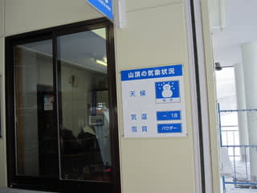
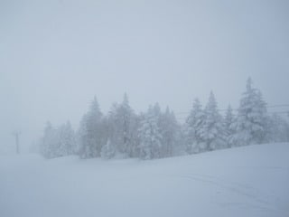
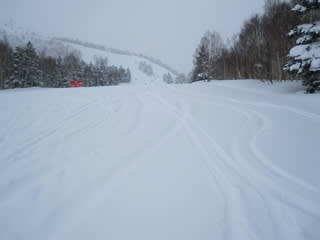
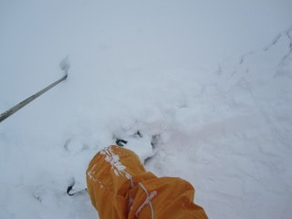
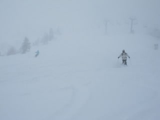
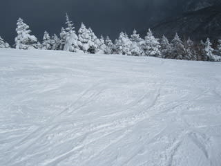
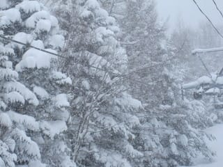
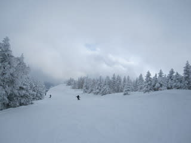
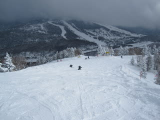
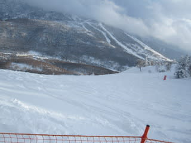

# 3月4日（金）の志賀高原は

📅 投稿日時: 2011-03-04 21:12:01

久しぶりの，平日スキーは…

寒いです！

とても3月とは思えない…

朝の気温はマイナス19度．

昼間でもマイナス13度までしか上がらなかったという…

真冬です．

3月ですけど，まだ真冬です．

おかげで，ゲレンデコンディションは最高！

先週の雨でだめになったかと思ったけど，完全リカバー．

パーフェクトなゲレンデ状況になりましたっ！

今朝，朝イチは，非圧雪バーンでブーツ～脛パフって

程度の新雪で，思ったほどパウダーは深くなかったですね～

焼額のオリンピックコースとかは，固い圧雪に完全底付きする

感じで，きれいに固めに圧雪されたバーンの上に，ブーツより

ちょい深いくらいの雪が載っている感じ．

気温が低いので，雪は軽いよ！

圧雪バーンも，下地がしっかり固めの圧雪（アイスバーンじゃないよ！）

の上に，10cmほど軽い新雪が載った感じ．

一見荒れそうな感じだけど，雪が軽いのでまったく気にならずに

滑れます．

天気は，終日降ったりやんだりの，一日中あまり日がささない

お天気．

でも，午後には雪も止み，夕方には薄日も差し始めるなど，

昼間の積雪の積み増しはほとんどなかったなぁ…

ゲレンデも，平日だけあってがらがらです．

貸しきり状態．

好きなラインとりたい放題．

この雪質で，この人の少なさって，どんだけ幸せなんだろうか…

って感じです．

…でも，焼額第1ゴンドラ，大体いつも10人前後は

待っていたので，まぁそこそこの人はいましたが．

＃今日は第1，第2ゴンドラとも風のため終日減速運転

＃だったから人が溜まっていたのかな？

気温が低く，雪がさらさらのままだったので，夕方には

多少でこぼこしてきたものの，割とフラットなバーンを

滑れました．

夜も，気温はむちゃくちゃ冷えてますが，雪は降ったり

やんだり．

…残念ながら，今は止んでます．

あんまり積もってませんね～

うーーむ．これから明日の朝までに，どかっと積もってほしいん

ですけど…

でも．

とりあえず．

この週末は，冷えるし雪もいいし，

最高ですよっ！！
