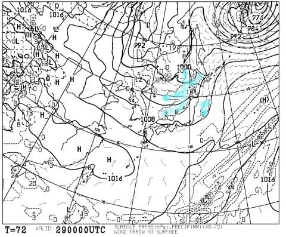
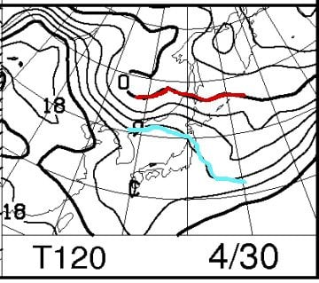

# GW前半，4月29，30，5月1，2日の志賀高原の天気は…おおむね晴れ．気温は平年並み～わずかに低め

📅 投稿日時: 2017-04-27 00:01:45

🏷️ カテゴリ: [スキー天気予想](c6554f5c3c106093b511a8daae23757e8.md)

そうなんですよ．

ええ．

そうなんです．

…なんと．

この週末から．

「ごーるでんうぃーく」などと

世間で呼ばれているらしい，なんだか

ステキな時期に突入するらしいのですが…

なんと．たいへん素晴らしいことに．

私もこのGWは．

はたして社会復帰できるのか？？

…と，心配になるほどの長い休みをもらえる

ようです…！！！

＃GW後に仕事がすごいことになってそうで超心配だけど，

＃それは気にしないことにしておこう…

だもんで．

全国1億2000万人の皆様も，このGWのスキー場の天気が

気になるのでは…？？←いや，この時期スキーに行く人はそんなにいないから．

この時期までスキーに行くのは，終わった人たちばかりだから

ということで．

このGWの前半の志賀高原の天気予想，行ってみましょう！！

えー．

まず．

GWの850hpa気温傾向から見てみると…

29日は平年よりわずかに低めの気温のようですが．

30日以降は平年並みの気温っぽい感じですね…

でも，水色で囲った，5月1，2日のあたり．

ちょいと気温予想のばらつきが大きい感じ．

だもんで．

ちょいとこの2日間の，FZCX50の特定高度線ばらつきを

見てみると…

うむ．水色で囲ったように，クラスタ間の

予想ばらつきが大きく．

さらにスプレッドが0.6と大きな値なので．

これは，この2日間の予想．

まだかなり精度が低いです…

だもんで．

5月1，2日の予想は，まだ参考程度にしか

ならないと思ってください…

とりあえず．

GW初日，29日の850hpa気温図を見ると．

うーむ．赤く記した0度線ははるか北海道…

そして，水色に記した+3℃線が志賀高原より

北にあるレベルなので．

…この日，志賀高原に冷え冷えの雪が降るという

奇跡は起きそうにないですね．

そして，地上天気図を見てみると…

うむ．

水色の降水域が日本海側に予想されています…

850hpaの風向を心眼で読み解くと，日本上空に

シアーが入っているように見えるので．

この日は雲が多く，もしかすると雨が一瞬ぱらつくかも…

で．

30日，日曜ですが．

赤く記した850hpaの0度線は，はるか北海道の北…

そして，恐ろしいことに．

水色で記した+9度線が，志賀高原より

北にいます…

これは…

30日は，かなりの高温になりますね（涙）

朝から雪はざぶざぶ，

この時期の典型的な，板が潜ってしまうような，

滑りが悪い雪になりそう…（泣）．

地上天気図を見ると…

うーん．

この天気図だと，まぁ晴れそうな感じに見えますね．

こういう高気温な日に晴れると…

雪質の劣化が加速するので，

あまり晴れないでいたほうが嬉しいかも…

そして．

あまりあてにしてはいけない，5月1，2日ですが．

5月1日は水色の+6度線が志賀高原より北にあるレベル，

5月2日は赤く記した0℃線が孤島のように東北を覆い，

志賀には+3度線がかかるレベルですが…

まぁ，5月2日はスプレッドが大きく．GSMとアンサンブル平均

の予想値が大きく食い違っているので．

GSM予想ベースのこの850hpa図は信じないほうがいいですね．

おそらく，5月1，2日ともほぼ平年並みの気温に

なるんじゃないかな～．

地上天気図を見ると…

まぁ，このアンサンブル平均の地上天気図を

見ている分には，この2日間も晴れそうです．

＃1日は雲が多いかも…？

ということで．

まとめると．

4月29日土曜日：午前中は雲が多そうだけど…

　午後は晴れていくかな？

　運が悪ければ，午前中にパラパラと，空から悲しい

　液体が降ってくる可能性も…

　朝から雪はちょいとやわらかめ．

　昼間の気温は+7-8℃程度にまで上がり，

　まぁこの時期のウェットな雪になるでしょう．

　午後はかなり重い荒れた雪になりそう…

30日日曜：晴れの一日．朝は放射冷却で硬いバーンを

　滑れるかな．

　ただし，朝の早い段階で雪は緩み始め，

　強い日差しと相まって，午前中にかなり

　ざぶざぶになりそう…

　昼間の気温は+10℃を超えそうで．

　日差しも強いので，暖かいというより

　「暑い」と感じてしまうレベル．

　午後の雪はドボドボした感じの，板が潜ってしまう

　雪になるかな…

　午後の一の瀬正面バーンや奥志賀エキスパートなどの

　急斜面は，結構なコブコブバーンに

　なるでしょう．

5月1日＆2日：この2日間の予想の精度は

　まだかなり低いですが…おそらく2日間とも

　同じような天気で，2日とも晴れ．

　1日は，ちょっと雲が多めで，一時曇るかも．

　晴れていれば，朝は放射冷却で硬い斜面を

　楽しめるか…

　でも，朝の段階から緩み始めるので，

　放射冷却が入った日は早朝が楽しい感じかな．

　午前中に雪はざぶざぶになっていき，

　この日もおそらく午後はかなりのドボドボ雪．

　斜面は荒れていくでしょう…

ということで．

2013年のGWのような，[こんな奇跡](ed87ecc584671a2c396ada52e71fdf5a5.md)は期待しないほうがよさそうな

今シーズンのGW前半ですが．

まぁ，これでも気温自体は平年並みかそれ以下なので．

奇跡はないけど，

超高温で雪があっという間に消えていく

という恐怖もなさそうなので．

雪がたっぷりの今シーズンの志賀高原．

GW最後まで，しっかり楽しめそうです…
