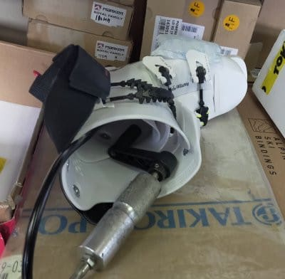

# HEAD Raptor WCR3のHEAD純正フォーミングインナーを作ってみた，その2…インソール・シェル成型完成

📅 投稿日時: 2024-01-09 04:35:36

🏷️ カテゴリ: [スキー雑談](c1f9d2cb7478308da16419928ea3945e9.md)

えー．

結局スキーに行けなかった3連休．

すごい悲しい3連休．

こんな3連休があっていいのかという，

ムチャクチャ寂しい3連休でした…

でも．

おかげで妻の熱は下がったので，

今週末はちゃんと滑りに行くぞ！！

滑りに行かないと死ぬ！！

…ってことで．

本日も滑りに行けませんでしたが…

特派員によると．

朝まで雪が降り続け，40㎝くらい

重めの雪が積もったようです…！

で，朝の気温は-14℃と冷え冷え！

この積雪のおかげで，GSコースも

最後の直進コースが無事滑れるように

なったようですが…

それ以外は，新たにオープンしたコースは

無し．

で，新雪が積もった柔らかい雪

だったので，昼頃には結構バーンが

荒れてきたようですが…

午後に向けて天気は良くなっていき．

さらに，雪がしっかり踏まれたからか

夕方になるとむしろ滑りやすくなって

いったという証言も…

ってなことで．

積雪が増えた焼額山ですが．

これだけ降ってもまだ，オリンピック

コースやSGSコース，ブナコースは

オープンできず（涙）

さらに，白樺コースも下の方はまた

小石が出てくるところもあったり，

まだあと一降り以上欲しい感じのようです…

で．

今回の積雪のせいで，雪崩の危険が

あるらしく…

明日9日(火)は，第3高速リフトが動かず，

イーストコースは滑れないようです(涙)

（[志賀高原焼額山スキー場ホームページ](https://www.princehotels.co.jp/ski/shiga/winter/)より）

うーん．

まだまだ雪は足りないけど…

今週もそんなにドサドサ積もらなさそう

なんだよな…（涙）

12日から13日にかけてちょっと積もり

そうなので，そこに期待か…

ただ．

志賀高原は今回の積雪で，

ブッシュや小石が出ているところが

まだあるものの，ほぼ全面オープンして…

まだ開いていないのは

焼額のオリンピック，SGS，ブナコース，奥志賀連絡，

一ノ瀬ファミリーのパーフェクターコース，

寺小屋のフィロソフィーコース，

東舘山のオリンピックコース，

西舘ワールドカップコース，

蓮池Aコース，

丸池Aコース，

くらいになりましたね～…

とりあえず．

今週末は滑りに行くぞ…っ！！

ってなことで，本題へ．

[前回，第1回目の記事](e582ef39b85579afa798005dfc6029c34.md)を書いてから，

正月休みで長らく中断していた

ブーツのフォーミングインナー作成

レポート．

久しぶりの続きです！！

…で．

[前回](e582ef39b85579afa798005dfc6029c34.md)，インソールを成形したところまで

書きましたが．

このインソールはまだ完成じゃなく．

これからインソールの裏にEVA素材の

フォームを貼って，ポスティング加工が

入ります…

ってなことで，前回はインソールを

足形に合わせ成形しましたが．

まだインソールは完成じゃありません．

このあと，インソールの裏に，青い

EVA素材を貼り付けて…

接着剤が乾くまで固定．

接着剤が乾いたら，裏側のEVAフォームを

削って，底を成形します．

何度も何度も角度を見ながら，細かく

削って調整を続けます…

かなり時間をかけて，ポスティングの

削りこみ，完成！！

…単に底をフラットにするだけじゃない

みたいで…

土踏まず部分の逃げとかも作ってあったり，

かかとの周りの削りこみとか，いろいろ

ノウハウがあるようです…

もう，インソール作成だけでかなりの

時間を費やしましたが．

これから次は，シェルが正しく当たり出し

されているか確認して．

さらにそのあと，フォーミングが待ってます．

今日は一日，かなり長くなりそうな予感…

まず，作ったインソールを入れた

標準インナーでブーツを履いてみて，

すでにある程度当たり出しをしてもらった

シェルに，当たりがないかどうか確認

しますが…

やはり一発では完全にあたりが

取り切れなかったので，追加の熱加工を

入れて，ぴったりフィットするよう

シェルを加工していきます．

何度か追加加工をして，当たりのない

シェルができたら…

これにてシェル加工は終了！

今度はカント調整に入ります．

標準のカントでは私の足に合ってないので，

くるぶし部分のヒンジ金具を，この写真左側の

穴が真ん中に開いている標準金具から，

穴が真ん中からずれたところに開いている

金具に交換して…

カントを見て，角度を調整しながら

金具を固定して．

カントをぴったりに合わせます．

このカントの合わせ方が，エキップさんは

絶妙なんですよね…

ってな感じで．

インソール・シェル加工にカント調整が

完了して，標準インナーでも滑れる…

という状況まででき上がったら．

ようやく最後に，本命のインナーブーツの

フォーミングにかかります…！

（[続く](eb06c3766961d8c507d7ddd857263dac3.md)）

## 💬 コメント一覧

### 💬 コメント by (かず)
**タイトル**: Unknown
**投稿日**: 2024-01-09 20:40:01

お久しぶりです  月曜狙いで足慣らしこみで土曜から初滑りでした  正月休み滑らないなんて初です…

今シーズンヤケビのナイターパウダー初体験したいのですが  下りの道が心配です  知り合いでナイター後下山してる人多いですか？

### 💬 コメント by (Skier_S)
**タイトル**: ＞かずさま
**投稿日**: 2024-01-10 03:05:03

ナイター滑ってる人は結構いますよ～！

ヤケビナイターをやっている1，2月は冷えているので，雪が昼間に融けなければ

12月や3月みたいに夜にそれが凍ってツルツルになることはないので，

他の車もいないし，むしろ安心して降りられるくらいです…

