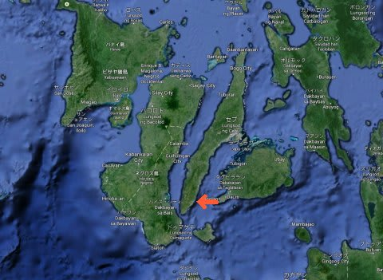

# 2013年11月　フィリピン・オスロブ　子連れでジンベエを見るぞっ！　プロローグ

📅 投稿日時: 2014-07-04 02:16:45

昨年の，夏．

『[突発性ジンベエを見たくてガマンできない病](ed709e496d6a37902cc6a2452f2475c2e.md)』

を発症した妻．

有効な治療薬や対症療法がなく．

海で本物のジンベエを見るしか治療法がないという，

たいへん厄介な病気の治癒のために，

[9月にタイ・サムイ島へダイビング旅行へ向かった](ee5d6c19f03c100753be26f9cd8a82f68.md)のですが．

…5日間もダイビングをしたというのに．

日ごろの行いが激烈に悪かったらしく…←ダイビングシーズンもこれかっ！

残念ながら，ジンベエ様には出会うことができず．

…というより，ジンベエ様が見れるポイントに

潜ることすらできない，という悲惨な目にあい．

…さらに病気を悪化させてしまったという，

全く逆の効果に終わってしまった，この旅行の後．

だんだん，ジンベエに関わる情報しか目に入らなくなっていく…

という，病状が進行していく中．

「フィリピンのオスロブとやら言うところに，

100%ジンベエが見れる場所があるらしい」

という情報に行き当たった妻．

何を考えたのか，私のスキーシーズンが始まって

しまっている11月に．

スキーシーズンにもかかわらず←ここ強調するところ

ダイビングの予約を入れてしまったという…

オスロブ…

それは．

フィリピンのセブ島，

その南端の近く．

この場所に，なぜかジンベエの餌付けに成功してしまい．

ジンベエザメが集まってくるエリアがあるという…

「餌付けのジンベエなど見るのは邪道じゃっ！！

天然自然のジンベエを見なくては…っ！」

という気分もあったものの．

…徹底ジンベエのモルジブのダイブクルーズで，

3日半のジンベエサーチにも関わらず，ジンベエを

外した経験を持つ私．

…一人数10万払ってモルジブくんだりまで行って，

またジンベエを見れず，妻の病気が治癒せずじまい…

という，恐ろしいリスクは負いたくない．

…なら．

餌付けでも何でもいいから，確実に，

100％ジンベエが見れる海で，妻の

『突発性ジンベエを見たくてガマンできない病』

を治すのが最優先…っ！！

…ってことで．

餌付けジンベエを見に行くことに決断したわけなのですが．

しかし．

果たして．

幼稚園児の子連れで，ジンベエを見に行くことはできるのか…？

という，私の危惧をよそに．

病状が進行し続けている妻は．

もう，他のすべてをさしおいて，

オスロブ遠征できるダイビングショップで，

かつ子供乗船可能…という

「[エメラルドグリーン・ダイビングセンター　サンタンダー](http://www.emeraldgreen-santander.com/index.html)」

というショップをあっという間に探し出し．

信じられない手際で，何かに憑りつかれたかのように，

あっという間にエアからホテル，

ダイビングまで予約完了し．

あとは出発を待つばかり…

という状況になったのでした．
