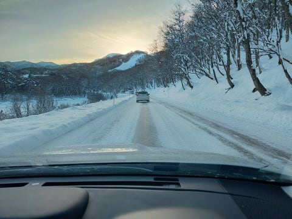
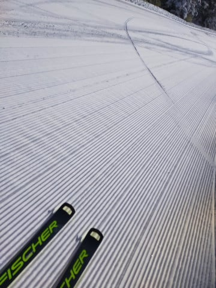
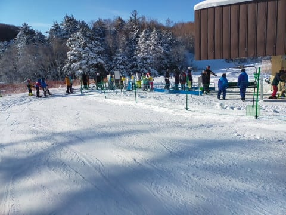
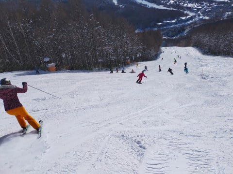
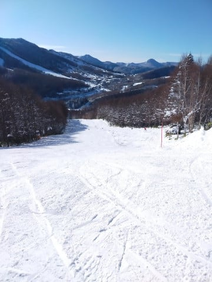
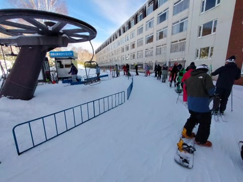
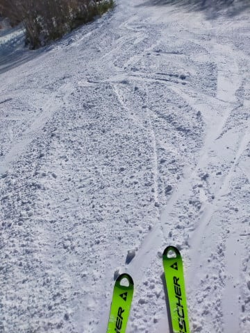
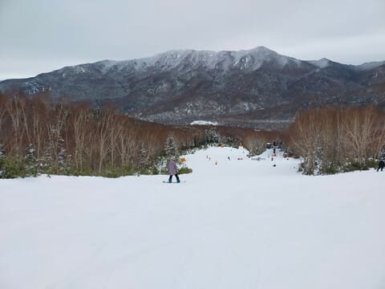

# 2023/12/24(日)の志賀高原の焼額山スキー場，速報レポート！…おおむね晴れ，結構冷えた一日．朝は混んだけど午後はガラガラ．サウスコースの雪質はよかったよ！

📅 投稿日時: 2023-12-25 01:48:44

🏷️ カテゴリ: [2024スキー滑走日記](c453f687e8a0f05679e95831d0a02cd0c.md)

ということで．

本日もラストリフトまで滑り，300㎞運転して

先ほど帰宅したところで…

いろいろ片付けたりなんだりしていると，

もう結構いい時間（涙）

もう深夜2時近いよ…

ってなところで，今日もいつもの速報モードで

レポートするわけですが．

その前に．

今，志賀高原でオープンしているのは．

横手山：第1ペア，第2高速トリプル，第4，第5リフト

熊の湯：第2ペア山頂から，第3クワッド

西舘山：クワッド

高天ヶ原：クワッド（NHKバーン），トリプル

タンネの森：リフトは動いてないけど高天ヶ原とファミリーの行き来はできる

一ノ瀬ファミリー：第3クワッド（天狗，正面バーン），ペア

ダイヤモンド：クワッド

焼額山：第2高速，第4ロマンス

奥志賀：ゴンドラ（往復乗車，滑れない），第2高速ペア，第3高速ペア，第4ペア

となっており．

22，23日の雪でそこそこオープンしている

ゲレンデは増えました…！

が．

まだ滑れるエリアはかなり限定的です．

そして，我がホームゲレンデ，焼額ですが…

23日の雪は60㎝ほど積もったものの．

軽すぎて，圧雪すると10cmくらいにしか

ならず．

ゴンドラを動かすには全然積雪が足りない

状態のようです…（涙）

あぁ…18日に全ての天然雪を融かした

雨が憎い…

とりあえず，

焼額では，天然雪が降らなくても．

動かせるうちにフルで人工降雪機を動かして

雪を溜めて，人工降雪機がないところに

その雪を運んででも，正月までにゴンドラを

動かす覚悟のようです．

そこまでしてゴンドラを動かそうという

のがすごい…

で．

今，最新の天気図を見ると…

うーん．

やっぱりこれから年末までは，

せいぜい降っても1日数㎝レベルの

雪しか降らなさそう…（涙）

降って1日10cm．

それ以上降る日はないんじゃないかな（泣）

ただ，年末の31日ごろは，かなりの雪が

降るかも…？？

まだ予想精度が低くて，雪の前に雨が

降る可能性もあるけど…

（標高が低いスキー場はおそらく雨）

とりあえず，年末年始は何かありそうな

感じ…！！大雪に期待…！！

ってなことで，本題へ．

本日の焼額スキー場の状況，さっくりレポート！

えー．

まず．

朝の志賀高原への道を登りますが…

本格的雪道だけど，道路上に新しい積雪は

なく．

昨晩から，1㎝も積雪が増えてないことが

わかります（涙）

でも．

あさイチのゲレンデは，昨日積もった

雪が圧雪された，柔らかめのきれいな

シマシマバーン！！！

昨晩のナイターに続いてシマシマを

いただきま～す！！

ただ，朝のうちは修学旅行生の団体さんで

リフトがちょっと混んで…

ゲレンデの人口密度も高めだったけど．

朝10時には，修学旅行生も引き上げて，

ゲレンデはガラガラになってきました！

第4ロマンスも，朝は写真のようにちょっと

混むことがあったけど…

午後はガラガラでした！

ガラガラになったけど…

第2高速側の唐松コースは，氷の

コロコロがところどころに出て…

ちょいと滑りにくいところもあった

のが惜しい…

でも．

昨日ほどボコボコにはならず，

午後にはコロコロもなくなり

滑りやすくなってきたし．

第4ロマンス側のサウスコースは，

コロコロもなくいい雪質のままで．

さらに昼を過ぎて午後になっていくにつれ，

雪が冷えて締まっていき，冷え冷えで

しっかり踏まれた，エッジがいい感じで

効くすごい快楽バーンになっていきました…！

ってなことで．

午後は人が少ないコースを気持ちよく

飛ばすことができたし．

滑れるところはブッシュが出てくるような

こともなく，いい感じのゲレンデ状況を

キープしてくれたので．

あとは，2本のリフトしか動いていないのが

惜しい…

早く全面滑走できるようになって，

いろんなコースを滑れるように

ならないかな…（切望）

また明日，詳細レポートやります～！

## 💬 コメント一覧

### 💬 コメント by (レインボー76)
**タイトル**: Unknown
**投稿日**: 2023-12-25 15:26:42

月曜日の志賀高原情報

朝の上林-3℃、蓮池-8℃。晴れ渡って気持ちいい。気分爽快！

奥ゴンで三高へ。今日もカミカミ極楽バーン。エキスパートを見ると、非圧雪と表記されてたのに、嘘でしょ！シマシマです。

上部はまさに最高だったけど、途中から圧雪が悪く段差があって危険信号。素人がぶっ飛ばせる状態ではない。

三高に戻ると、憧れの天才高校生○○○ちゃんと御一緒できました。勉強になるー！至福の時間を過ごせました。ありがとう。

今日はこれだけで大満足です。隊員の一人の膝が悪くて10時過ぎに終了。

昨日の石ころですが、注意してたのに今日も板に傷が付いてました。それがなければ奥志賀最高なんですが、、、

### 💬 コメント by (アリス)
**タイトル**: Unknown
**投稿日**: 2023-12-25 17:29:08

Skier_S様

昨日は失礼しました(^_^;)

ファミリー正面バーンが良過ぎてハマっていました。

普段あまり経験ないシマシマフラット♭

その後、高天原のNHK廻し。

空腹で気がついたら15時でした。

本日は仕事ズル休みで、朝一からファミリーと高天原のクワッド廻しして今帰宅中です。

早くゴンドラコース滑りたいですね～、

### 💬 コメント by (Skier_S)
**タイトル**: 回答が投稿されてなかった…回答遅れてすみません
**投稿日**: 2023-12-27 02:53:24

＞レインボー76さま

月曜のエキスパ，圧雪だったんですね…！

そして天才少女が現れましたか．

昨シーズンは奥志賀に行ってないので，会ってないんですよね…

私も会いたいな．

＞アリスさま

一ノ瀬＆高天で過ごしてらしたんですね．

でも，高天はガラガラだったみたいですから，それが正解だったかも…

早くもっとドサドサ積もって，ゴンドラ滑りたいところです…

