# 2019/4/6(土)の志賀高原焼額山スキー場は…晴天なれど，気温は高く春の雪．でも，板は予想より滑ったよ

📅 投稿日時: 2019-04-07 00:24:28

🏷️ カテゴリ: [2019スキー滑走日記](c3e4496fc0fb7f9c17ff21214a35b1ace.md)

ということで．

本日も，予告通り志賀高原で滑っていたわけですが．

いやーー．

晴天でした．

…でも．

その代わり．

雪は完全に春の雪でした…（涙）

ってなわけで．

まず，朝の志賀高原の登り坂ですが．

昨日積もった雪が，道路に残ってますね…

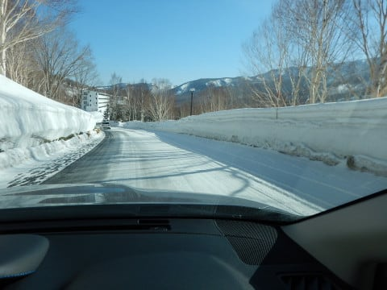

これならば，今日はガリガリバーン

ではなく．

その上に新雪が積もった，いい感じに違いない！！！

…ってな感じで．

朝8:30の通常営業スタートで，

焼額の山頂へ上ると．

山頂の気温は-3℃と．

高めながらも，冷えた気温です！

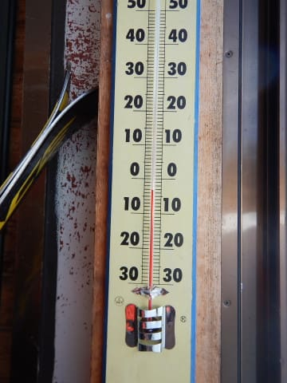

そして．

山頂の気温は，晴天っ！！

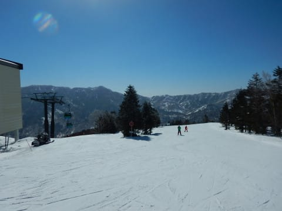

…いや．

この時期．

晴天になるよりも，曇ってくれた方が

雪が緩まなくていいんですが…

でお，気持ちいい晴天の，

シマシマバーンっ！！

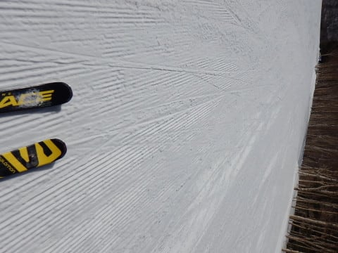

朝から気温は高めですが．

でも，朝の雪は比較的締まった，

思ったよりいい感じのバーン！！

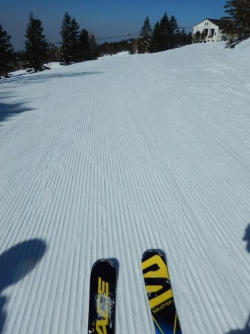

朝9時ごろまでは，結構締まった感じの，

いいバーンでしたが…

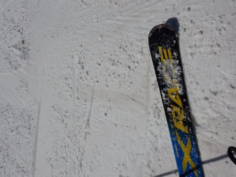

9時半ごろになると．

いい感じに締まったバーンの

雪が緩み始めて．

…見事な春の雪になってきましたね（涙）

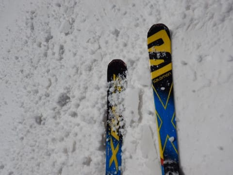

そして．

雪が緩んだだけではなく…

なんだ，これは？？

黄砂？？

雪がかなり黄色く汚れてます…（泣）．

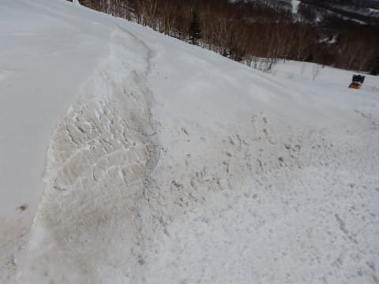

で．

雪は緩んで．

黄砂で汚れてはいますが．

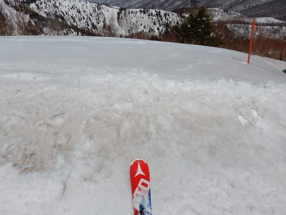

でも，せめてもの救いは．

汚れて荒れた雪ながらも，結構板が滑って，

ストップスノーにならなかったことですね…

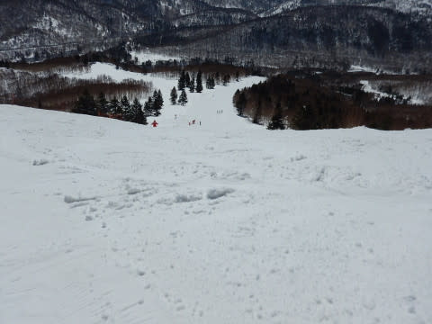

雪は荒れてますが．

ゲレンデはガラガラだし．

ゴンドラ待ちもほとんどないし．

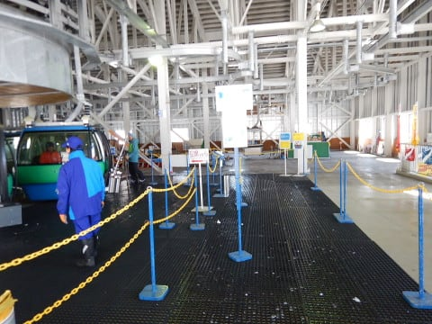

すっきり晴天なのに．

ゲレンデは，ガラガラです！

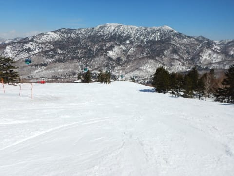

ただ，午後になると．

気温はプラスにふれてきたので…

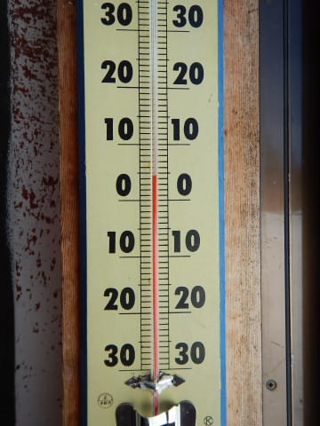

雪はかなり春っぽいザブザブ雪に

なってしまい

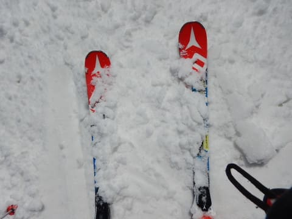

かなり荒れ荒れにになってきて

しまいました（涙）

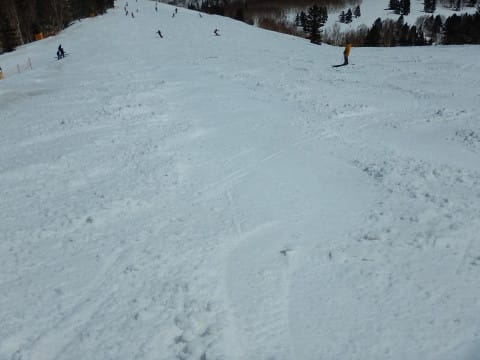

ただ，荒れ荒れ斜面ながらも，

ストップスノーにならなかったのが

今日のすくいでしょうか…

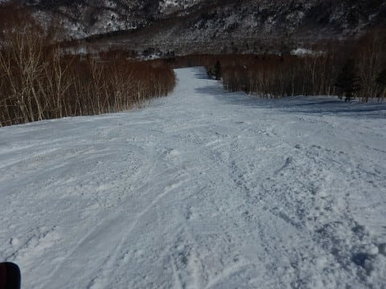

ただ

午後3時ごろになってくると．

ゲレンデの気温がさがって．

雪がだんだん固まり始めて

来たんですけど（泣）

この，凸凹バーンのまま，かたまって

来たんですが…（涙）

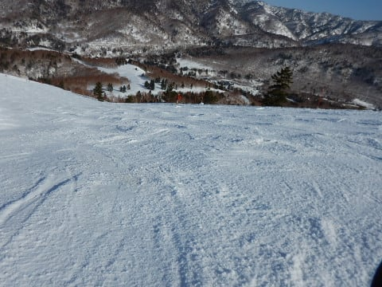

ってな感じで．

終日晴天だったのはありがたくて．

黄砂に雪が汚れながらも，比較的

午後まで雪が滑ったのは良かったのですが．

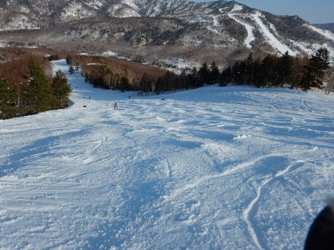

今週木曜日までの冷え冷え真冬ゲレンデとは違って．

春らしい，激烈に緩んだ春の雪に

なっちゃったなぁ…（泣）

と，悲しみながら．

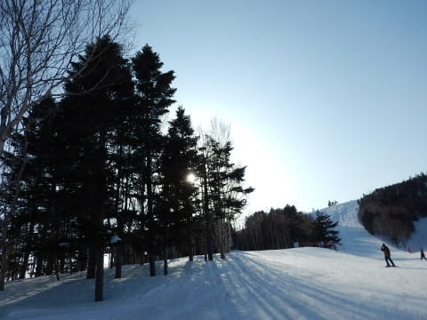

いつも通り，夕方のラストゴンドラまで

滑ったのでした…

明日は朝から曇り空なので．

これほど緩まなさそうですが．

明日は終日硬そうかな～．

## 💬 コメント一覧

### 💬 コメント by (Hide)
**タイトル**: おつかれさまでした
**投稿日**: 2019-04-07 00:54:36

S 様

おつかれさまでした。

帰りは駐車場で若干お話させて頂きありがとうございました。

朝のうちは良かったんですけどね～

あっという間に春の雪でした（笑）

確かに15:00頃からは難しいコンデションでした。

殺人じゃがいもコロコロだらけだわ、コブだと思ったらザク雪の寄せ溜まりだわ・・・一度板が刺さりました（笑）

日曜も頑張ってください。

### 💬 コメント by (Skier_S)
**タイトル**: >Hideさま
**投稿日**: 2019-04-08 01:51:56

土曜はお世話になりました～！

でも，土曜はまだ板が滑っただけ良かったです．

日曜は板が滑らず，かなり悲惨でした（涙）

さすがの私も，かなりくじけそうな感じでした．

うーーん．

春ですねぇ…（泣）

