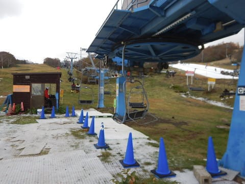
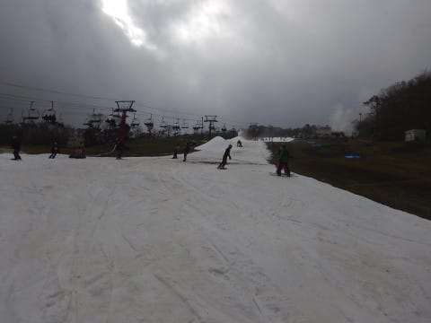
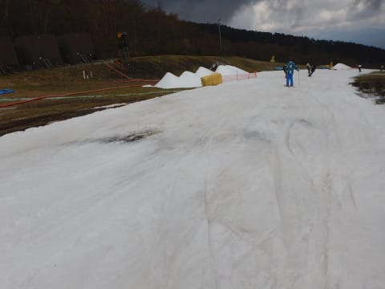

# 2018/2019シーズンオープンから1週間…10月28日のイエティ速報＆動画

📅 投稿日時: 2018-10-29 01:09:03

🏷️ カテゴリ: [2019スキー滑走日記](c3e4496fc0fb7f9c17ff21214a35b1ace.md)

ってなわけで．

本日，イエティで滑ってきたわけですが．

…ナイターまで滑って，ちょいと帰宅が遅めだったので．

今日は速報モード＆ゲレンデ状況の動画にて…

えー．

まず．

すっきり晴天で始まった本日．

人も少ない朝イチに，気持ちよくかっ飛ばそう！

…と，思ったら．

朝イチからちょいとゲレンデは荒れ気味…

あんまり気持ちよくかっ飛ばせない（涙）．

そして．

晴れの天気予報だった本日．

[オープン週の先週土曜](e59c737cc2670a6274fe7b5bce86011b0.md)よりも人が多くて…

朝10時ごろには，クワッドリフト待ちがかなり

すごいことに…

でも．

10時すぎに並行するペアリフトが動いてからは．

クワッドリフトも，3分待ち程度にまで

待ち時間が短くなりました…

で．

天気予報は晴天の一日だったにも関わらず．

晴れていたのは，10時前まで．

それ以降は，ずっとこんな感じの曇り空が

一日中続きました…

でも．

曇っていた方が，雪がとけなくていいですね．

このくらいの天気の方が，板が滑るし，

雪質もひどくならなくて，いい感じ…

と，思っていたら．

なんだ，これは…（泣）

昼ごろには，コースの上の方に，

ところどころ穴が開き始めました…（涙）

いや，これ．

曇っているからまだいいものの．

晴れて強い日差しがあったら，

もっと穴が大きくなって，

かなりヤバい感じになってたよ…

曇っててくれて，良かった…

まぁ，ひどい穴が開いているのは，

コース上でこの写真で見えている，

長さ100mくらいのエリアで．

それ以外は，大体こんな感じで．

ところどころ，ポッコリ穴があいている

場所がある感じ．

まぁ，でも．

浮石とかも結構あったので．

新しい板は持って行かない方がいいレベルの

雪でしたね…

あー．夕方のゲレンデは．

当然のごとく，結構荒れ気味でした．

うーむ．

今日の午後は，穴だらけで．

かなり荒れ荒れのゲレンデで．

ちょっと残念な感じ…

だもんで．

やはり，穴の開いてない．

フラットなゲレンデを滑りたいよね！！！

…と．

夕方のゲレンデ整備の後まで居座り．

穴が埋められて，ちゃんと圧雪がかけなおされた

ナイターで，楽しんできました～！

…ナイターは，雪も締まり気味で，

結構良かったかも…

ってな感じの一日でしたが．

いつもの定番，ゲレンデ動画を貼りつけておきます…

お昼12時頃の，リフトを降りたすぐあたりから，

リフト乗り場までです．

この時間帯だと，まだ致命的な穴は開いてない

ですね…

明日，元気があったら．

もう少し詳細レポートをします…

今日はもう眠いので，おやすみなさい～…
