# 2017年8月，小学生の子連れで座間味でダイビング…ファイナル

📅 投稿日時: 2018-08-08 01:01:54

🏷️ カテゴリ: [ダイビング日記](ce3a7a8d424d112fce83ee85c81a0e344.md)

今日も，ちょいと帰宅がご無体時間でした…（泣）．

帰国日以来の寝不足が解消されてないんですが（涙）

だもんで．

今日も書きためておいた，座間味ダイビング旅行記です．

今回がついにラスト！

…うーむ．

去年8月の旅行記が．

旅行から1年後にようやく書きあがったか…

でも．

去年の8月は，座間味の後にパラオに行ってるんだよな…

まだ，ナビ取り付け記事もあるし…

パラオ旅行記，今年中に書きあがるのかな？？

とりあえず．

座間味旅行記ファイナルです！

---

ってな感じで．

座間味を後にした高速船は．

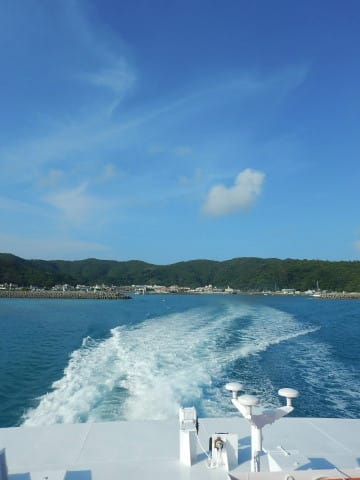

慶良間諸島を離れ…

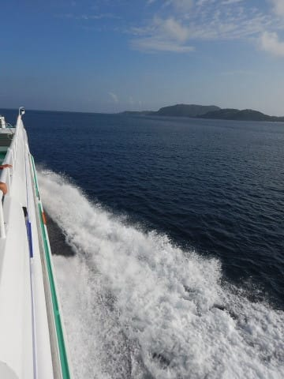

那覇に向かってひた走ります．

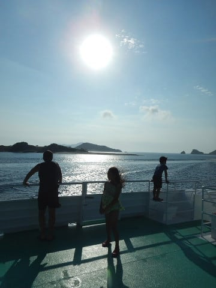

そして，座間味から約1時間．

午後5時過ぎ，那覇の港に到着！

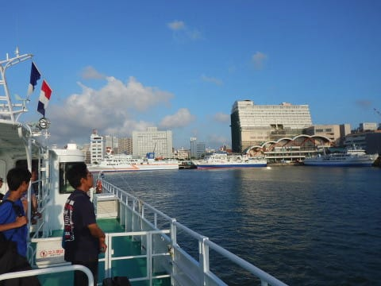

船を降りたら…

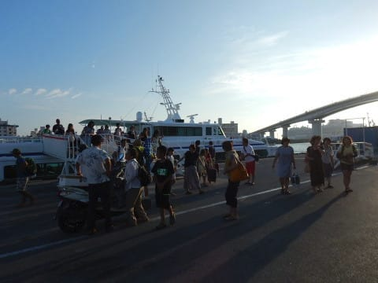

港のそばの，今晩泊まるホテルへ向かいます…

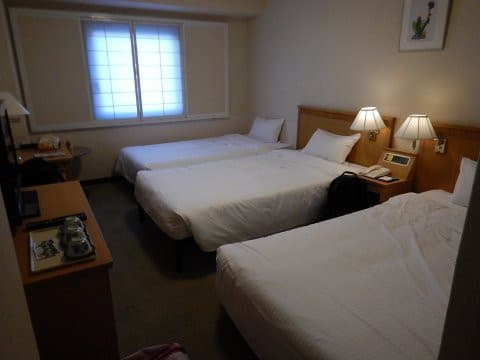

そして，ホテルのそばの料理屋さんで

夕食にしますが．

…子供にしては渋い味覚のわが娘．

目ざとくジーマーミ豆腐と

海ぶどうを見つけ．

完全自分一人で独占しています…

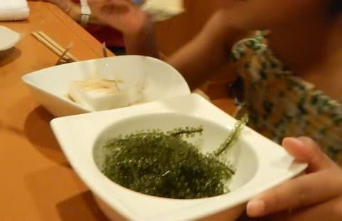

…この娘．

海ぶどうが大好きで．

あればあるだけ食べちゃいます…

そして．

こういうモズク天ぷらも，

わが娘の大好物．

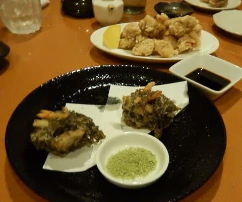

…お前，食べ物の趣味渋すぎ…

とりあえず．

わが娘．沖縄料理も大好きなようです…

ってな感じで．

たらふく食べて．

満足の娘は，いつも通り宿に帰ったら

即爆睡…

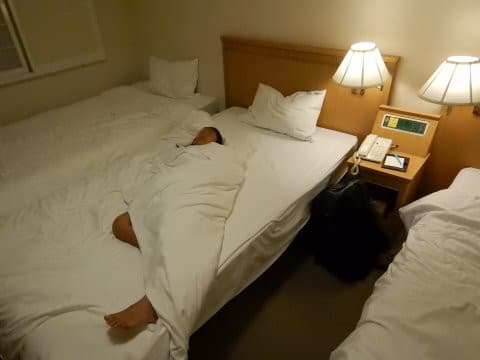

そして翌朝．

この日は，もう飛行機に乗って帰るばかり．

朝9時過ぎには，ホテルから那覇空港に移動

しましたが…

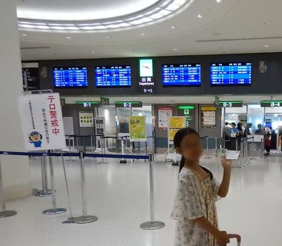

この娘．

お土産屋さんで海ぶどうを見つけて．

「これ買って～！これ買って～っ！！！！」

…わが娘．

普通の子供が沖縄土産として欲しがるものと，

かなりズレたものを欲しがっている

気がするのだが…

ってな感じで．

お土産を買った後は．

飛行機に乗り込んで．

さらば沖縄！

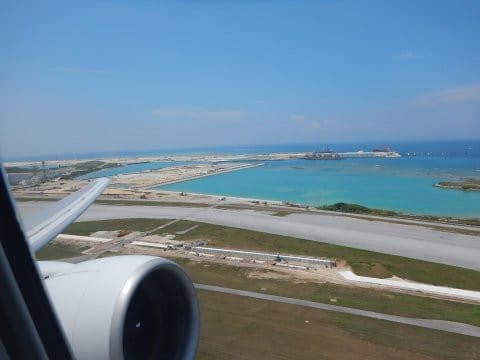

…窓の外に，沖合で埋め立て途中の

新滑走路が見えますが…

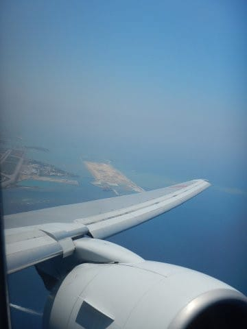

うーむ．

こんなところを埋め立てて，空港を

拡張するのか…

で．

最近の国内線．

Wifiが結構使えるようになっていて．

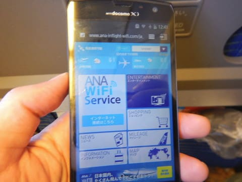

ANAの国内線も，スマホをWifiでつなげば．

いろんな番組やら，地図が見えるように

なってましたね…

…でも．

あんまり面白い番組やってないなぁ…

まぁ．いいか．

星砂さんがお土産に持たせてくれた，

手作りサーターアンダーギーを

食べながら．

今回の座間味の思い出を噛みしめつつ

帰るとしますか…

と．

今回も満足だった，座間味の海を脳内で

リプレイしながら．

残り少ない，旅の最後の時間を過ごしたのだった…

（おしまい）
