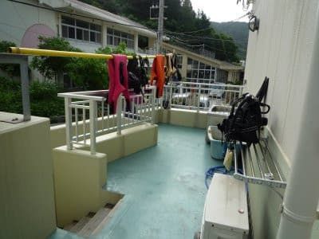
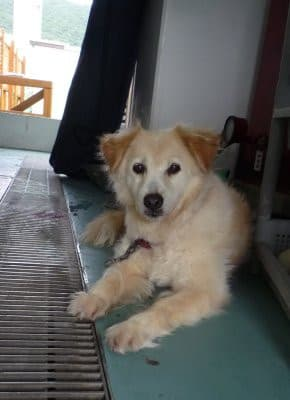
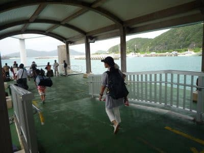
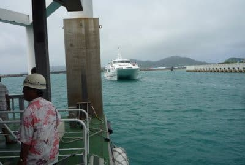
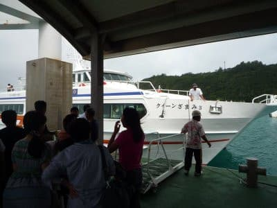
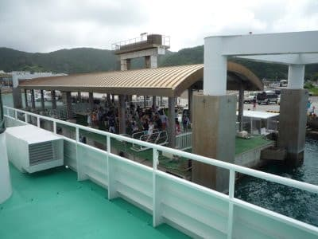
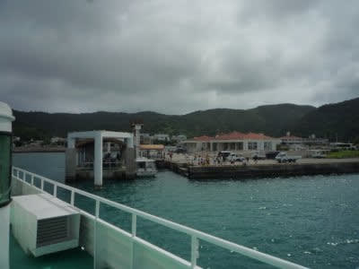
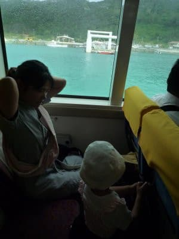
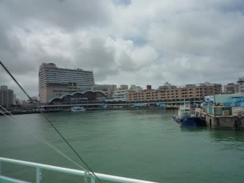
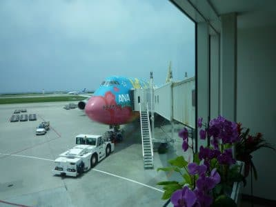

# 2010年7月，2歳の子連れで座間味でダイビング！ファイナル…そして，帰宅

📅 投稿日時: 2021-10-28 01:47:18

🏷️ カテゴリ: [ダイビング日記](ce3a7a8d424d112fce83ee85c81a0e344.md)

えー．

昨日の3か月予報の記事ですが．

天気図の読み解きから記事を書くのに

2時間以上もかけてしまった

という力作だったんだけど…

書きあがった記事を読み返すと．

後半はあまりにもマニアックすぎて，

全ての読者を振り落としきって

独走してしまった感があり．

あぁ…こんな記事を書くのに，貴重な

睡眠時間を2時間も削ってしまった…

と嘆きつつ．

もう深夜3時を過ぎていたので書き直す

元気もなく，そのまま投稿したんだけど．

なんと．予想外にポジティブなコメントが

あって．

少なくとも2人は「面白い」と思って

くれたようです…！

そうか…こんなマニアックな記事を，

ごくわずかの人数とはいえ，楽しんで

くれる人がいるんだなぁ…(ちょっと感動)

ってなことで．

天気解説の記事はマニアックすぎるからか，

あまりアクセス数が伸びないんだけど．

…ごくわずかにいるっぽいマニアックな人

に向けて，

ときおりディープな天気解説記事を

書いてみようかな？？←いや．それって，一部の人は楽しんでも，

読者の99％を振り切ってしまうと思う…

…という前フリのあとは．

今日も10年前のダイビング旅行記です．

今回が，本編は最終回となります～！

ーーーー

ついにやってきた，最後の帰る日．

…いつも旅行に行ったときは，

永久に帰る日が来なくていいと

思っているのですが…

なんで，最後の日ってやってくるんで

しょうか…(涙）←そのまま沖縄で暮らせばよいのでは？

この日は，器材を片付けて帰るだけです．

朝ごはんを食べ，ベランダに干してあった

器材を片付けると…

はやくも，座間味から那覇に帰る船の時間です…

あぁ…短い．

3泊4日，短すぎる…

映画，「マリリンに会いたい」のモデルと

なったマリリンの孫らしいこの宿の

飼い犬ともお別れして．

港へ向かいます…

あさイチの高速船，クイーン座間味で那覇に

戻るわけですが…

那覇行きクイーン座間味の到着とともに，

「お船乗る～！！」

とハイテンションな娘．

うーーん．行き，この船でゲロゲロ

だったのは忘れたか？？？

そして．

座間味の人たちの見送りを受けて．

高速船は座間味の港を離れます…

これで，3度目になる子連れダイビング旅行．

行く前はいろいろ心配して，

4日間大変だろうなぁ…

と思ってたけど．

トラブルなくここまでくると．

もっと長居したかったなぁ…

…と，名残を惜しみつつ．

離れていく座間味島を見送ります…

ハイテンションだった娘も，乗って

しばらくで熟睡．

天候がよく，ゆれが少なかったことも

あいまって，娘はゲロゲロになることなく，

高速船は那覇港へ．

…座間味から戻ってくると．

那覇がすごい大都会に見えますね…

帰りは，乗り継ぎ時間が少ないため，

泊港からタクシーで空港へ！

空港へ着くと，すぐに搭乗時間で．

娘は「飛行機乗るの？飛行機乗るの？」

と，いつも通りのハイテンション．

搭乗する羽田行きはポケモンジェット

でしたが，ポケモンを知らない娘には

全く意味なしですね．

ってことで．

大好きな飛行機の中でずっと大喜びで

娘は過ごして…

娘にとっては短いらしい，2時間ちょいの

フライトで羽田に到着．

…いや．

ホントに乗りもの好きの子供は，

旅行するのに楽だわ…

ってなことで，空港からは電車に乗り，

夕方には帰宅．

無事，3度目の子連れダイビング旅行が

終わったのでした…

んで，夕方帰宅後．

家についたら

「公園に遊びに行こうよ～」

と，娘に家の前にある公園に遊びに

連れ出され，

「午前中まで沖縄にいたのに…

家の前の公園で夕方に

遊んでるって不思議だの～」

ということに意味のない感動を覚えつつ，

いつもどおりの日常の世界に戻って

きたのでした…

（おしまい）

## 💬 コメント一覧

### 💬 コメント by (m&t m)
**タイトル**: Unknown
**投稿日**: 2021-10-28 10:03:55

人を連れて山に入るという事は、人の命を預かる事だと思います

なので、自分は常に天気図を気にしています

しかし、ここまで詳細なものは理解不能ですが・・・

でもスキーシーズン中に白馬あたりも予想範囲に入れると、とんでもなく読者が増えると思います

### 💬 コメント by (Skier_S)
**タイトル**: ＞m&t mさま
**投稿日**: 2021-10-29 04:09:29

をを！天気図を読んでらっしゃるのは素晴らしい！

…私も違うスキー場の予想ができればいいのですが，

天気図と実際に志賀高原に行って経験した天気の違いから

志賀高原の予想ができるようになったので，他のスキー場がどういう風向きだと

どんな天気になるのか，正確には分からないという欠点があります…

志賀高原だと，風向きでどのスキー場にどう雲がかかるのかとか，

どの高度以上なら雨から雪に変わりそうか…とか，

経験からかなり正確に

推測できますが，他のスキー場はダメです…(涙)

### 💬 コメント by (新米パパ)
**タイトル**: Unknown
**投稿日**: 2021-10-29 12:16:38

ほんとうにいつも正確な天気予報に感謝です。。

正直　Sさんの予想をみて志賀高原行くのを取りやめた日もあったので　そのうちネガティブな予想はだすな！という圧力がかかり、それを無視したSさんが志賀高原で消息不明になる日が来るんではないかと心配しております。

