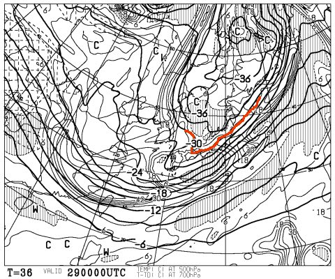
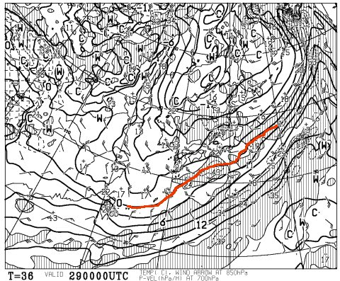
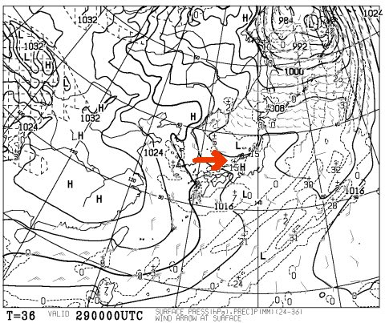
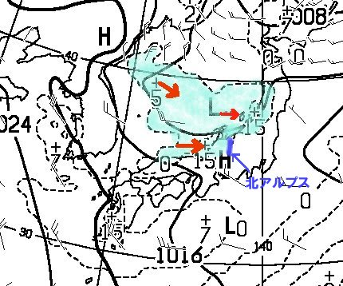

# 29日はむちゃくちゃ冷えるのだが…信州は積雪が少ないかも…

📅 投稿日時: 2013-11-28 02:23:30

えー．

[木，金はすごい冷えるよ！](http://)

積もりそうだよ～っ！

と，予告したように．

専門天気図のFXFE5784を見ると…

29日の500hpa面の寒気は，こんな感じで，

赤く示したように，マイナス30度という，

かなり気合の入った寒気が入ってきてます！

これは，大雪の目安ですね～．

そして…

850hpa面を見ると．

0度線は日本のはるか南に下がっているじゃありませんか！

…これは．

雨の心配はありません．

かなり，標高が低いところでも，降れば雪です．

…そう．降れば．

…降れば，雪，なんですが．

FXFE504を見ると，29日の地上天気図は…

赤く矢印に示した感じで．

長野県・新潟県付近，見事な西風が入る気圧配置になっちゃってるよ…

この図の，日本近辺を拡大したのがこいつなんですが．

降水量がある部分，水色で塗ってみましたが．

これは，典型的な日本海からの吹き出しの雲が出ているパターン．

この，日本海からの雲が日本に到達して雪を降らせるわけですが…

…だけど．

赤い矢印で示したように，西風になっているので．

青い線で示した北アルプスに邪魔されて，

北アルプスより東，長野県側には雪雲が流れず．

長野県は全く降水量が無い予想になっています…

…この天気図．

志賀高原とか，信州では雪が降らない典型的な

パターンなんだよな…(涙)．

まぁ，500hpa面に-30度の寒気が入っていれば．

全く降らないわけは無いとは思いますが．

…信州は，どさどさ積もるほどでは無い感じ…(残念)．

新潟は結構積もりそうなので．

かぐらとかはいいかも…

ちなみに，その後．

土日は晴れます．

新潟では，時々雪雲が流れてきて，曇り→雪が

ちらつくことがあるかもしれませんが．

内陸部，信州は晴れます．

うーん．

せっかく週末は天気がいいんだし．

それまでに，ドカッと積もって欲しかったんっだけどな～．

…この予想が，いい方に外れてくれることを祈るばかり．
