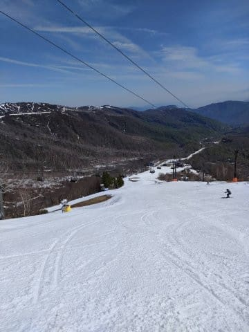
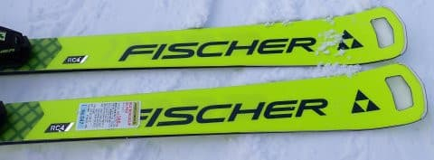

# 2024シーズンモデルのスキー板，試乗レポートその1…FISCHER RC4 WC SC Pro

📅 投稿日時: 2023-05-10 00:56:58

🏷️ カテゴリ: [スキー板試乗](c0bd8048615710cee890e403a36cc9a2b.md)

えー．

GW明けの昨日はすごい雨＆風で

スキー場は軒並み営業できず．

この日・月の2日間の風雨で，スキー場は

すごいことになってるんじゃないか

と思っていましたが…

送られてきた，本日のかぐらスキー場の写真を

見てみると…

晴天で穏やかで，バーン状況も良さそうで．

そして，思ったよりも雪がありますね～！！

どのくらいの雪の厚みがあるのかは

分からないけど．

今週は冷えるので，今週末までは問題なく

もつんじゃないか…という話．

今週末に期待…

ってなことで，本題へ．

昨日予告した2024シーズンモデルのスキー板

試乗レポート，本日よりスタートしますが…

まずは3月のエキップさん試乗会で試した

板のレポートからです！！

昨日書いた通り，この時は雪質がよく，

トップシーズン並みのコンディションで

試乗できた時のレポートですが．

最初はフィッシャー編からです．

では，どうぞ～！

〇FISCHER RC4 WC SC Pro 165cm

基礎小回り用

小回り板のSCで，強い方のMプレートがついた

この「Pro」は，基礎用のトップモデルになります．

ちなみに，2023シーズンモデルの試乗板のみ

オーストリア製，量産品はウクライナ製でしたが…

今回は，試乗板もウクライナ製でした．

火事による生産中止から，ウクライナ工場は

完全復活したようですが，

以前の古い工場から機械も一新されたとの

ことで，以前のウクライナ製よりできが

よくなっているとの話でした…

で．

色が黒から黄色になった以外，今シーズン

モデルからほぼ変わってないように見える

この板ですが．

今シーズンのM/OプレートがMプレートに

変わったみたいですね．

昨年までのM/Oプレートは，トゥピースが

メインの黒いプレートからゴムで浮かされた

黄色いプレートの上に乗っていて，トゥピース

付近の板のたわみを出しやすい構造になって

ましたが…

（昨年のSC Pro）

今年のMプレートは，トゥピースも完全一体の

普通のプレートになり，しっかり感が増したと

言うことです…

果たして，Mプレートの効果やいかに？

滑ってみたところ…

結構重さがある板ですが，履いてみると

かなり軽快な板です．

トップからテールまでの長いエッジの

全てがしっかり効いて，気持ちよくカービング

してくれる板ですが，SLモデルのように

グリップガッツリのどうしようもない

カービングマシンではなく，

ある程度板をずらせる軽快さもある，

扱いやすさを感じられる板です．

そして，SLモデルほどではないにしろ

張りが比較的強めなので，小回り強制

マシンではなく，踏まなければ比較的

まっすぐ落ちていけるし，

踏んで傾けて行けばよくたわんで

キュインと回ってくれる，回転弧の自由度と

オールラウンド性があるいい板です．

ただ，今シーズンモデルの気持ちよい

しっとり感がちょっと弱まった感じ…

今シーズンモデルは圧に応じてすっとたわんで，

たわんだ中での圧の溜まり感とガッツリグリップ

感があって，返りの気持ちいいばね感があったけど．

来シーズンモデルはある程度のたわみを出すと

板の硬さを感じるし，返りのばね感もちょいと

弱まった感じがする…

Mプレートのせいかなぁ…

今シーズンのSCの気持ちよいばね感が

ちょっと弱まってしまったので，気持ちよさは

今シーズンモデルの方が良かった気がする…

でも．

これは2023シーズンモデルのオーストリア製

試乗板のSCの乗り心地が，あまりにも私の

趣味にフィットしすぎていただけで．

一般的な基準から見ると，1級以上の

レベルをもった人ならばある程度の

大回りから小回りまで作れる自由度もあり，

かなりのしっかりグリップ小回りから

ハイスピードのズラシまでできる

懐の深さもある，いい板だと思います．
