# 4月1日（土）の志賀高原は…終日ガス（泣）ゲレンデが全く見えない…雪は下地が硬いものの，この時期として悪くなかったのに

📅 投稿日時: 2017-04-01 23:26:30

🏷️ カテゴリ: [2017スキー滑走日記](c7d777cecfc91bdf0fa464ad62c6d49ab.md)

ということで．

本日も志賀高原を滑っていたわけですが．

ええ．

4月と考えれば，雨になったり

ざぶざぶ雪になったりせず．

ゲレンデは冷え冷え雪でしたよ．

でも…

終日ガスで，ゲレンデが見えない一日でした…（涙）

まず．

本日も朝イチは，

焼額より30分早くスタートする，奥志賀

スタートだったわけですが．

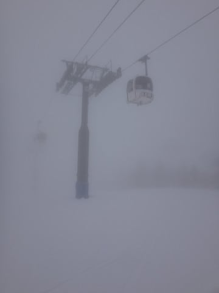

で．

ゲレンデの上に乗っている雪は最高だったのですが．

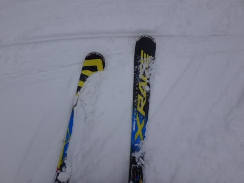

…でも．

昨日から積もった新雪は3cmほど．下地はちょっと

硬めだったのが，残念で．

さらに，朝イチゲレンデ．

ガスで視界が…（涙）

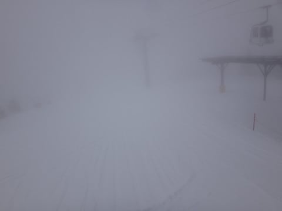

ゲレンデはシマシマなんだけど．

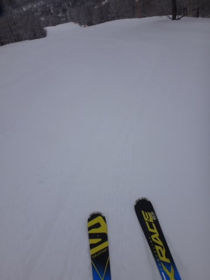

前が見えなくて下地が硬くて，

ちょっと気持ちよく飛ばせない感じ…（涙）

だもんで．

8時半にオープンの焼額へ移動すると…

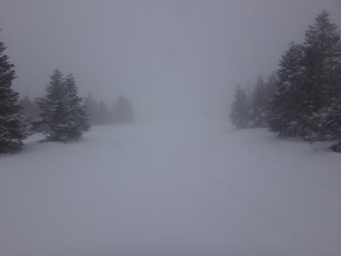

朝9時時点の気温は，-2℃とちょっと高めで．

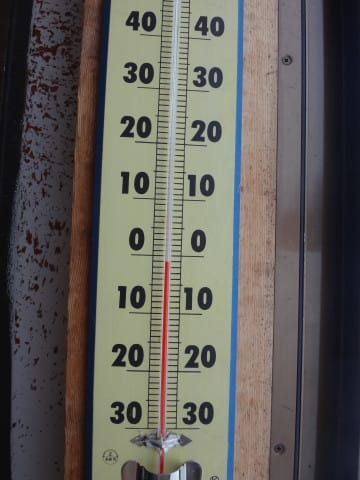

暖かい空気が入って．

やはり焼額も全面ガス…（泣）

焼額のゲレンデは，柔らかい新雪がきちんと朝に

圧雪されたいい感じで．

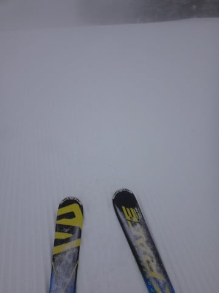

そこそこスピードを出せるいいバーンだったんだけど…

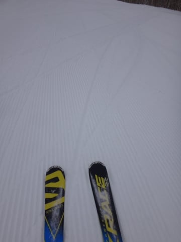

でも．

この視界の悪さでは，スピードが出せないよ（泣）

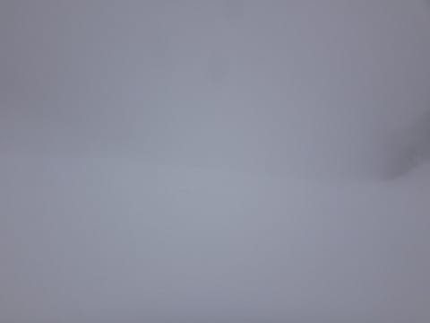

いや．

私は焼額なら，目をつぶっても滑れるから

いいんだけど←だから，ホントにやったら崖から落ちるか気にぶつかるかで死ぬから

でも…

雪はいいのに，見えなくて飛ばせないのが厳しい…

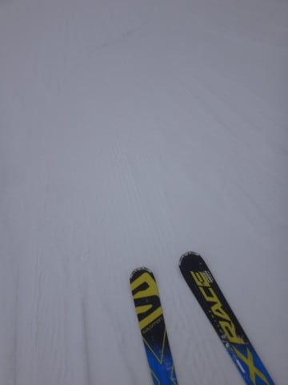

とりあえず．

本日は．

昼になっても全然ガスは晴れる気配はなく．

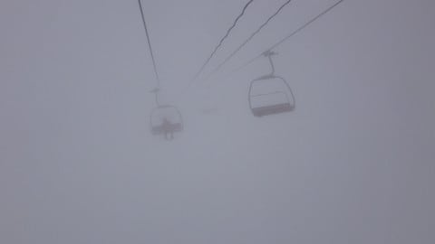

ゲレンデを知らない人間にとっては．

どっちがコースかわからず，恐怖を感じるレベルで．

もう，残念ながら夕方までこんな感じ（涙）

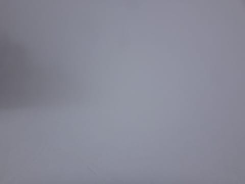

気温は，予想よりはちと上がって，

昼間で微妙にプラスに上がったものの．

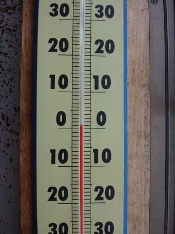

でも．

そのせいか，ゴンドラ待ちは全くないし．

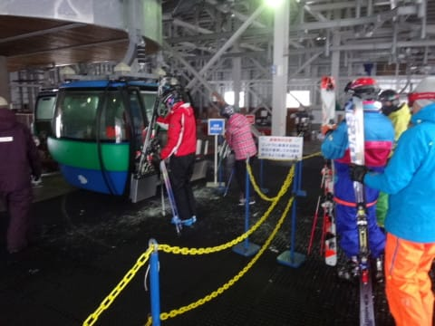

雪自体は結構冷え冷えで．

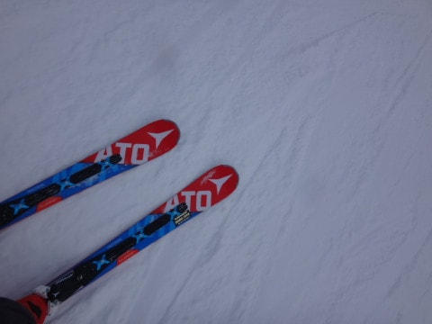

まぁ，多少雪のコロコロが出てたものの．

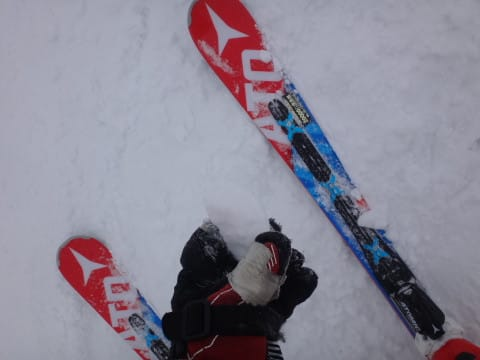

ゲレンデは夕方まで完全フラットで．

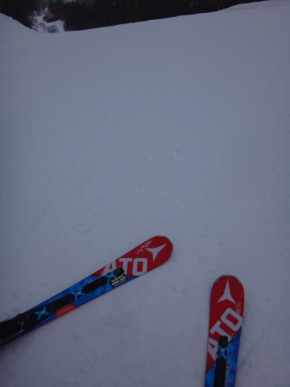

…これで，視界さえ良ければ．

かなりいいコンディションなのに…

という一日を過ごしたのでした…

いやー

とりあえず，4月になって，お客さんは減った

感じですが．

今日はホントに，終日，ゲレンデが見えなかったのが

痛い…

もう，今日は朝遅く．眠いので．

とりあえず寝ます．

おやすみなさい～．

## 💬 コメント一覧

### 💬 コメント by (白花模様)
**タイトル**: ありがとうございました
**投稿日**: 2017-04-02 07:37:40

おはようございます。

昨日はステッカーいただき、ありがとうございました。リフトで嫁が変態発言、すいません。

また、ゲレンデでお会いできましたら声を掛けさせていただきます。

### 💬 コメント by (いか)
**タイトル**: Unknown
**投稿日**: 2017-04-02 20:57:59

昨日のガスにはやられましたね、、、加えてアイスバーン+ザラメのもさもさで土曜日はかなり修行でした。打って変わって今日は快晴でしたね！新板のGS RS 176で足がどこまでも外に出ていきそうないいコンディションの五竜グランプリ（今日はちょっと出張）でした。志賀は一日快晴+緩まずよかったのではないでしょうか？

### 💬 コメント by (Skier_S)
**タイトル**: 今日も深夜更新
**投稿日**: 2017-04-03 02:12:18

＞白花模様さま

昨日は声かけていただきありがとうございました～！

ステッカーも喜んでいただけたようで，

こちらの方が嬉しくなりました（笑）．

私はGWまで志賀高原に出没し続ける予定なので，

またゲレンデでお会いしましょう～！

＞いかさま

いやーー．昨日のガスはひどかった．

八方もガスだったんですね…

志賀も今日は最高でしたよ～！

全然春の雪にならず，いい雪をキープでした．

しかし，この時期に新板デビューなんですね（笑）

### 💬 コメント by (いか)
**タイトル**: Unknown
**投稿日**: 2017-04-04 00:19:49

私はここ最近(14SX、14AX、16SX、17RS)、3月ー4月頭に新車投入しています。この時期だと足がだいぶ出来てきて、初期性能(わけのわからない傾き)を目一杯楽しめますので、、、(笑)

### 💬 コメント by (Skier_S)
**タイトル**: いかさま
**投稿日**: 2017-04-04 02:17:25

3-4月に新車投入ですか…！

私は遅くとも1月に投入して，

雪がいい時期に新しい板を

楽しみたい人なので，ちょっと驚きでした（笑）．

…しかし．

SX，ヘタるの早すぎます…（涙）．

16SXも，そろそろ買い替え時では？

（と，物欲選手権に誘ってみる）

### 💬 コメント by (いか)
**タイトル**: Unknown
**投稿日**: 2017-04-05 00:41:09

SXは既にだるだるですが…物欲選手権…その手にはこれ以上は乗りませんよ…。

なにせいつもの黄色いお店ですでに、来期のAtomicのXビンディングが乗る黒いやつを予約済みですから…(笑)

### 💬 コメント by (Skier_S)
**タイトル**: いかさま
**投稿日**: 2017-04-05 01:48:25

えええ！？？

来シーズンモデル，もう予約したんですか？？

…それも，黒いやつにXビンディングつくんですか！？？？

黒いやつはTLビンディングしか着かないと聞いてますが…

それとも何か，スペシャルバージョン？？？

…気になります…

