# 1月7日，3連休中日の志賀高原は…曇りのち晴れ！人が多めだったので，午後は荒れ荒れバーン（涙）

📅 投稿日時: 2018-01-08 00:19:07

えー．

年末からひたすら続いている，志賀高原レポート．

…そろそろ，読者の方も飽きてきたころだと思います．

ええ．飽きてきているはずです…

…だって．

書いてる本人も飽きてきているんですから←そうだったんかい！

でも．

読者が飽きていようが．

書いている本人が飽きていようが．

今日も続く，本日の志賀高原レポートっ！←なんだか投げやり

ってことで．

3連休の中日の朝を迎えたわけですが．

…うーん．

昨晩からの積雪はこの程度で．

数㎝～5cmってところですか…

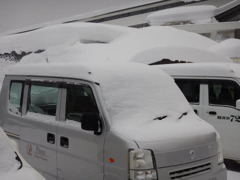

たしか，誰かさんが4日にやった予想では，

　ブーツパフくらい

という予想だったはずだけど…

外したということか？？←でも，積雪が全くなかったわけでないから許して（Skier_S心の声）

朝イチゴンドラで山頂に出ると…

うむ．

気温は-12℃ですか！

冷え冷えですな…っ！

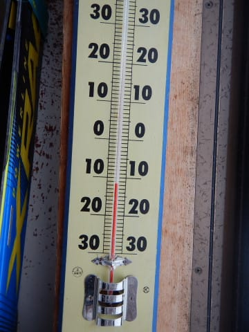

ここも，4日の予想では-8～9℃と予想していたのが，

3℃ほどずれちゃってるのは，内緒にしておこう…←ここに書いてる時点でバレてるから

そして．

山頂の天気は…

小雪がちらつく天気ですな．

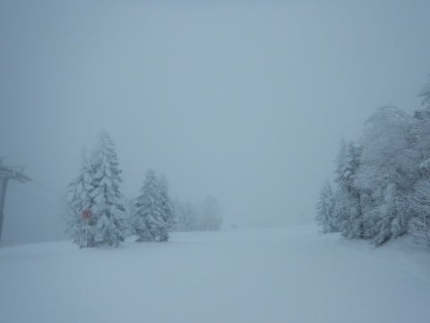

朝は雪降り，という予想は当てていることに一安心…

で．

コース脇は，ブーツパフとまではいかないまでも

5cmほど積もっていて．

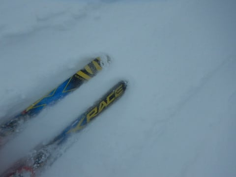

圧雪コース上も，うっすら雪がかぶっていたので…

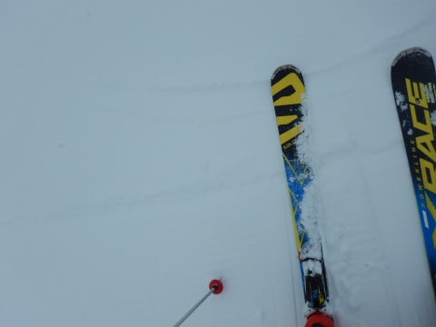

朝イチは，シアワセハイスピード圧雪バーンというより，

かなりやわらかい圧雪の上に新雪が乗った，結構

柔らかめのバーン…

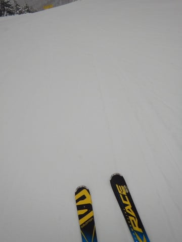

そして，朝のうちは雪が降り続けて．

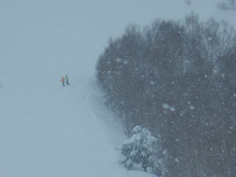

コース全面が柔らかいので…

非圧雪のオリンピックコースなんかは，

開始後1時間でもう荒れ荒れ凸凹になり始めてますし．

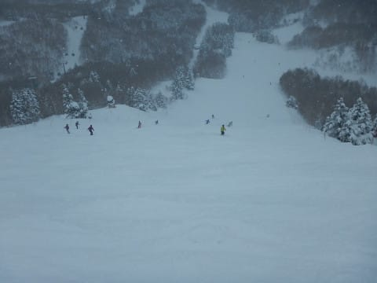

圧雪が入ったGSコースも，朝早くから結構荒れ始めて

来ちゃってます…（涙）

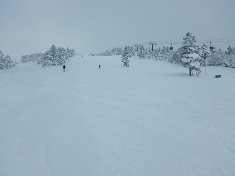

そして．

朝10時には．

あらら？？

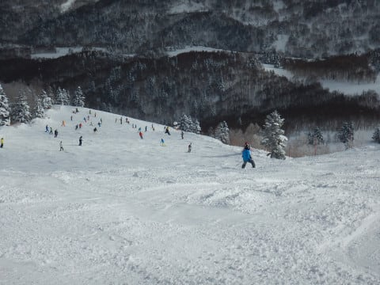

あらあらあら…

かなり人口密度が上がってきました（涙）

ただ，昼頃には．

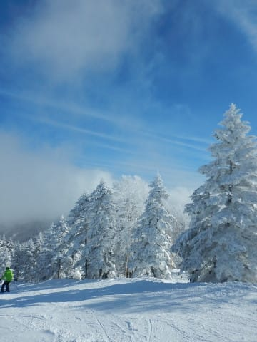

日が差し始めて来ましたよ～！

そして，12時すぎには…

すっきり晴れ上がりました！

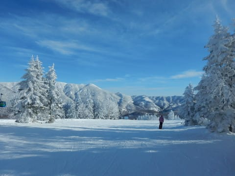

　午後は天気が良く，気温も-5℃程度と冷え冷えで

　雪もいい感じ．

という予想は，ドンピシャ当てました！

さすが！←必死の予想当てたアピール

天気は晴れてきたけど．

3連休中日ということで．

ゲレンデの人は多く…

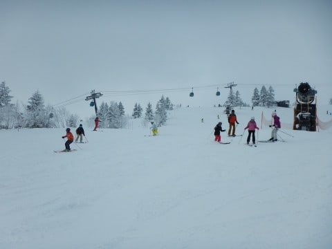

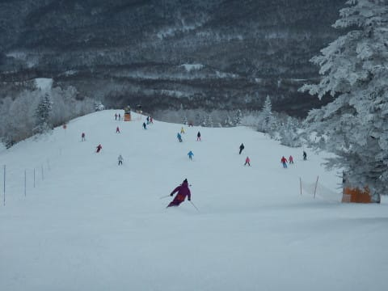

第2ゴンドラは，10分待ち以上になったようだけど．

でも，8人乗りの輸送力をもつ1ゴンは，

せいぜいゲート外まで人があふれるかどうかという

程度の混雑で…

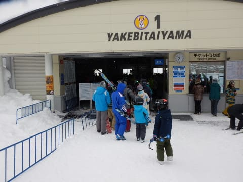

相乗りレーンを使えば，せいぜい1～2分待ち程度．

さらに，昼以降は…

かなりのガラガラになりました！

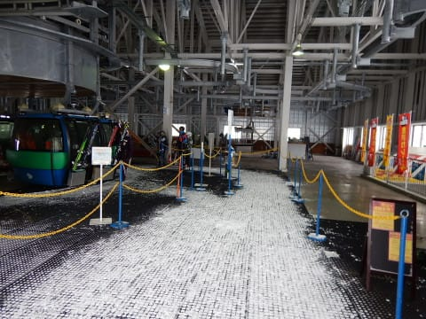

昼間は，天気が良かったのに気温は-5度以下と

冷え冷えで，雪質は終日Good！

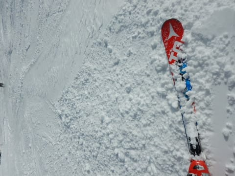

白樺コースとか，穴場的コースは人も少なく．

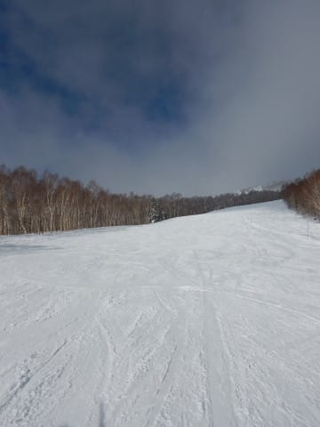

午後は第2高速リフトも待ちがなく．

3連休中日にしては人が少ないかな？？

という混雑具合だったけど…

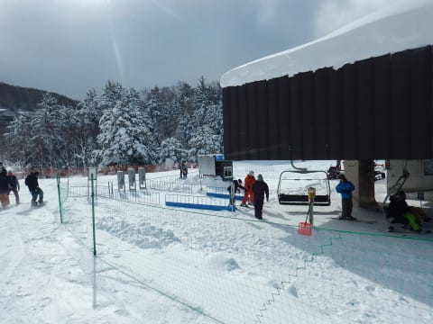

でも．

さすが3連休中日．

コース上の人はそこそこいたので．

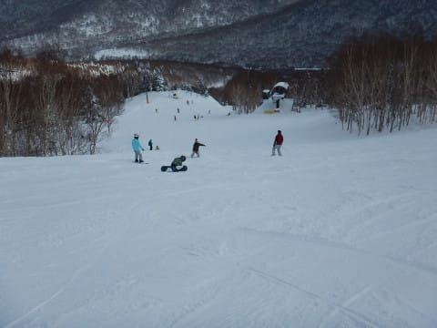

…そうです．

コースが柔らかく，人が多いということは．

午後は荒れ荒れ凸凹コンディションに…

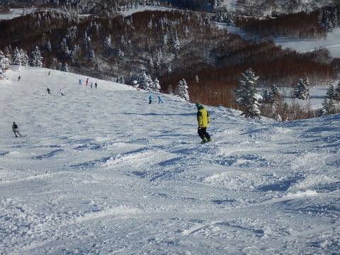

夕方になると．

焼額はコース全面凸凹バーン（涙）

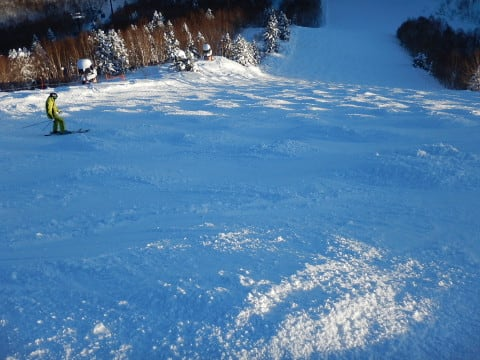

オリンピックコースも．

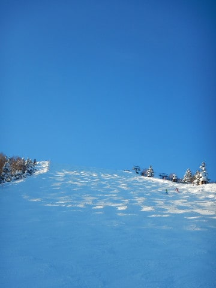

圧雪のGSコースも．

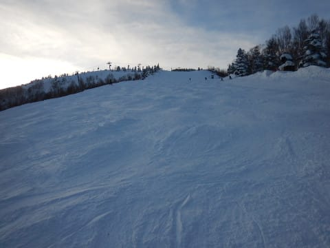

どこに行っても，凸凹から逃れられない，

凸凹地獄化しました…（涙）

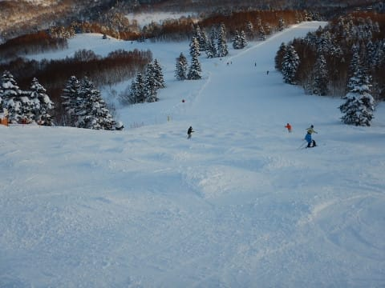

ただ，せめてもの救いは．

晴天ぴかぴかで，凸凹が良く見えたって

ことかな～．

というわけで．

午後はすっきり晴天となったものの，

凸凹地獄で死ぬほど疲れた本日でしたが．

いつも通り．

夕日が沈む．16:15のラストリフトまで，

滑り倒したのでした…

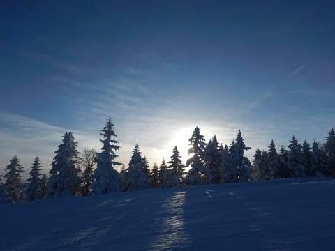

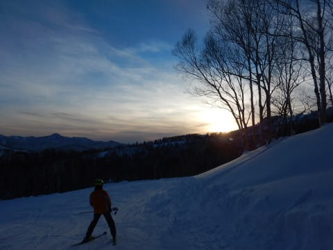

が．

まだ終わりません．

そうです．

お約束の，ナイタータイム！

本日も，夜7時から9時まで営業の，サンバレーナイターへ

行ってみますが…

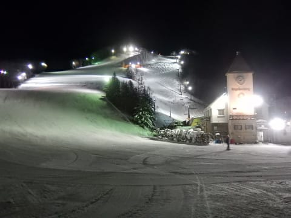

ふはははは．

また，圧雪かけたてのピカピカシマシマバーンを

いただけるのだっ！！

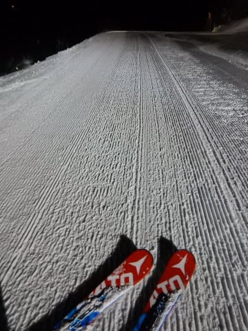

それも，高速クワッドリフトで，長いコースを

たっぷり楽しめるのだ！

…と，喜び勇んで突っ込もうとしたところ．

うむ？？

なんだ，このキャタピラ跡は…？？

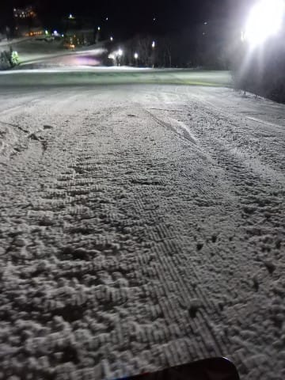

どうやら．

今日の昼間．サンバレーもコブコブ凸凹地獄

だったらしく．

その凸凹が，十分に均しきれてない状況で．

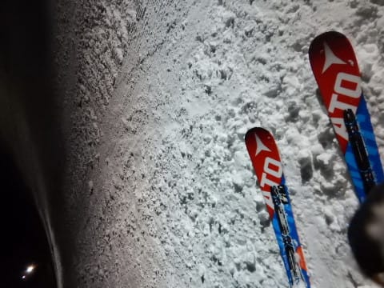

なんということだ…

コース全面，コロコロ地獄（涙）．

まさか，この時期にコロコロ地獄になろうとは…

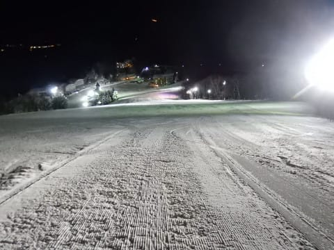

ってことで．

ピカピカシマシマだと思っていたところ．

予想外の全面コロコロ斜面という悲しい事実に．

泣きながらリフトストップまで滑り続けた，

Skier_Sだったのでした…

ということで．

明日，8日の天気ですが．

うーん．

何とか午前中は，雨が降らずに曇り空のまま

もってくれそうですね…

でも．午後はやっぱり，やばいものが

降ってきそうな雰囲気ですが．

いまのところ，リフトが動いている時間には

そんなにザーザーぶりにならずに済みそうな

気配です…

ただ，南風が強くなるので．

2ゴンや奥志賀ゴンドラ．

減速や営業中止の危険性があるかも．

うーん．

明日も何とか一日，降らずにもってほしいなぁ…

## 💬 コメント一覧

### 💬 コメント by (Skier_S)
**タイトル**: まさかの1ゴン運休(;_;)
**投稿日**: 2018-01-08 08:57:33

焼額1ゴン2ゴンとも運休（涙）

奥志賀もゴンドラだめみたいです…

2ゴン、奥志賀ゴンドラはヤバいと思ってたけど、まさか1ゴン運休とは…

### 💬 コメント by (michi)
**タイトル**: Unknown
**投稿日**: 2018-01-08 09:06:37

Sさま

昨日も朝しかお会いしませんでしたね⤵️

ゴンドラから2回ほどお見かけはしましたが、、、

柔らかい雪と荒れたゲレンデのせいでかなり疲れました。でも午後から天気が良くなったのは良かったです。

また宜しくお願いします。

### 💬 コメント by (ほっぽ)
**タイトル**: 全滅
**投稿日**: 2018-01-08 11:50:22

朝はニ高駐車場で失礼しました。

まさかのゴンドラ全滅は痛いです。

何故か？タマゴンは稼働してるのが不思議です。

一日お気をつけて。

### 💬 コメント by (Skier_S)
**タイトル**: 焼額1ゴン
**投稿日**: 2018-01-08 12:38:27

動き出しました

### 💬 コメント by (Skier_S)
**タイトル**: 今日はひどい天気だった…（泣）
**投稿日**: 2018-01-09 01:14:22

＞michiさま

昨日も朝だけでしたね…

探しながら滑っていたのですが，

私の方は全くお見かけできず，残念でした…

またの機会に一緒に滑らせてください～！

＞ほっぽさま

今日はお疲れ様でした！

あれからもずっと滑ってらしたのでしょうか…

私はラストリフトまで行ってしまいました．

しかし，ひどい天気でした（涙）．

今度は最高の天気で，最高の雪で滑りたいですね！

また志賀でお会いしましょう！

