# 3月21日の志賀高原は…ぶるるっ！真冬の吹雪の一日

📅 投稿日時: 2014-03-21 20:10:43

🏷️ カテゴリ: [2014スキー滑走日記](c992167609b6415052179ee69ea1ea7d8.md)

ってことで．

真冬です．

寒かったです．

ありえない感じです…

まー，冷え冷えだったんですよ．

今日は．

朝の志賀高原の上り坂から，こんな感じで．

昨日の雨で融けた雪が，今日の冷えひえで凍って

つるつるで．

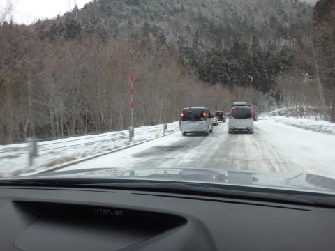

登れない車が多数．

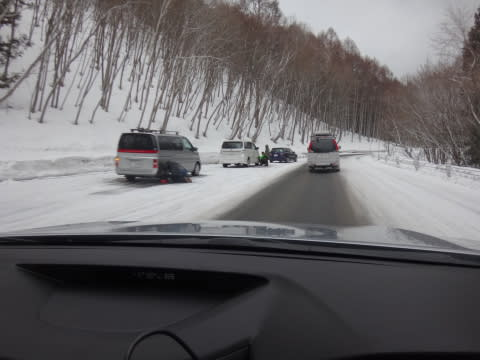

うーん．

まだまだ真冬の道路状況だの～

んで．

ゲレンデに到着すると…

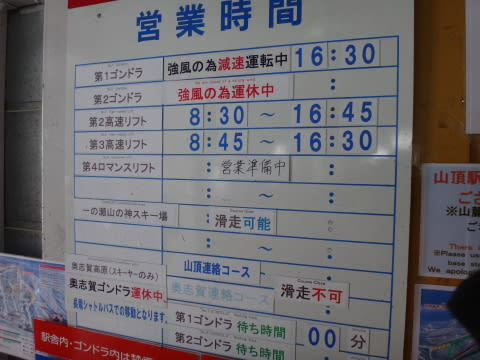

…やっぱり，予想通り．

焼額第2ゴンドラも奥志賀ゴンドラも運休(涙)

＃こんな予想は当たらなくてもいいのに…

…まぁ，焼額第1ゴンドラが動いていただけでラッキー

…ということにしておこう．

で，第1ゴンドラに乗って山頂に行くわけですが．

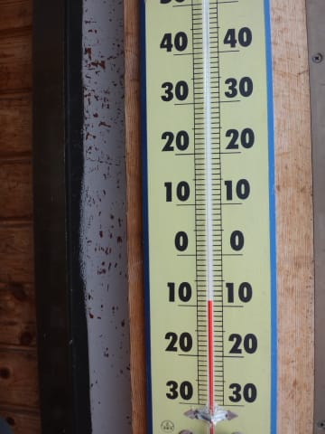

ふむ．マイナス10度．

冷えてますな～．

降ってますな～

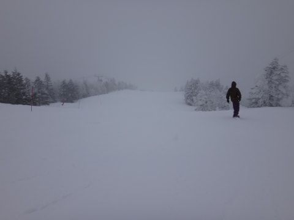

冷え冷え最高の雪質で…

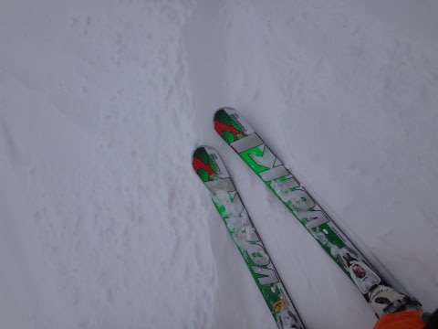

オリンピックコースは，10cmほどの新雪っ！

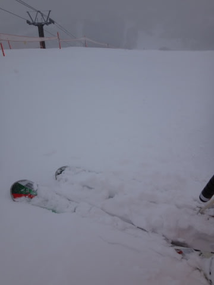

だけど．

…下のほうは，昨日の雨で固まったアイスバーンが…（涙)

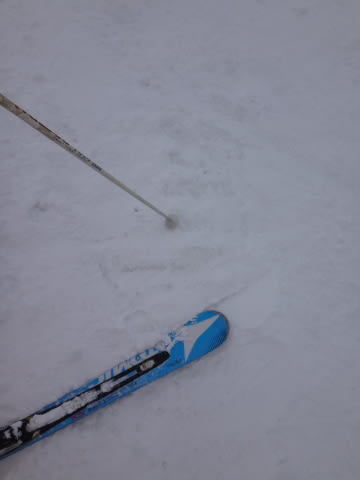

アイスバーンの上にもさもさ雪が積もっているので．

滑りにくい…（涙)

そして．やはり3連休．

ゲレンデの人も増えてきて…（さらに涙）

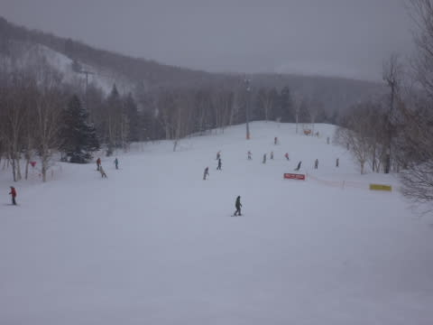

そして．焼額第1ゴンドラは，午前10時から1時間ほど，

5分待ち以上の列が…(もっと涙）

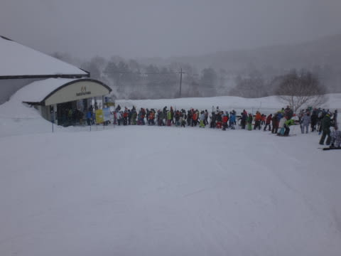

時折雪は強く降り…

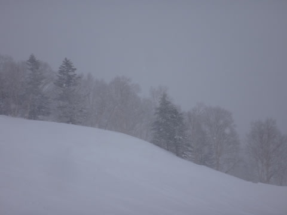

視界が悪い中，人をよけつつ滑らないと…（ひたすら涙)

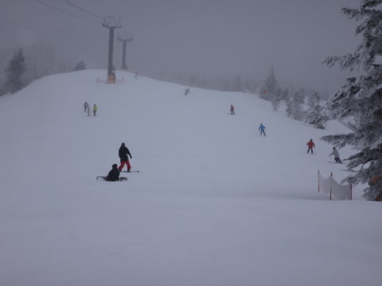

でも．

11時過ぎから第2ゴンドラが，減速運転ながらも

運転開始し，ゴンドラ待ちもなくなり…

さらに，昼間もこんなに気温が低い状態で．

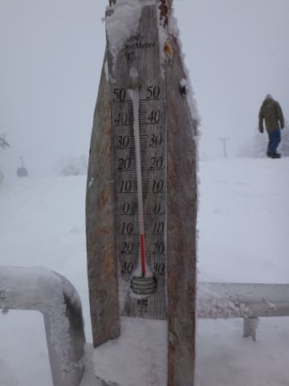

それで，がんがん雪が降り続けるわけだから…

ゲレンデは，結構いい雪で覆われて来ました！

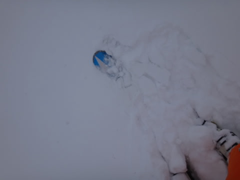

もう，トップシーズンの軽い雪！

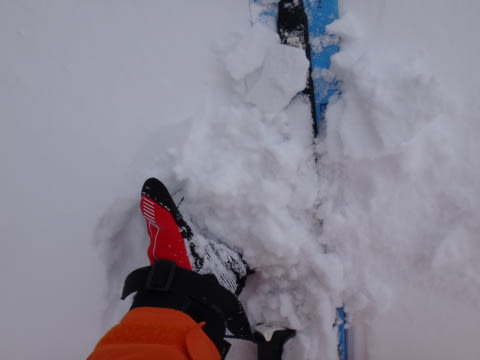

午後になると．

急斜面を除いて，アイスバーンはほとんど隠れて．

ゲレンデ全面，新雪パフパフっ！

…でも．

逆に言うと．

ゲレンデ全面凸凹，とも言う（涙)

そして．

時折弱まるタイミングはあるものの．

今日は一日中雪が降り続け．

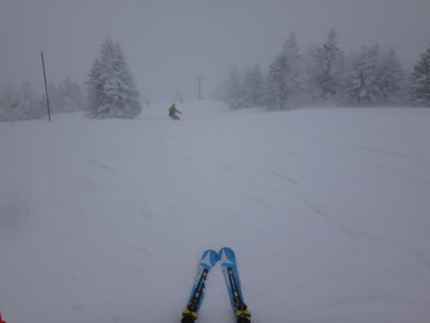

…結局，朝はアイスバーンの上に新雪のちょっと滑りにくい

状況，

午後は雪が降り積もり，ゲレンデ全面ぼこぼこの状況…

という．

やっぱり予想通り，ちょっと残念な一日だったのでした…

＃今日の天気予想は，恐ろしいほどかなり正確に

＃当てたと思うのだけど…なんでこんなあたって欲しくない

＃天気は当てるのかな（涙)．

で．

いつもどおり，リフトストップまで滑って帰ろうと

思うと．

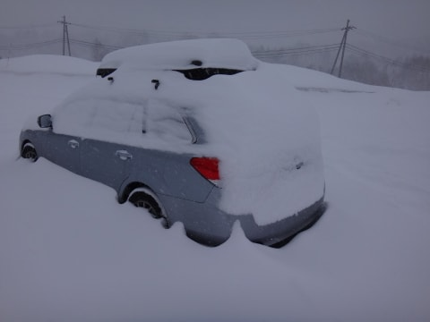

…今日一日で，こんなに積もったのかっ！！

…車，発掘しないと動かせないよ…(超涙)

そして．

本日は悪天候でナイター無し，という

さらに悲しい追い討ちをかけられて，今日という

一日が終わっていったのでした…（激涙） 

まだ降り続いてるので．

明日は新雪パフパフが楽しめそう！！

そして，晴れそう！

明日に期待っ！

PS.

明日は，焼額第2ゴンドラは8時から，第1ゴンドラは

8時15分から運転なので．

いつもどおり，8時半にやってくるとパウダーが食われてますよ～

と，Gokuさんにメッセージを送ってみる．

## 💬 コメント一覧

### 💬 コメント by (aqura)
**タイトル**: Unknown
**投稿日**: 2014-03-21 21:40:59

いゃー、今日はよく降りましたねぇ…。一ノ瀬で滑っていたのですが、何も見えなくなってきたのて、止めてしまいました。ブロ主様の天気予報どうり、明日のてんきに期待します(^_-)-☆

### 💬 コメント by (Goku)
**タイトル**: Unknown
**投稿日**: 2014-03-21 22:34:07

おー２ゴンは８時から動くのですね♪

と言うことは２ゴンで上がってオリンピックコースとかに行けば１ゴンの人より先にＦＴがゲットできると言うことですね。

しかし、私３連休は結局１日しか滑りに行けませｎ(T_T)

土曜日の朝一はまさにパウダー三昧、でもその後はボコボコのバーンが待っていそう。

日曜日は締まった雪が圧雪されて最高のグルーミングバーンが楽しめそう。

うーん、迷ってしまう・・・けど、日曜日かな。

### 💬 コメント by (Skier_S)
**タイトル**: 明日は基本的に晴れ！
**投稿日**: 2014-03-21 22:53:52

>aquraさま

いやー．

ホントに降りましたね～．

私は当然，リフトストップまでコースでしたが，

最後のほうは何も見えませんでした…

コースはぼこぼこだし．

明日は朝はちょっと雲が残るかも，ですが．

午前中から晴れてきますから，

明日に期待！

＞Gokuさま

日曜も，ゴンドラスタートが早くなるようです…

出遅れないようにご注意を！！

