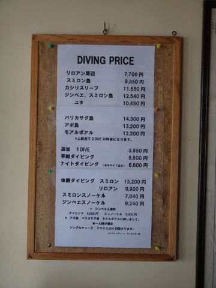
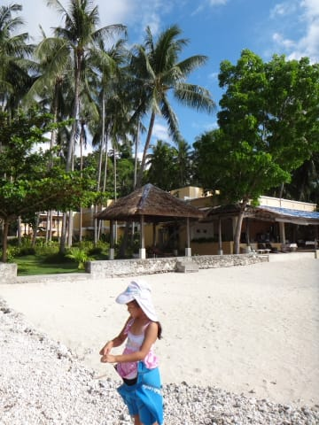
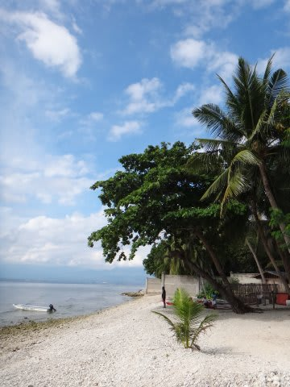

# 2013年11月　フィリピン・オスロブ　子連れでジンベエを見るぞっ！　その4

📅 投稿日時: 2014-07-09 01:28:04

🏷️ カテゴリ: [ダイビング日記](ce3a7a8d424d112fce83ee85c81a0e344.md)

ってことで．

朝のブリーフィング開始ですが．

ガイド　「えー．予定通り本日は，これからオスロブに向かいます…」

私　（をを！予定通り，ジンベエ様見に行けるんだ…っ！）

ガイド　「これからジンベエを見に行くわけですが，

　シュノーケリングとダイビングの方それぞれに

　説明を行います…」

ふむ．

…いかにもノンダイバーといった人がここにいて

不釣り合いだと思ったんだけど…

今回，シュノーケリングの人も結構いるようです．

こんな感じで，ジンベエシュノーケリングも

ちゃんと価格表に入ってて．

結構，シュノーケルで予約する人もいるんだなぁ…

…でも．

実は今回．

妻はダイビングに行くんですが．

…いろいろあって．

私はダイビングじゃなく，シュノーケリングなのだ．

…そして．

なんと．

今回．

娘も，ジンベエシュノーケリングで申し込んだのだっ！

娘にも，ジンベエを見てもらうのだっ！

えー．

こうなった経緯を説明すると．

先日，ですね．

到着後の，今後のダイビング予定確認の際に．

ジンベエダイブの際，子供をどうするかという

話になったわけで．

私　「あのー．幼稚園児でも，ジンベエシュノーケリングって

　参加できるんですか？？」

　（まさか，できないよね～…無理だよね．）

ショップの人　「ええ．できますよ」（あっさり）

私　「えええええええええっ！」

ショップの人　「シュノーケリングの時は，子供用の

　ライフベストを着てもらいますし，シュノーケルもガイドが

　ついて，ガイドが浮き輪もってサポートしますので…」

私　（ををっ！！幼稚園児でも，ジンベエシュノーケリング

　できるんだっ！）

ショップの人　「なので，ご両親どちらかがついてもらえれば…」

私　「あ…やっぱり，両親どちらかがつかないとダメですか…」

　（夫婦でダイビングで，娘だけシュノーケリングってのは

　　無理なのかな…）

ショップの人　「さすがに保護者の方についてもらわないと…」

私　「…だったら，まず夫婦でダイビングに行って，

　ダイビングのエグジット後に，

　娘とシュノーケリングってわけには

　行かないでしょうかね…？」

ショップの人　「…ジンベエを見に行く場合，シュノーケリングと

　ダイビングは同じボートから同時エントリーで，

　ダイビングがエグジットしたらシュノーケルも

　ただちに引き上げますので…ダイビングとシュノーケリングの

　両方は残念ながら，無理です」

私　「…そうですか…（妻を見る）」

　

妻　（私はダイビング！ダイビングよっ！…と，強く目で訴える）

私　「…」

妻　（あなたがシュノーケリングでしょ，と，強く目で訴える）

私　「………．」

妻　「………．」

私＆妻　「…………………」（熱く（？）見つめあい続ける二人）

私　（…ま，負けた…）

　　「…では…私が娘の面倒を見ますので，

　娘と私はシュノーケリング，妻はダイビング，ってことで…」

…という．

夫婦での激しい心理戦の結果，

心優しい私は，妻にダイビングの権利を譲って．

…あー．ここ，大事なところなので，繰り返します．

心優しい私は，妻にダイビングに行かせてあげて．

私と娘はジンベエシュノーケリング，

妻はジンベエダイビング

と相成ったのでした…

