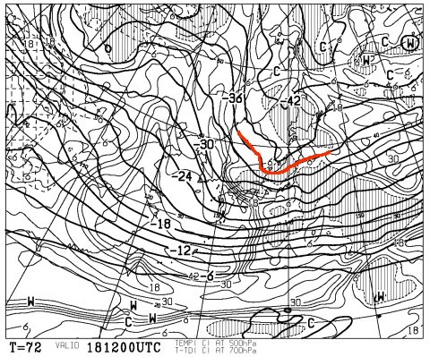
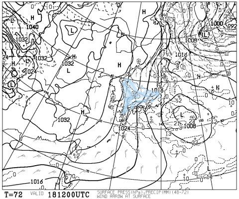
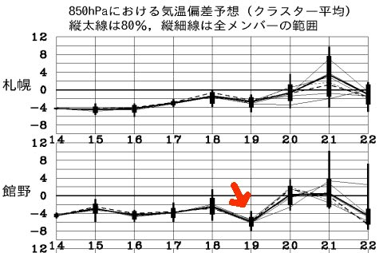
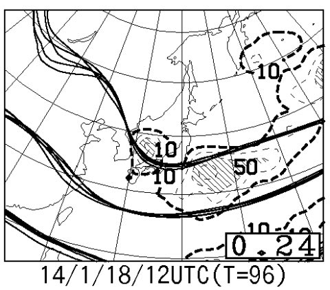

# 定番！この週末の志賀高原の天気は…日曜はパウダーかもっ！？

📅 投稿日時: 2014-01-16 02:25:19

ふーむ．

この週末の天気予想ですが．

…とりあえず，土日とも雪になりそうですな．

土曜朝の積雪は，それほどでもないかもしれないけど．

土曜は終日雪が降り続けて．

特に，夜からかなり激しい雪になり．

…このままの予想なら，日曜朝はパウダーですな！！

18日土曜の夜9時の，500hpa温度を見てみると…

むはーっ！

赤い線で記した，-36度っていう強烈な寒気がっ！

志賀高原まで降りてきてます！

…この，ニュースとかで「上空5000mの寒気」って呼ぶ，500hpa気温．

-30度で結構な雪になり，-36度だと大雪の目安…

これは，大雪になるかっ？？

地上天気図も…

こんな感じで，本州で等圧線がわずかに右に傾いた縦じまになる，

志賀高原でも降るパターンっ！

さらに，青く塗った日本海からの吹きだしの雲が，

見事に日本にぶつかってる様子が…

…これは，おそらく．

土曜の夜は，山陰各地～福岡などの北九州も雪だよ…

で．

矢印でしるした，19日の気温．

平年より6度くらい低い感じで．

…これは，18日夜から19日にかけて，冷えたいい雪が

志賀高原にも積もる，よ・か・んっ！

さらに．

こんな感じで，18日の等圧線予想ばらつきは

それほど大きくなく．

異なるクラスタの予想線が大体重なってて．

スプレッドも0.24と小さいので．

これから予想が大きく変化することはなさそう…

ってことで．

土曜…朝から終日雪が降る．朝の新雪はそれほどでもないけど，

　　　夕方から雪が強くなり始め，夜はどさどさ降る．

　　　午後のゲレンデは，荒れたもさもさ雪になるかな…

日曜…朝は冷えひえパウダーっ！！かなり寒いよっ！

　　　終日降りそう．時々強く降る．

　　　エンドレスパウダー供給デーになるかも．

って感じで．

日曜はパウダーねらい目かなっ！

＃残念ながら，太陽は全く拝めなさそうだけど…
