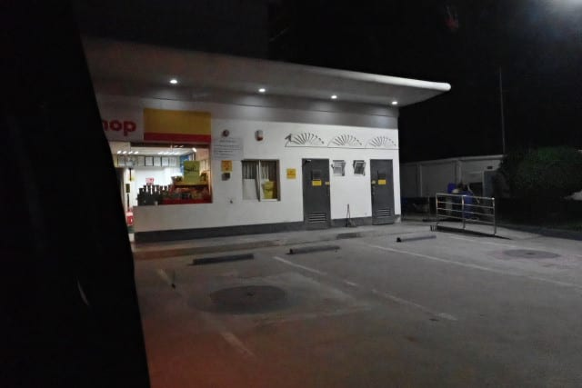

# 2024年8月，5度目の子連れモアルボアル，コロナ後初の海外へ！その3…空港からホテルへ

📅 投稿日時: 2024-10-08 00:37:32

えー．

Garmin様が告げるこの1週間の平均睡眠

時間が3時間半を切っている今日この頃．

…週末を含めてこれはヤバい…

今日はちょっと早く帰れたので，

もう寝ます．寝る．寝ます…（深夜12時過ぎで

早いという時点でいろいろ終わっている）

ってなことで．

早く寝たいのにBlog更新．

今日もモアルボアルの旅行記です！

ーーー

（[前回はこちら](e2892aa0a7866d5c87be3ce8f3f51ac41.md)）

ってなことで．

無事モアルボアルの空港へ到着しましたが，

5年ぶりにやってくると，フィリピンの

入国審査の手続きがこれまでと変わって

いました…！！

1週間前から，入国申請と税関申請をWebで

受け付けていて，スマホで家族全員分を

申請すれば，こんな感じでQRコードが

発行されます．

10分もあれば登録できるので，知らなかった

人は入国審査のゲート前で必死に入力

してました…

で．

入国審査では，このQRコードとパスポートを

見せるわけですが．

いつも通り入国審査で，私のパスポートだけ，

何か警告が出るらしく．

入国審査官が眉をしかめながらPCをいろいろ

操作して，結構時間がかかったものの…

一時期のように，別室に連れていかれ尋問

されるようなことはなく，無事入国！

入国後，荷物を受け取りますが…

荷物にはプライオリティタグが付いてて，

最初の方に出てきました…！

ANAのプレミアム会員だと，ラウンジが

使えるだけじゃなく，荷物もプレミアム扱いで

一番最初に出てくるのね…

ラウンジは使えるけどプレミアムのチェックイン

カウンターは使えないとか，どこまで

ANAのプレミアムの効果があるのかが不明だな…

荷物をピックアップした後の税関も，QRコードを

見せるだけであっさり通過でき，すごい楽に

なりましたね…

空港のお土産屋さんや両替には立ち寄らず，

空港の出口に向かうと．

空港の出口で，モアルボアルまでの送迎車の

ドライバーが出迎えてきてくれているので，

送迎車に乗り込みます…

ここからの道のりが長いんだよな～…

空港からモアルボアルまで，3時間半．

今，現地時間7時なので…

ホテル到着は夜の10時半ごろですね（涙）

家から志賀高原までが4時間なので，

それよりちょっと短いくらいの時間が

かかります．

そして，いつもは空港で円からフィリピン

ペソへ両替するのですが，今回は運転手さんに

お願いして，途中で両替屋に立ち寄って

もらいました．

空港より両替レートがいいだろうと

思ったけど…

確かにちょっとだけレートは良かったけど．

そんなに空港と差がないですね…

せいぜい1-2％の差だったので，時間が

無ければ空港で両替してもあんまり

変わらないな…

朝ごはんはついているので，3人で

4日分のお昼ご飯，夜ご飯と飲み物代．

ダイビングフィーは日本円で払えるので，

3人で1万5000円分くらい両替すれば

いい感じ．

現金が足りなくても，レストランは

だいたいカードが使えるので心配なし．

…4日間の家族3人の飲み食いがこれだけで

済むってのは，安いよな…

ってな感じで．

あとはひたすら夜の道を走りますが…

やっぱりセブの街中．

おしゃれなショッピングセンターがいくつも

できていて．

日本の変な地方都市より便利かも…？？

というくらい発展してたましたね～…

あとでダイブショップの小見山さんに

聞いたところ，やっぱりコロナ期間の

フィリピンの経済投資はかなりすごかった

みたいです…

ただ，郊外は相変わらず．

途中，郊外のガソリンスタンドでトイレと

売店に立ち寄り休憩があって…

あとはひたすら走ります…

でも，かなり郊外の道路まで，車線に

LEDが埋め込まれていたりして．

うーん．日本の地方の道路よりも

すごいかも…？？

ってなことで．

車の中でもほとんど寝てたけど．

現地時間の夜10時半過ぎに，

ようやくホテルへ到着しました…

（[続く](ea52fee8909461fdee188b9de91734555.md)）
