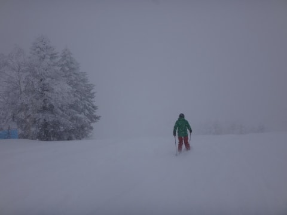
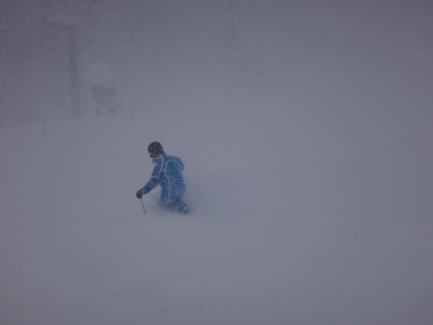
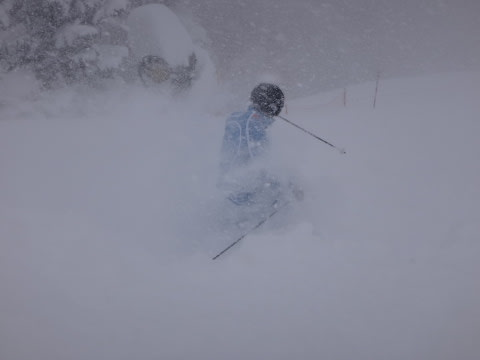
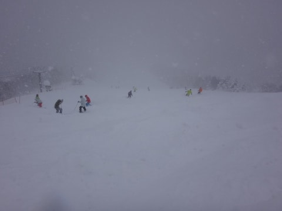
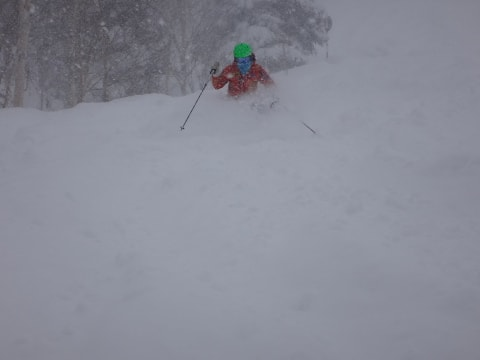
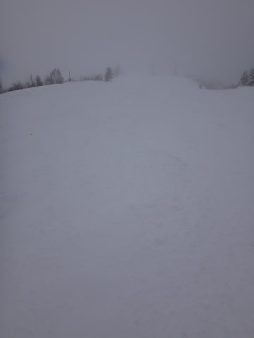

# 1月12日の志賀高原速報モード…終日パフパフデー！

📅 投稿日時: 2015-01-12 23:34:44

えー．

本日も，帰宅が遅いので．

速報モードで…

今日は，朝から予想通りの雪降りの天気でしたが．

昨晩から朝にかけての降りは強烈で，50cm近く積もったので．

朝に圧雪したコースもブーツパフでした…

ここは当然，新雪をいただくために，

オリンピックコースへ向かうと…

こ，これは…っ！

腰パフっ！

顔面にパウダーが降り注ぐっ！！

残念ながら，10時近くになると結構人が

増えてきちゃったけど…

それでも，午後も雪が降り続いたため，

コースによっては，昼頃まで新雪パフパフが楽しめて…

さらに．

午後は．

コースに誰もいないほどのがら空きに！

…ってことで．

今日は一日，おなか一杯パフパフを楽しめた，

超強烈パウダーデーでしたよっ！！！

詳細情報は，また明日…
