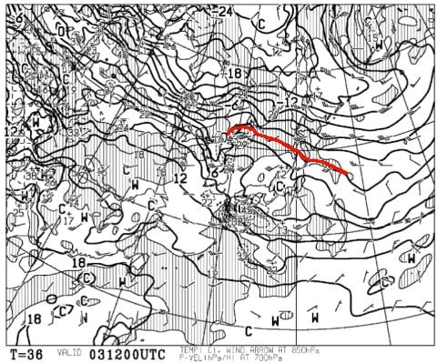
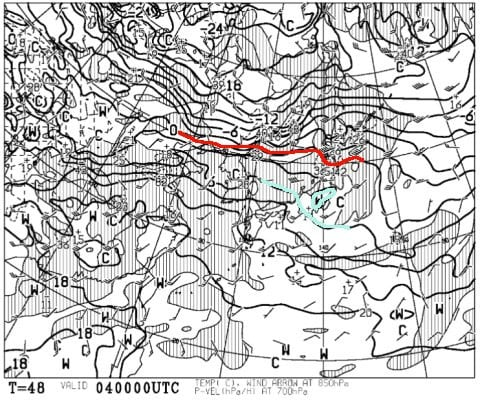
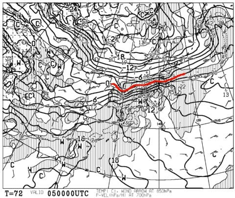
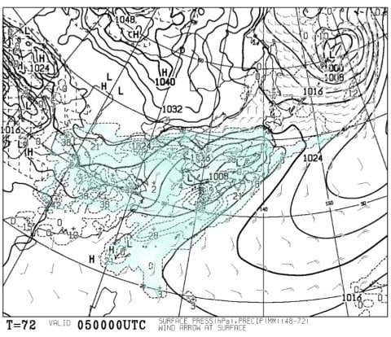

# 今週末も志賀高原だけど…完全春スキーだな，こりゃぁ…（泣）．

📅 投稿日時: 2018-03-02 23:01:14

えー．

やはり本日．

結構気温が下がり，雪がちらついたものの．

積もるほどではなったようで…

明日の朝は，固いバーンの上にうっすら柔らかい雪が

乗ったような状態でスタートでしょうか…

完全なアイスバーンではなくて，上にちょっと新雪が

乗っている分，まだ救われている感じです…

で．

土曜は一日中晴れそうだし．

さらに3日土曜の夜9時の850hpa気温図はこんな感じで．

やっぱり0℃線は志賀高原よりかなり北なので…

昼間は完全0℃を超えて，春スキーっぽい

湿った重い雪になりそう…

ナイターの時，昼間融けた雪がそのままガチガチに

固まったらやだなぁ…

そして．

4日日曜の，朝9時の850hpa気温図は…

やっぱり赤い0℃線ははるか北．

志賀には水色の+6℃線が…（涙）．

朝は放射冷却でわずかに締まっているか

もしれないけど．

朝早いうちから雪は緩み．

昼間は4月のような，ザラメが融けた感じの

重い雪になっていきそう…

まぁ．

でも．

天気は良さそうだから．

気持ちよい春スキーだ

と思って雪質が悪いのはあきらめて，

晴天の下スキーを楽しみましょうか…

しかし．

ホントに怖いのはその次の月曜，5日なのだ！

こんな感じで，850hpaの0℃線は青森付近まで

北上しているだけでなく…

はうぁ！！

日本全域が降水域に覆われてます…

これは．

月曜は．

朝から雨です．

終日雨です．

強い南風が入るので，焼額第2ゴンドラはヤバいか？

奥志賀ゴンドラも営業できない可能性がある，

ちょっと危険レベルという，

高温＆雨＆南風

の3重苦の一日になりそうです…（涙）．

雨は6日まで降り続きそう…

なんてこった…

何の仕打ちだ…

とりあえず．

またここで．

5日，6日は冷え冷え！どっさり雪！！

と書いておけば，冷え冷えになってくれるかも…！？？←そんなわきゃ無い

ってなわけで．

また今週末も，春雪の中．

いつも通り焼額グルグルしている予定です～！
