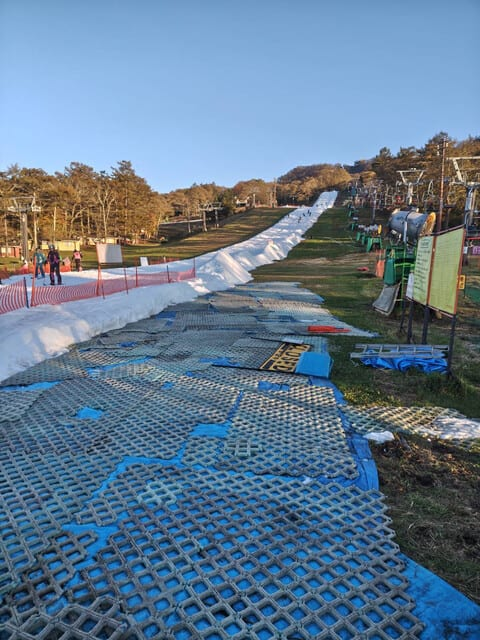

# 11月3日(日)，3連休中日の軽井沢スキー場特派員情報…軽井沢は雨でもゲレンデは耐えたよ！でもイエティは当分運休のアナウンス(涙)

📅 投稿日時: 2024-11-04 00:20:21

えー．

3連休の中日だった本日ですが…

特派員から送っていただいた写真によると，

軽井沢のゲレンデは朝から晴天で，

雨にも耐えて，結構良好なコンディションで

滑れたようです…！

土曜も通常営業して，

土曜に一日中降り続けた雨にも耐え，

金曜日より雪が減ったとはいえ，

この雪の厚みが残っているので．

これからも問題なく営業できそうですね…！

その一方．

大変残念ながら，イエティはここから数日の

営業中止をアナウンスしました…(泣)

（[イエティFacebook](https://www.facebook.com/YetiSnowtown)より）

積雪ゼロから1週間ちょいの造雪で

コースオープンしてしまう驚異の造雪

能力を持つイエティですが．

さすがにこの雨＆高温には耐えられなかった

ようで…

本日のライブカメラを見ると，金曜より一気に

雪が減り，これだと確かに次にいつ再オープン

できるかわからない感じですね…（泣）

（[WNIライブカメラ](http://webcam.wni.co.jp/KAC24326/loop.html)より）

金曜夜の段階で，雪にブルーシートを

かけてない段階でヤバいな…と思いながら

見てましたけど．

やっぱりかなり融けちゃってるよね…

うーん．シートをかぶせて保護しておけば

もう少し雪が残ったと思うんだけど…

当初の予想より6日，7日の冷えは弱まった

ものの．これから8日までは気温が低めで，

雨もそんなに降らなさそうだし．

6日の水曜か7日の木曜ごろには再開して

くれるかな…？？

ということで．

イエティがオープンできないこの3連休．

私は滑りに行けず，3日とも家で仕事を

やっつけることになりました（泣）

そんな中でも，コンディションがよさそうに

見える3連休中日の本日の軽井沢．

雪もかなり残ってますね…

昨日の雨は，軽井沢近辺はそこまで

ひどくなかったのかな？

ちなみに，リフト待ちは朝10時台に

プリンスリフト20分待ち，栗の木リフトは

15分待ちというアナウンスが流れていた

ようですが．

まぁ，晴天の3連休中日で，軽井沢しか

滑れない状況の割には予想より混んでない

ですね…！

バーンは硫安が効いていてしっかり

硬かったみたいですが，

昼過ぎになると荒れ始めてきて…

午後は結構雪が削られてきてますね．

ちなみに昼頃からリフト待ちは短くなり，

5-10分待ちくらい．

ただ，夕方に向かってバーンはかなり

ボコボコになっていき…

全面コブっぽくなり，コブ溝には一部

土が出てきたところもあったみたいです…

そのせいで，ラストのころはリフト待ちも

かなり短くなっていたようですが．

でもまぁ，土が出てきているのはわずかだし．

営業終了までこんなコンディションだったので，

これからの冷え込みでバーン状況も改善

していくだろうし．

軽井沢は今後も問題なく営業できそうですね～！！

一瞬，明日は軽井沢に滑りに行こうか？？

…とも思ったけど，

軽井沢は駐車場代もリフト代も高いし，

ちょっと仕事が詰まってることもあり，

時間をかけてまで行くのが辛い感じなので…

イエティがオープンしないこの3連休は，

家でじっと仕事してます…（涙）
