# 1月27日土曜の志賀高原は…終日激寒の雪降りなれど，朝の積雪は5cm（涙）．パウダーデーじゃなかったよ…

📅 投稿日時: 2018-01-28 00:53:19

ってなわけで．

今日も志賀高原で滑ってきたわけですが．

…朝，志賀高原に来るまでは，少なくとも

ブーツパフだと思ってきたわけですが．

…全然積もってませんでした（涙）

とりあえず，朝．

本格積雪路を登って，志賀高原へ向かうわけで．

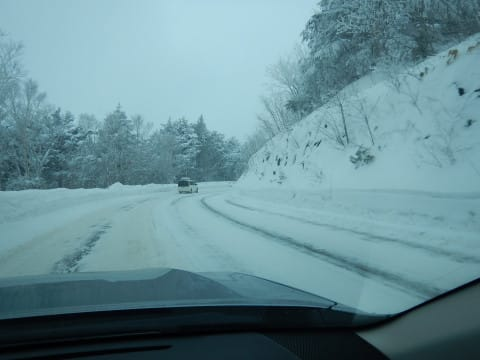

…先週に比べると，路面に雪が積もってるよ！！

これは新雪に期待っ！！！

…と，だれもが思うわけですよね．

ええ．

で．

いつも通り，朝イチのゴンドラに並び．

山頂に来るわけですよね．

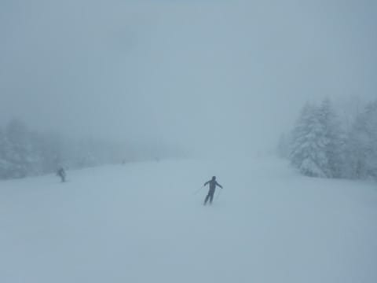

そして，シンシンと降る雪を見て．

さらに，圧雪コース上にも新雪が乗ってるのを見て．

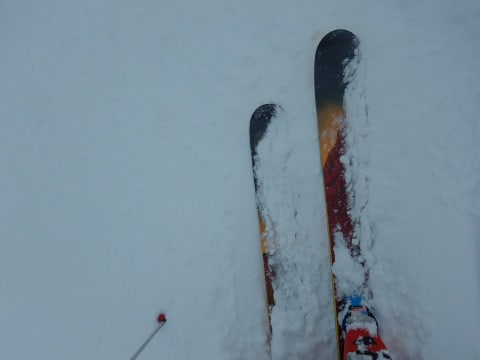

そのうえ，気温が-16度と激冷えなのを見て．

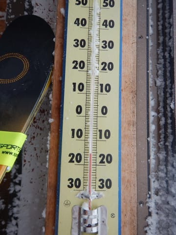

これは今日はパフパフパウダー，

膝パフといわないまでも，ブーツパフ

くらいはいける！！

と，思うわけですよね．

普通は．

で，太板を履いて，ワクワクでオリンピックコースに

飛び込むわけですが…

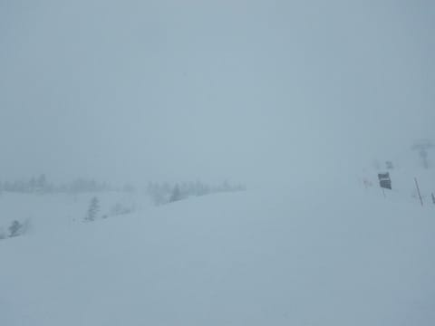

んん？？

…これだけ？

積雪，たったこれだけの深さ？

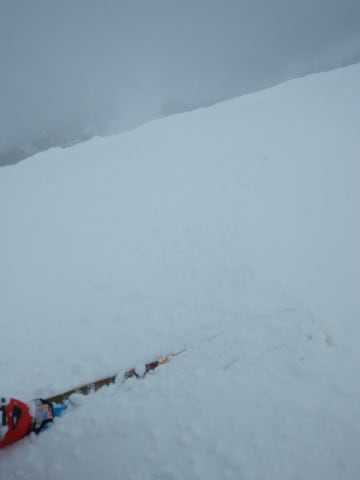

…ブーツパフ，あわよくば脛パフを期待して．

まさかの積雪5cm（涙）

なんてこった～！！

せっかくのパフパフデーだと思ったのに…（泣）

こんなの太い板，要らない！

速攻で大回り板にチェンジ！！

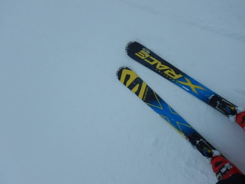

と，板を変えたけど．

奥志賀はゴンドラ，第2高速ペア，第3高速ペアが動かず．

ほぼ全面運休になるほどの強風＆悪天候（泣）．

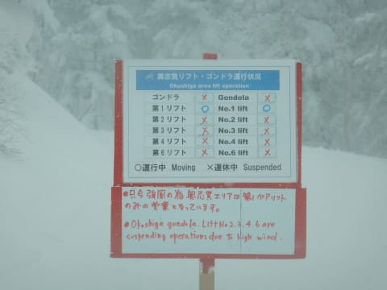

だもんで．

奥志賀から流れた人も多く，

10時ごろにはちょっと人も増え始め．

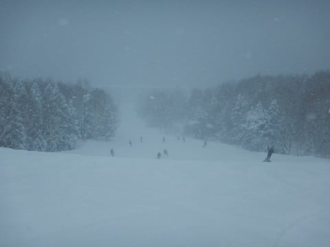

そして，雪も本格的になり，視界も悪くなってきました…（泣）

」

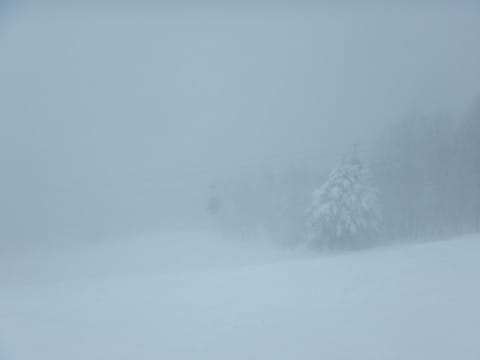

ぱふぱふパウダーがたらふくいければ，

雪降りもいいんだけど．

全然パウダーがないのに，雪ばっかり降るとは…

どういうこと？？

で．

と，いつものイチゴンをグルグルしてたわけですけど．

午前中は，まだ元気な人がいて，

ゲレンデ人口密度は高めだったけど．．

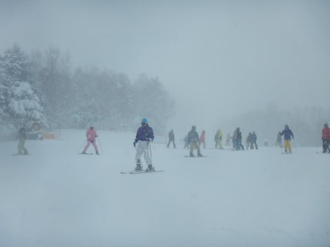

でも，第1ゴンドラはそれほど列がつくほどではなく．

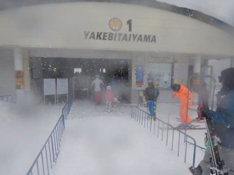

時折せいぜいゲートの外にぎりぎり人が並ぶ程度．

…さらに．

もう，今日は終日視界が悪めで．

さらに風も強く．

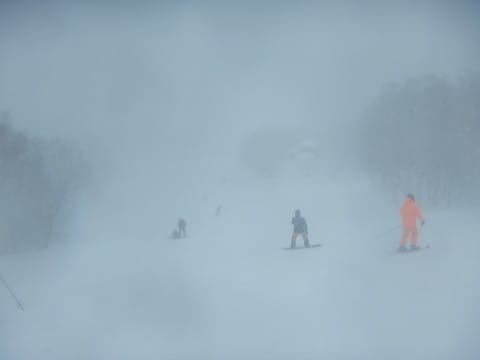

昼間も気温が-12度と，激冷えの一日で．

リフトに乗ると凍死しそうなほど寒かったので．

…多くのスキーヤーは昼頃に．

「寒いから，帰るか～」

と思ったのか，午後はガラガラ！！

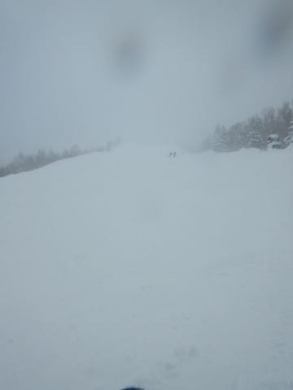

気温は激寒なので，夕方まで雪質は最高．

さらに，先週までの下地の硬いのは完全なくなり，

雪は激烈にいいです．

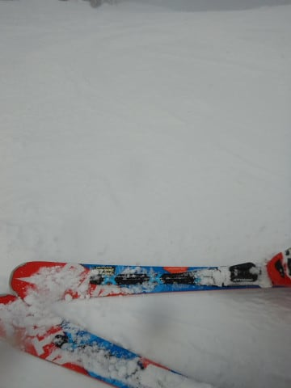

こんな雪質のいいゲレンデを．

午後はほぼ貸し切りに近い状態でした…

ってことで．

いつも通り，16;15のヤケビ営業ストップまで滑った

あとは．

はい．

ナイターです！

それも今日は魅惑のサンバレーナイター！！

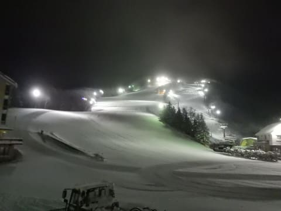

長いクワッド一本で，効率よく滑れて，最高！

そして…

圧雪をかけなおした，シマシマバーンは最高！

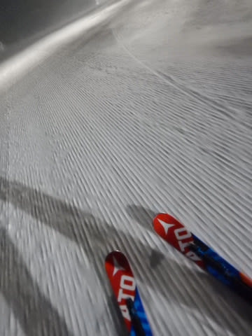

さらに…

冷え冷えで雪質も最高！！

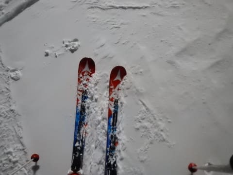

ってなわけで．

全部のお客さんを集めても，

10人も滑ってないのでは…？？

という，ガラガラナイターを，思いっきり

満喫してきたのでした…

終日天気は雪降りで，凍傷になるかと思うほど

寒かったけど．

うーむ．

雪質は良かったし．

ガラガラだったし．

まぁ，楽しめた一日だったとしておこう…

## 💬 コメント一覧

### 💬 コメント by (yumi)
**タイトル**: 残念でしたね。💧
**投稿日**: 2018-01-28 06:09:11

Sさぁ～ん。

昨日、ルンルン😃🎵で太板を運んでいるＳさんがまだ見えてます。

今日は多分、美しいシマシマダウンヒル、８時オープンからのスタートです。

それでは、また、後程お会いしましょう🎵

### 💬 コメント by (ほっぽ)
**タイトル**: 昨日
**投稿日**: 2018-01-28 06:20:56

Ｓさん

昨日チラッとお見かけしましたがタイミング悪くご挨拶できませんでした。

私も太板出動したのにアレレって感じで板チェンジして滑ってました。

今日もヤケビスタートなのでお会いできたらよろしくお願いします。

### 💬 コメント by (Goku)
**タイトル**: Unknown
**投稿日**: 2018-01-28 09:06:05

おはようございます。

志賀高原はいい天気のようですね。

雪も冷え冷えで最高なのでは…

ウ～、滑りたい‼ 

ちなみに某県は薄曇です。

### 💬 コメント by (michi)
**タイトル**: Unknown
**投稿日**: 2018-01-28 09:46:42

昨日は朝一しかお会いしませんでしたね。

雪質最高でしたが、何しろ寒いし視界は悪いしで息子も自分も午後は心折れて早めにあがりました。

ラスリフの時間には家に着いてました（笑）

またご一緒お願いいたします。

### 💬 コメント by (ほっぽ)
**タイトル**: お会い出来ました。
**投稿日**: 2018-01-28 11:27:06

先ほどは偶然にも一ゴンでご一緒できありがとうございました。

お仲間の皆様にもよろしくお伝えください。

### 💬 コメント by (はなげ親分)
**タイトル**: 富良野に遠征です
**投稿日**: 2018-01-28 22:27:56

昨日はいまいちの天気だったようですね～

本日の富良野は午前中は晴れて、圧雪の上に15cm程の積雪があり高速大回りで降りて行く超気持ちいい～コンディションでした。

あしたは最高気温－11度の予報です！

来週は友人との志賀復帰となります。

友人共々よろしくお願いします♪

### 💬 コメント by (かず)
**タイトル**: Unknown
**投稿日**: 2018-01-28 23:45:57

本日は初のシャトルバス5回乗って奥志賀でした　大変でしたが楽しめましたよ

### 💬 コメント by (Skier_S)
**タイトル**: 今日は良かった…
**投稿日**: 2018-01-29 03:04:04

＞yumiさま

いやー．土曜朝は絶対積もってると思ってたんですが…

残念でした．

今日は奥志賀が動かなくて大変でしたね～．

ここしばらく，奥志賀運休率が高い気がします．

＞ほっぽさま

今日は無事お会いできましたね～！

でも，最高の一日でしたね…

また来週お会いしましょう！

＞Gokuさま

今日の朝礼欠席者には申し訳ないのですが．

本日は，最高でした．

晴天で冷え冷えシマシマと，

これ以上はそうそうないコンディションでした…

また今週末もコンディション良さそうなので，

今週末にお会いしましょう～！

＞michiさま

土曜はかなり厳しいコンディションでしたね…

一緒に行った仲間も，ゴンドラ以外は無理，

リフトに乗ったら死ぬ…と言って，

全員でひたすらイチゴンだけ滑ってました．

しかし，昨日はそんなに早く帰ってらしたの

ですね…

土曜の午後は，同じような人が多かったのか

だんだんゲレンデの人がいなくなっていくのが

面白かったです…

＞はなげ親分さま

富良野ですか！

もう10年以上行ってないなぁ…

しかし，志賀でも土曜は最高気温が

-10℃程度だったので，富良野は

寒いでしょうね…

楽しんできてください！

＞かずさま

え？？

シャトルバス5回？？

ゴンドラが動いてないダウンヒルコースを

グルグルですか！？？？

でも，誰も滑ってないコースなので，

新雪ぱふぱふだったでしょうね…

