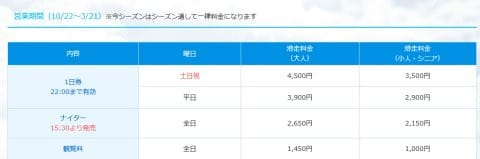
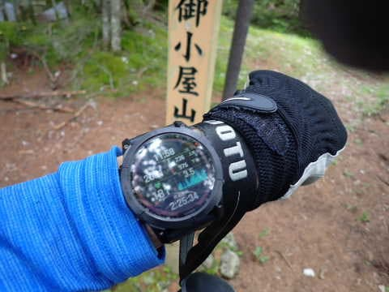
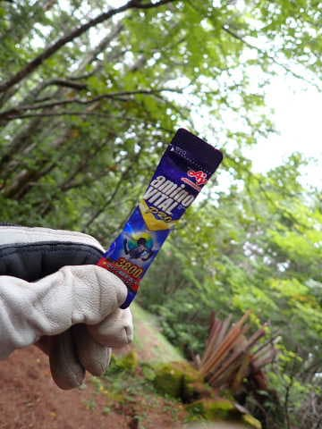
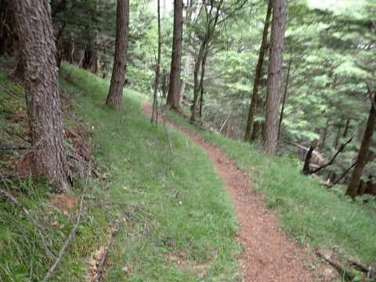
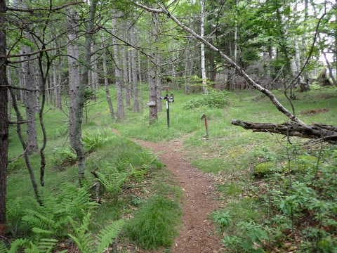
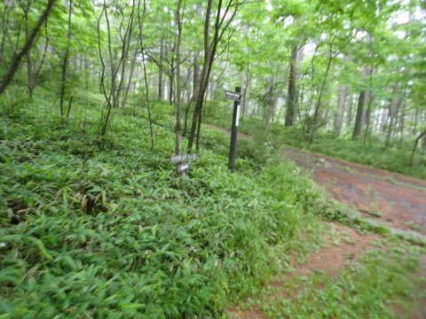
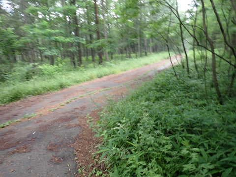
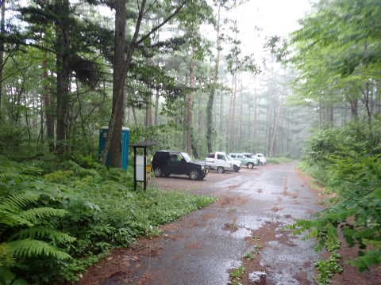
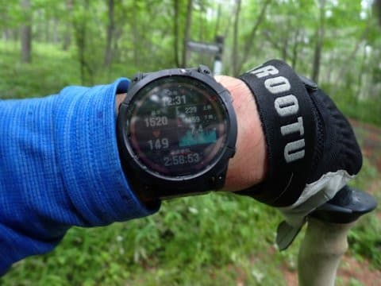
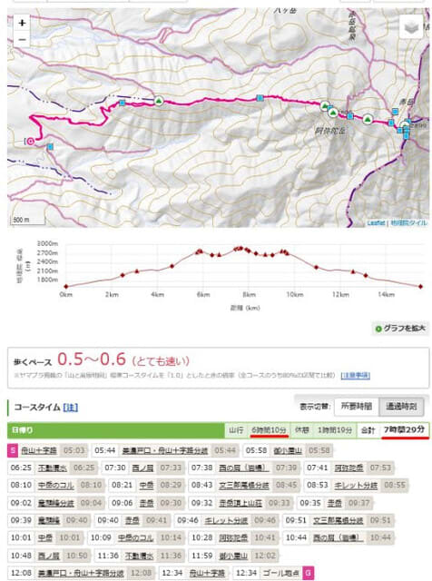

# 八ヶ岳の阿弥陀岳・赤岳ピストン登山！その10…無事下山！下山と同時にどしゃ降り！！ヤバかった…

📅 投稿日時: 2022-10-17 00:34:23

えー．

イエティの今シーズンの[詳細な営業情報](https://www.yeti-resort.com/service/)が

出ていましたが…

今シーズンも，営業初日から2月25日まで

毎日，夜10時までナイター営業してくれて．

それ以降も3月いっぱいは土曜のみ夜10時まで

ナイターをやってくれるようです…！

そして，土日祝日は朝9時から，

平日は朝10時からの営業開始となります…

一昨年，「祝日は朝10時から」という

[トラップにひっかかった](d20201104.md)ことがありますが．

今年は昨年同様，祝日も土日同様，9時から

営業開始です～！！

一時期，夜9時にナイター終了になりましたが．

このご時世にもかかわらず，ちゃんと夜10時まで

やってくれるとはありがたや…

ただ，やっぱりリフト券は値上がりするようで．

平日一日券：3500円⇒3900円

土日祝一日券：4000円⇒4500円

ナイター券：2500円⇒2650円

と値上がりしてますね…（涙）

（[スノーパークイエティホームページ](https://www.yeti-resort.com/service/)より）

そして．

昨年同様，初滑り時期の割引料金は無いようです…

メルマガに登録すれば毎回400円引きになるという

ことですが．

昨シーズンはメルマガ会員カードを持ってる人は，

来場2回目だとか5回目とかの節目で半額割引が

あったけど．

今シーズンは無くなるのかな…

でも．

とりあえず．

あと1週間でシーズンインです！！

ちゃんと10月20日前後でオープンしてくれることに

感謝！！！

…って前フリのあとは．←いつもながら，スキーBlogとしてはこっちの方が本題なんじゃないの？

本題へ．

しばらく中断していた阿弥陀・赤岳登山レポートの

続き．今回が最終回です！

ーーー

ってなことで．

阿弥陀岳⇒中岳⇒赤岳⇒中岳⇒阿弥陀岳と

激しいピストン行程を終えて，

最後の阿弥陀岳から駐車場へ向かう

ラストスパートに入っていますが…

ちょっと足に疲れが来はじめて，

あまりペースが上がらない中．

阿弥陀岳山頂から1時間20分ほどの

11:58に御小屋山に到着！

…あれ~？？

阿弥陀岳からここまで標準コースタイム

1時間35分なのに…

1時間20分もかかったか（涙）

やはり，阿弥陀岳2回登ったのが

効いてるな…（泣）

ここから駐車場まで，まだ標準コースタイムでは

74分もあるし．

ちょっとエネルギー切れ感もあるので，

ここで，アミノバイタル投入！

でも，今にも雨が降りそうで．

ゆっくり休んでるとヤバそう…

ここはアミノバイタル補給&給水の3分だけの

休憩で直ちに出発！

ここから先は，こんな感じのハイキングコース

みたいな緩やかな歩きやすい道なので．

疲れてはいるものの，小走り気味に

ペースアップして下りていけます…

そして．

もうすぐ駐車場というところまで

走り続けたところで…

…うわ．

来た．

ついに来た！！

ぽつ，ぽつと降り始めてきましたよ…！！

まだポツポツだし．

致命的な降りにならなきゃいいけど…

大降りになったらヤバいので，

さらにスピードアップ！

そして駐車場まであと残り100mという

あたりの，林道との分岐までやってきた

ところで…

ついに，

パラパラパラパラ…

と強い降りになり，

アスファルト路面がぬれ始めてきました！

ただ，ここまで来れば駐車場は見えてる！

全力疾走して，どしゃ降りになるのと

ほぼ同時に車に到着！！！

間に合った～！！

いや．

ヤバかった…

ホントにヤバかった．

あと1-2分遅かったら，びしょ濡れになってた…

ホントにきわどいタイミングだった…

…でも．

こんなピッタリ，どしゃ降りになる直前に

車にたどり着けたって．

ペース配分とか途中の休憩時間がちょっと

でもずれてたらヤバかったってことで．

いや．

私のペース配分が実に素晴らしかったんだな！！←いや，ただの偶然だから．

ってなことで．

きわどいタイミングで，12:30過ぎに下山．

赤岳山頂から約3時間，阿弥陀岳山頂から

1時間50分で降りてきました…

いや．

最後は飛ばした．

御小屋山から駐車場まで，標準コースタイム

74分を，30分で降りました…

おかげで，ずぶぬれにならずに済んだけど．

ちょっと疲れ気味だったけど，

「まぁ，急がなくていいか」

とゆっくり歩いていたら…と考えると．

恐ろしい…

（ちゃんとレインウェアは持ち歩いて

いますが，あまり雨の中歩きたくない）

ってなことで．

ヤマレコの標準コースタイム10時間30分のところ…

さすがに阿弥陀岳2回登り返したこともあり．

トータル7時間29分もかかりました…

丹沢や蛭ヶ岳の4時間半に比べれば，

後半疲れてたのもあり，かなり時間が

かかりましたね．

でも．休憩を除いた山行時間では6時間10分で，

歩くペースは0.5~0.6ですか…

そんなに速かったイメージは無いん

だけどな？？

とりあえず．

2年ほど前までの2年間．

山の下りで毎回膝が痛くなって．

コースタイム3時間20分のところに

5時間20分かかった

とかいう[悲しい経験](ea2ea1081ec82f7e9317b70572fc5a44c.md)が続いていて．

「もう，コースタイムが長い山には登れないのかも…」

と，悲嘆に暮れていたけど．

これだけのコースをかなり早いペースで

行ってこれるようになったので…

膝サポーターやらトレッキングポールの

おかげで，登山の膝の痛みからは

完全復活

したようです…！！

## 💬 コメント一覧

### 💬 コメント by (ねも)
**タイトル**: 阿弥陀岳経由で赤岳往復!?
**投稿日**: 2023-08-05 09:32:16

初めまして

あちこち超快足の山日記、ワクワクしながら読ませてもらいました。真夏の丹沢は暑くて死にそうですが、大丈夫でした？

阿弥陀岳は何回か登りましたが(2014年９月に御嶽が噴火した翌日が最後)、すべて中岳側からピストンです。

中岳側からもうわっという絶壁ですが、反対側はもっともっと凄いんですねΣ（・□・；）

「私のペース配分が実に素晴らしかったんだな！」

↑そのとおりです(拍手)　40歳すぎくらいかと推測しますが、韋駄天ぶりに脱帽！(私なら、阿弥陀岳登頂でミッション終了ですね、笑)

私も40年前の20歳代のころはコースタイムの７掛けくらいでしたが、若者じゃないのに素晴らしいです。

以後、贔屓にさせてください。

少しでもお仕事に余裕ができて、スノーライフも山ライフもいっそう楽しまれることを願っています。

### 💬 コメント by (Skier_S)
**タイトル**: ＞ねもさま
**投稿日**: 2023-08-06 10:52:24

初めまして！

コメントありがとうございます～！

ようこそ，この駄文置き場へ…

阿弥陀岳，急登が続くのはやっぱり中岳側からのほうです．

ただ，その反対側はちょっと岩場を越えなくてはならないポイントがあって，

ところどころザイルが張ってあるところがある程度で，あとは中岳側に比べれば緩斜面です…

私の場合はスキーシーズンのトレーニングを兼ねて

歩いているので，

スピードハイクは邪道な山歩きと思いながらもハイスピードで歩いてます…

本来は山は景色や自然を愛でながら，ゆっくり歩くのが良いと思っています（笑）．

これからも山，海，スキーとアウトドアネタ満載していきますので，御贔屓のほどよろしくお願いします…

