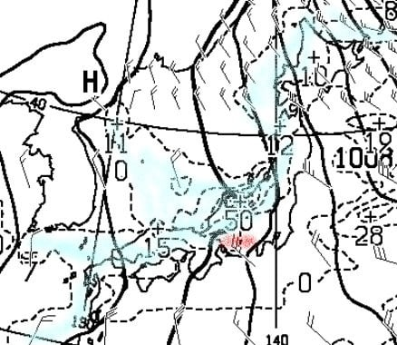

# 今日も朝更新…1か月予報は引き続きスキーヤーに嬉しい冷える12月の予想！そしてこの日曜はスキー場に雪が積もる！

📅 投稿日時: 2024-12-06 08:52:38

最近いろいろクリティカルな日々が続き．

昨日も気づいたら床で意識を失ってました…

だもんで，今日も朝に手短に更新！

まず．

皆さんご存じ，木曜発表の気象庁1か月予報

ですが．

引き続き12月は冷えそうという予報です～！

北日本の日本海側の降雪量は平年より

多い確率が50％だし．

1週目，2週目の東日本の気温も平年より

冷える確率がそれぞれ50％，60％と，

冷えそうな予想ですよ～！！

12月いっぱいはスキーヤーにとって安心

できそうな予報です…

そして．

8日の日曜の天気図を見ると…

うはーーー！！

縦縞の見事な冬型の天気図になってます！

日本付近を拡大すると…

北風なので，志賀高原にも降りそう．

新潟近辺は50という数字が見えるので．

降水量50mm．積雪量なら50cmになる

感じなので…

これ，土曜の夜から本格的に降りはじめ，

日曜は一日雪が積もりそう！

もう1日早ければ，日曜にオープンする

ゲレンデが増えそうな感じだったので，

ちょっと惜しいけど…

土曜は志賀は5-10cm，

日曜は20cmか，それ以上積もるかも？

という感じで．

今週末から志賀高原ですが，

いい感じになりそうな予感…！

## 💬 コメント一覧

### 💬 コメント by (レインボー77)
**タイトル**: Unknown
**投稿日**: 2024-12-06 13:08:43

金曜日の志賀高原情報

朝の高天は-3℃、曇りのち雪。気温が下がっていくので人工降雪機フル稼働です。頼もしい！

寒さに慣れていないうえマスクや手袋を忘れたため、寒くて寒くて、ガスも出てきたので、11時過ぎに終了(どうせその時間にやめるよね)。

明日はどこも雪が積もって楽しそうです。どこで滑るか悩ましい。

### 💬 コメント by (Skier_S)
**タイトル**: ＞レインボー77さま
**投稿日**: 2024-12-07 01:01:16

土曜朝までに積もりそうですね～！

ゴンドラが動くほど積もってくれるといいのですが…（無理）

でも，日曜も積もりそうなので，日曜には2高か2ゴン動いてくれるといいなぁ…

週末お会いしましょう！！

