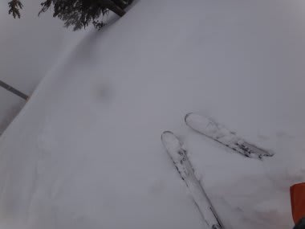
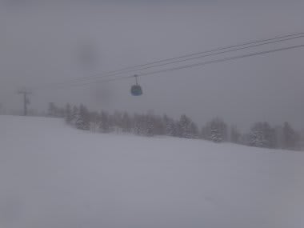
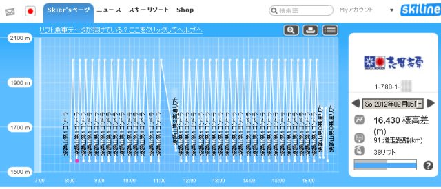
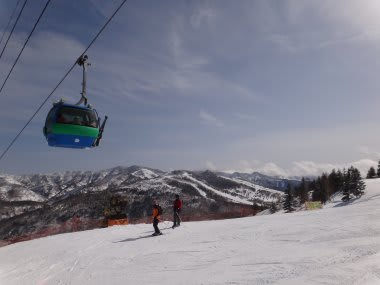

# 焼額第1ゴンドラ営業終了…今シーズンもお世話になりました

📅 投稿日時: 2012-04-03 01:10:08

ということで．

この4月1日をもって．

我が愛する焼額第1ゴンドラの営業が終ったわけですが．

雪はまだまだまだまだいっぱいあるし．

コンディションもいい感じだし．

これで営業終了は，もったいなさ過ぎる…

でも．

これで，来週から．

もうジャイアントスラロームコースも．

オリンピックコースも滑れないんですね…

寂しいなぁ．

で．

はっきりいって，焼額第1ゴンドラを愛しすぎている私は．

シーズン中，子連れのとき以外はこのゴンドラをメインに

滑り続けているわけですが．

今年から志賀に導入されたSKILINEを使って，

今シーズン，一体焼額第1ゴンドラに何回乗ったのか数えてみました．

…数えてみました．

…（暇なヤツだとお思いでしょうが）

さて．

私は今シーズン，焼額第1ゴンドラに何回乗ったと思いますでしょうか．

100回？

200回？

正解者には，豪華商品をプレゼント…

するわけにもいかないので．

とりあえず，ここで回答をばらしちゃうと．

510回でした．

うーーーん．

子供連れの日は一の瀬を滑ることが多くて，

焼額をほとんど滑らない日もあったりするんだけど．

それでも，シーズンで500回以上も乗ってるのか…

とりあえず．

こんなに愛して止まない第1ゴンドラが終了すると．

シーズンはもう終盤って感じがしますね．

お世話になったね～第1ゴンドラ．

また，来シーズン戻ってくるからね～っ！

でも．

今週末からは．

焼額第2ゴンドラをぐるぐるするのだ（笑）．

## 💬 コメント一覧

### 💬 コメント by (雪上の翁)
**タイトル**: 凄い Part2
**投稿日**: 2012-04-03 23:06:47

ヤケビ第1ゴンドラ、私も好きです～^^

今までに乗ったゴンドラの中で、

一番乗り心地が良いと思います！

でも、510回って。。。

間違いなくチャンピオンですね。

多分私は20回くらいかな。

第2ゴンドラは、ちょっと狭くてテールが太いと刺さらないのが玉にきず、ですよね(笑)

### 💬 コメント by (Skier_S)
**タイトル**: 多分もっとすごい人がいると思う…
**投稿日**: 2012-04-04 00:27:03

焼額には，私がいつ行ったときにも

必ず滑っている人がいて，

その人もかなりのペースで滑っているので，

おそらく私よりすごい人がいると思います…

私にとって焼額第2ゴンドラの欠点は，第1ゴンドラより遅いことです(笑）．

第1ゴンドラなら乗車時間約7分で1サイクル13分．

第2ゴンドラは乗車時間9分で1サイクル15分かかります．

第1ゴンドラは1時間で約5回乗れるけど，第2ゴンドラは4回が精一杯…

だもんで，第1ゴンドラの方が好きなんです…(^^;

