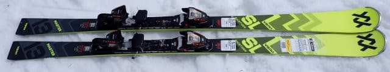
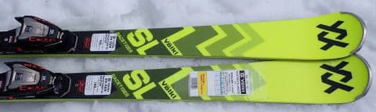
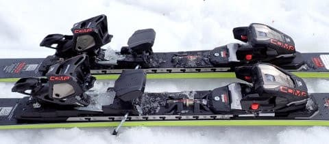
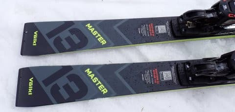
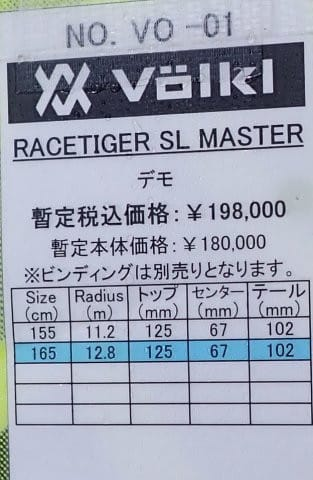

# 2025シーズンモデルのスキー板，試乗レポートその32…VOLKL RACETIGER SL MASTER

📅 投稿日時: 2024-07-20 01:25:22

🏷️ カテゴリ: [スキー板試乗](c0bd8048615710cee890e403a36cc9a2b.md)

えー．

[昨日のChatGPTネタ](e72bdf04a8fb4ea7570c1d8fc5e4c4c1e.md)．

Skier_Sの本名がTatsuyaなんじゃないか

という疑惑がありますが…

いや．全然Tatsuyaじゃないです．

全く違いますから．

ってか，ChatGPTさんが，このBlogで

一度も晒したことのない私の名前を知って

いたら，それはそれで夜も寝られなくなる

怖い話だと思うのですが…

しかし．

ChatGPTがこのブログを知ってました～！

こんなこと言ってます～！

って程度のネタのつもりだったのに．

あそこまで見事にオチがつくとは

思ってなかった…

ChatGPT，実は笑いを取る機能も仕込まれて

いて，狙ってウケを取りに行ったのかも？？

ってなことで，本題へ．

今日は2025シーズンモデルのスキー板

試乗レポート．

今回はフォルクル編です！

〇VOLKL RACETIGER  SL MASTER 165cm 

基礎小回り

基礎小回り用のトップモデルとなる，

RACETIGER SL MASTERですが．

ごついピストンプレートにメタルが

しっかり入った強い板という，

基礎小回りというより，SL競技用と

言ってもいいレベルの板です…

滑ってみると…

おっと．やはりこの板，基礎用としては

かなり強めで，乗り手を選びそうな板です…

が．

私はこういう板，大好きなんですよね…！！

谷回りの早い段階からエッジがガッツリ

しっかり食い込んで強烈にグリップして，

高い旋回性で板が回り込んできます．

朝の硬さが残っているバーンでも，

板がクッと食いついて，トップが弧を

描くように鋭い旋回性で板が内側に

回り込んで来ます．

山回りを仕上げると，かなり早くて強い

反発力で板が返ってきて，鋭い切換が

できる板．

硬い斜面でも急斜面でも，どんな斜面でも

板がガッツリグリップして，ちょっとや

そっとじゃグリップが外れたり板が

流されたりしないので．

この鋭い切換で谷回りに入った後，すぐに

カツンとグリップしてくれて，谷回りから

安心して板を強く踏み込んで行くことが

できます．

谷回りから強い踏み込みができて，

板にきれいなたわみが出せるとともに，

強烈グリップ＆強い旋回力でクルンと板が

回ってきてくれるし．

強い踏み込みで板に溜まった圧が，

早くて強い返りとなって解放され，

板の返しもすっと決まるので．

かなり力強い小回りができますね…

板のフレックスが結構強いので，

スピードを出しても板がたわみ切って

しまうことはなく．

スピード耐性は十分高いです．

すくなくともこの日試乗した中では，

板の速度限界というのが全く見えない

感じで，スピードが出て怖いと思う

ことは全くなかったです…

超ハイスピードの中でも，板は微塵の

ズレもなく，鋭いターンを続けて

いきます．

ただ，板のフレックスは強めだけど．

旋回性がかなり高いので，

たわませなくても結構小さい半径で

回っていきます．

反応の早さもあり，小回りスペシャルという

感じで，中回りや長めに引っ張るターンが

苦手かな…

というより，この板を履くと，ひたすら

気持ちいい旋回性に身をゆだね，

快感度の高い反発力を上手く使って，

ヒュンヒュン小回りをするのが楽しい

感じ．

小回りスペシャルです．

小回りをひたすら楽しむ板です．

ものすごい気持ちいい小回りができます…

スピードレベルが高く，結構強めな板が好きで．

ゲレンデを攻め攻めのハイスピードで気持ちよく

小回りをかまして行きたいよね…

という人は，間違いなくこの板を気に入ると

思います…！！

ただ，小回りを強制する要体力の板なので．

一日この板を履いていると疲れるかも…
