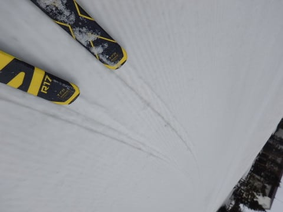
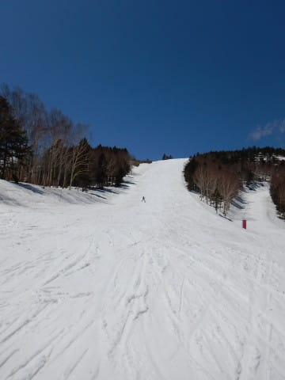
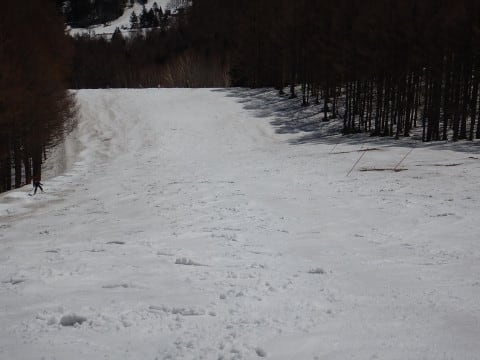
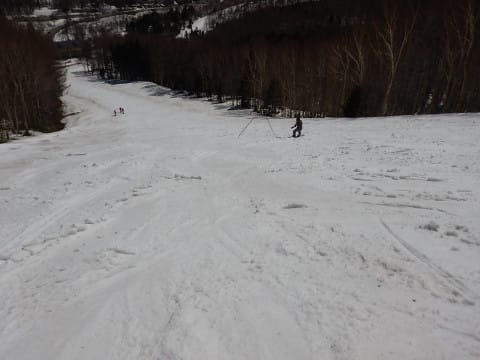

# 2019/5/2(木)，GW10連休6日目の志賀高原スキー場は…朝一瞬小雪，その後晴れ！気温は低め．雪はまだまだたっぷりあるよ！

📅 投稿日時: 2019-05-02 21:19:21

ということで．

昨日は深夜3時に志賀高原から

帰宅したわけですが．

Blogを書いたりなんだりで，

明け方の5時にようやっと布団に入り．

そのまま夕方まで死んだように寝て．

板の手入れ＆夕食＆風呂だけ済ませて

夜10時ごろにまた寝て．

そして，本日朝2時に家を出て．

早朝スタートまでに，

志賀高原に舞い戻ってきました～！

ってなわけで．

自宅滞在時間23時間で，

また志賀高原へ戻って来た，

Skier_Sです．

えー．

本日の志賀高原レポートにいくわけですが…

まず，朝．

志賀高原に登ってくる道で．

すでにガス＆雨（涙）

…なんだか，ヤバい感じ…

で．

朝6:30ぎりぎりに焼額に飛び込むと…

予定より5分ほど早くゲートが開いたようで．

すでに出遅れ状態（涙）

慌ててゴンドラに乗ると．

…無情にも，雨粒がゴンドラの窓を

叩きます（泣）

…雨だよ（涙）

山頂の気温は，ぎりぎり0℃．

そして，山頂も…

雨です（涙）

一応，雪は締まり気味の，エッジが

いい感じで噛むシマシマなのですが…

ぽつぽつ雨粒が落ちてくるのが，

ちょっとテンションを下げます（涙）

と，思っていたら．

ゴンドラ2本目のあたりから…

あれ？

雪？

窓に着くのが水滴じゃなくなって

きたんですが？？

それも，うっすら積もり始め…

シマシマバーンに，雪が積もって

来ましたよ！

雪というより，あられみたいな感じで．

板に張り付いたりせず，滑りもいいし．

天気が悪いからか．人も少ないし．

雨の時に比べて，テンション100倍アップ！

そして，この雪は30分ほどで止み…

青空が顔を出して来ましたよ！！

そうこうしていると，早朝営業終了タイムなので…

通常営業開始と同時にオープンする

パノラマコースへ！

パノラマコースは，シマシマの上に

早朝の間に積もった雪がうっすらと

乗っていて，いい感じ！

本日早朝に続き．

パノラマコースの，まだほとんど

跡がついていないぴかぴかシマシマ，

いただきま～す！

今日は朝，天気が悪かったからか．

あさイチから滑る人が少なく…

第2ゴンドラ側のサウスコースも．

第2高速沿いの唐松コースも．

誰もいない，ガラガラのシマシマ！

ってな感じで．

ほぼ無人のシマシマバーンを

1時間ほど堪能！

早朝から，もう3時間近くシマシマを

楽しめて…

やっぱり，この時期は早朝から楽しま

ないと…！←早朝スタート直後が雨だったことはもう忘れている

そして．

午前10時ごろには．

雲が完全に切れてきて…

ゲレンデに日が射し始めて

きたなぁ…

と思ったら．

天気の様子見だった人が大量に

出てきたのか．

ゲレンデの人口密度がちょっと

上がってきましたね…（ちょっと涙）

でも．

今日もゴンドラ待ちはほとんどなく…

リフトも当然ガラガラ！

雲が切れ始めたら．

こんどは一気に雲がなくなり，

快晴になってきました…！

うーむ．

この時期．

晴れよりも曇りの方が，雪が

緩まなくていいんだけどなぁ…

日差しのせいで，雪は一気に

緩み始めて来ましたが．

でも．

今日の気温は，昼頃までは+3℃程度と，

割と低めをキープしたので．

雪の滑りは多少悪くなったものの．

張り付き雪というほど悪くなく．

午後になって気温が上がったけど．

最高気温は7℃と．

この時期としては，比較的低め．

この時期．トレーナーやTシャツで滑れる

ことが普通だというのに．

今日は，晴天にもかかわらず．

ウェアのジャケットを着てないと

寒く感じるような，寒めの一日でした…

そのおかげで．

晴天ピカピカなのに，午後まで

結構滑る雪でしたよ～！

で．

焼額の現在の積雪状況ですが．

第1ゴンドラ側のGSコース．

まだまだ大量に雪が残ってます．

何の心配もなく，幅いっぱい大回り

できますよ～！

例年，一番最初に雪が消える，

右コーナーの先の部分も．

コース外に多少土が見えますが．

コース内はまだまだたっぷり

雪の厚みがあります！

一番最後のホテル前も…

なんと．

まだ全面真っ白！

まだまだ雪はたっぷりあります！

第2ゴンドラ側のパノラマコースも．

まだ完全にコースいっぱい滑れて．

荒れた午後でも，ブッシュが

出てくる気配はないし．

その下のサウスコースも，

全く問題なく幅いっぱい，

たっぷり雪が残ってます！

第2高速沿いの唐松コースも，

ほぼ幅いっぱい雪がついてますが…

ただ，このコースは．

上から見て右側．

ちょっと土が出始めてます…

上から見て左側に掘られたコブは，

シーズン終了まで残すことに

なったようですが…

こちらは，まだまだコブ溝に

土が出てくる気配はありません．

そして．

最後の落ち込み部分．

ここも，真ん中にバッテンが

つけられてます…

でも．

また土が出てくるとかいうレベルでなく．

この写真でもよくわからないレベルの，

わずかに木の枝の頭が出てきている…

という感じで．

もう少しもちそうな感じ…

ってな感じで．

焼額山は，GW最後まで問題なく

楽しめるだけの雪が，たっぷり

残ってますよ～！

…とはいえ．

天気が良かった本日．

午後の雪はズッシリと重くなり．

夕方には，結構荒れ荒れで

手ごわかったですが．

晴天で，たっぷりの雪を滑れる

シアワセをかみしめながら．

いつも通り，日が暮れ始める，

営業終了時間まで…

しっかり滑り倒してきたのでした．

ってな感じで．

令和初のスキーとなった本日．

天気も良く，比較的気温も冷えて．

雪もストップ雪にはならず．

ガラガラで．←朝に天気が悪かったことは忘れている

楽しめた一日でした～！

