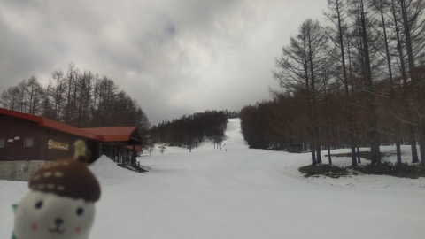

# 焼額山スキー場の春営業は1ゴンで早朝は6時スタート！そして3月27，28日の志賀高原スキー場特派員情報は…雪がかなり減ったよ（涙）

📅 投稿日時: 2023-03-29 01:08:01

🏷️ カテゴリ: [日記](cc4b5682fb7b8b144980957a978653fb0.md)

えー．

わがホームゲレンデ，焼額の春営業の

情報が出てきましたが…

まず，月曜夜から，焼額の圧雪が朝ではなく

夕方圧雪になります…！

朝はガチガチになって上手く圧雪ができず，

夕方圧雪の方がフラットで締まったバーンに

なるので，春先のタイミングで夕方圧雪に

なるのですが…

普段は，夕方圧雪への切り替えは4月に

入ってからのような気がするんですが？？

ちょっと早い…

（[焼額山Facebook](https://www.facebook.com/yakebitaiyama/posts/pfbid02GZxquwsP5n6aepz8gR4bvVY6truCzn7ay9NevAr16bg8JiByR45SwrDK5xsLiTdzl)より）

そして．

4月1日からは…

水曜日が定休日となり，

第2高速は4/2まで，

第2ゴンドラは4/9まで．

それ以降，GWまでは第1ゴンドラのみ

運行です！

…今年の春営業は第2ゴンドラかと

思ったけど…第1ゴンドラが営業ってのは，

第1ゴンドラを住み家とする人間にとっては

嬉しい限り！！

（[焼額山Facebook](https://www.facebook.com/photo.php?fbid=197009876408039&set=a.137480485694312&type=3&theater)より）

さらに…

4月1日から早朝営業がスタートしますが．

早朝のスタート時間が，昨シーズンまでの

6:30から30分早まり，

6時営業開始

となりました！！！

通常営業は8時からと，こちらも30分早まりました…

（[焼額山ホームページ](https://www.princehotels.co.jp/ski/shiga/informations/early_morning_skiing/)より）

で．早朝は焼額限定券ならどれでも滑れるようで…

・焼額限定2時間券

・焼額限定4時間券

・焼額限定1日券，2日券，3日券

・焼額シーズン券

であれば，早朝から滑れます！！

全山共通の日数券，時間券，シーズン券は

8時からしか使えないので，別途6時から

8時までの2時間券を買う必要がありますが…

2時間3000円か…

プリンス会員割引もないみたいで，

ちと高い…（涙）

でも，この時期は早朝がすごく良いので，

早朝券を買う価値はあるんだよなぁ…

まぁ，シーズン券を持ってない人は，

焼額限定4時間券を買って6時～10時まで

雪がいい4時間をきっちり滑るのが一番

いいかも？？

…ってなことで，話題は変わって．

昨日，月曜の夜は．

睡眠不足でスキーに行った反動か，

夜中に不覚に寝てしまい，

昨日の月曜，3月27日の特派員レポート写真を

載せられなかったのですが…

2日分，27日月曜，28日火曜の特派員レポートを

おおくりします！！

今さらですが，27日の月曜のおこみん

特派員の写真を見てみると．

朝は久しぶりの雪景色！！

…ここしばらく，液体ばっかり降ってたので，

道路に雪が積もってるのは久々の感じ…

そして…

あさイチの気温は，久しぶりの-5℃！

久しぶりに，そこそこ冷えてますね！！

…ホントはこのくらいが平年並みなんですが…

ここしばらく，暖かすぎました（泣）

でも．

あさイチの積雪はせいぜい5cm程度だったようで．

思ったほど積もってない…

とはいえ，久しぶりの新雪．

下地はかなり硬めながらも，上に新雪が乗って

結構良かったみたいです…

で．

本日，3月27日の火曜日の特派員情報によると…

あさイチは-3℃，11時ごろになっても-1℃程度と

そこそこの冷えだったみたいですが…

焼額はきれいなシマシマですが，

夕方圧雪になったこともあり，あさイチは

かなりの激硬のハードバーンだったようです…

おこみん特派員の奥志賀も，あさイチは

そこそこ締まってたみたいですが…

でも，こちらは朝圧雪で柔らかかった

代わりに，すぐに荒れちゃったみたいです…

焼額は硬めで緩むのは遅かったとはいえ．

天気は曇ったり晴れたりで，

時折日差しが当たったのもあり，

11時前には雪はかなり緩んじゃったみたい

です…（残念）

そして．

この日は平日というのに，学校の春休みだからか，

かなりゲレンデは混雑したようで．

高天ヶ原とかは，休日より混んでたよう

です…（涙）

で．

一の瀬，高天ヶ原より標高が低いゲレンデを

眺めると…

うげげげげ！！

東館からブナ平，かなりもう土が…（泣）

これは，ブナ平の下の部分の七曲りですが．

ここももうダメな感じ…（涙）

そして西舘も…

もうこれは終わりげな感じですね（涙）

まぁ，東館，西舘，ブナはどれも3月31日で

終了予定のゲレンデで．

もともとあと3日しか営業しない予定だったので…

予定より早くクローズというわけではないの

ですが．

それにしても，例年なら雪はあるけど

人が来ないのでクローズという感じなのに．

今年は雪が少なすぎる…（激涙）

これから一週間の天気図を見ても，

雪が降ったり冷えたりする気配はなく…

うーん．

このまま残念な感じでこのシーズンは

終わってしまうのか…

3月がダメダメだったぶん，

4月に入ったらめちゃくちゃ冷えて

くれないかな～…

今年のGW，せっかくの5連休なのに，

志賀高原が滑れなかったら，痛い…

## 💬 コメント一覧

### 💬 コメント by (レインボー75)
**タイトル**: Unknown
**投稿日**: 2023-03-29 15:40:36

水曜日の志賀高原情報

今日もスキー日和。昨日よりも少し暖かい。

今日もいちごんは6分早くスタート。悔しいけど歩かなくてもいいので私らはニゴン。今日も情報が！

8時40分GS、昨日と打って変わってちょい緩みの絶妙な硬さでgoooooodでしたよ

8時42分ダウンヒル

柔らかいけど

アンギュレーションきつくて

トランポリンみたい

8時52分エキスパ　圧雪悪い。段差いっぱい

8時54分(私)白樺は柔らか目。唐松は固かったり柔らかかったりで、いまいち

8時55分(私)朝イチのサウスは絶妙。気持ちいい

白樺とサウスを狙って四回り。ザクザクを感じたので終了。10時でした。もう今はレインボー(２時上がり)を名乗れないですねえ。テンクラブ？キリストクラブ(十時と十字架をもじって)？

### 💬 コメント by (Skier_S)
**タイトル**: ＞レインボー75さま
**投稿日**: 2023-03-30 03:16:28

今日はあさイチだけ良かったんですね…

これからしばらく冷えなさそうだし，雪も積もらなさそうです(泣）

