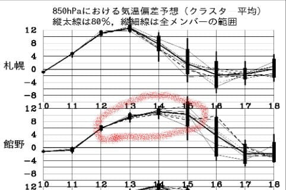

# 2020/2/11(火・祝)の志賀高原スキー場，速報レポート！…すごい積もったよ！雪質最高，朝は太ももパフのパフパフ祭り！そして午後は晴れの最高天気！

📅 投稿日時: 2020-02-12 01:27:53

🏷️ カテゴリ: [2020スキー滑走日記](c282e9230de179e245c7334eabeb0a3b3.md)

えー．

本日もいつも通り，ラストリフトまで

しっかり滑って，帰宅が遅かったので．

…スキーから帰宅した日恒例の

速報モードにて，本日の志賀高原

レポートです！

えー．

まず，本日朝．

むっちゃ積もりましたよ！！！

積雪40～50cmってところでしょうか…

朝，車を発掘するのが大変でした…（涙）

そして．

車を発掘して，焼額に向かうと…

昨晩から引き続き，激しい雪が

降り続けています！！

…どこかの誰かが，

　今晩から明日までに，10㎝くらい冷え冷え

　雪が積もりそう！！

　朝は雲が多いかもしれないけど．

　明日は基本的に晴れて，

とかいう予想をしていた気がするけど…

これのどこが積雪10cmだ？？

どこが，「朝は雲が多い」だ？？

こんないい加減な予想した奴，誰だ！？？←自分でしょ

しかし．

今回の予想は，珍しくいい方向に外れているのだ．

いつもは悪い予想ばかり当たるのに．

今回は，予想よりいい方向に外れたので，

良しとするのだ！！←予想が外れたことの責任回避してないか？？

なんてったって．

圧雪後も20cmほど積もったようで．

圧雪コースも，圧雪の上にブーツパフの

新雪が！！

それもむちゃくちゃ軽い雪なので，

気持ちよく新雪を蹴散らしながら

滑れるよ…！！

…そして．

新雪の日にはいかねばならぬ，

オリンピックコースへ行ってみると…

うはああぁああぁあーーーっ！！

太ももパフ！！

それも，激軽パウダーの

太もも～腰パフだぁっ！！！

シーズン1～2度，出くわすかどうか

というレベルのパウダー！！

雪不足の今シーズン，こんなパウダーに

巡り合えるとはっ！！

…と．

喜んで滑っていたものの．

数本滑ると，おいしいところは終了（涙）

単なる踏み荒らされた斜面と化しました…

圧雪コースも，新雪が踏まれて

かなり凸凹した感じになってきましたが．

でも，雪が軽くて柔らかいので，

ちょいと疲れるけど，楽しく滑れます！

（腰には悪いけど）

…そして．

朝は激しい雪降りでしたが．

昼前から，雲が切れて青空が

出てきましたよ！？

…さらに．

昼には太陽が射して来ましたよ！！

そして．

　朝は雲が多いかもしれないけど．

　明日は基本的に晴れて，冷え冷え雪を

　楽しめそう！！

という予想が当たり．

午後はすっきり晴天の，

冷え冷え雪ゲレンデになりましたよ～！！

ふはははは！

見よ！わが予想通り，午後は

晴れたではないか！！←朝の積雪量と天気は，完璧に外してましたけど？

ただし．

やはり，朝に柔らかい雪が積もった

ゲレンデは．

午後はかなり凸凹になり．

激烈な疲労蓄積バーンと化しましたが．

でも．

すっきり晴れて，冷え冷えのいい雪質だったので．

いつも通り，日が傾くリフト営業終了まで，

気持ちよくかっ飛ばし続けたのでした…

いやーーー．

この4連休．

冷え冷えで，うち2日パウダーに当たり．

2日間，晴天のもと滑ることもできたし．

結構恵まれた，満足度の高い4日間でした～！！

良かった，良かった…

…けど．

明日，12日は．

朝は晴れて最高シマシマかもしれないけど．

昼から気温がぐんぐん上がり，雪が緩み始め…

そして．13日の木曜は…

朝方，ちょっと液体が落ちてきます．

ただ，明け方にパラパラ降るくらいで

終わってくれそう…（と，信じる！）

14日も，気温は高いものの，

曇り空で乗り切れるかな？

週末，15，16日は…

微妙．液体が落ちてくるか，

曇り空で留まってくれるか…

微妙．

とりあえず．

13日から15日まで．

この図の赤で括ったように，

降れば雨の異常高温がやってきます（激涙）

液体が空から落ちてこない

週末が過ごせるよう．

このBlogを読んだ方には，

狂ったように全力で冷え冷え踊りを踊る

ことを強制しますので．

皆様，休まず踊らず踊り続けることを

お願いします…

## 💬 コメント一覧

### 💬 コメント by (せっちゃん)
**タイトル**: Unknown
**投稿日**: 2020-02-12 01:36:50

こんばんは。

４日間中、ほぼ３日間初っぱなから焼額に突入していたのですが。

辛抱たまらんお仲間達が第一ゴンドラを何往復もさせてくれず。

お会いすることが叶いませんでしたが、新雪バフバフを１１日はタンネと高天が原で満喫しました！

今シーズンもう１度は志賀高原に出没したいと考えております。

その際には是非ともよろしくお願いします。

### 💬 コメント by (いちと)
**タイトル**: Unknown
**投稿日**: 2020-02-12 12:25:20

我が家も再来週に参加しますので、それまで踊り続けます

### 💬 コメント by (ももも)
**タイトル**: Unknown
**投稿日**: 2020-02-12 17:43:38

今日は水曜日。恒例のお天気予報の日ですね。

今週末は家族がお友達と一緒にお邪魔しますがお天気は液体で確定でしょうか?　

2月に液体だなんて3月末に家族で出没予定ですがその頃には雪があるかと心配です(T_T)

>naoちゃんねるさま

20000メートル達成おめでとうございます！！

お仲間さん達が見守ってくださって心強いですね^_^　私は娘と一緒でしたからリフトでは女子トーク炸裂でしたが一人だったら地獄でした。男性はお喋りしなくても大丈夫なのかな?　

>西館さま

私もiSKY使ってます。1割以上も多くなると聞いたこともありますが、私のスマホは0.2割ほどの誤差。子供のスマホは何故か2割以上少なくなります。

スマホの性能によると思うので、一の瀬のクワッドで1本ごと、5本ごとと数字を確認しながら何日か滑るとご自身のスマホの様子がわかると思います。

でも、一番はやはり本数かと…一の瀬3クワッドでしたら8時間クワッドに乗リ続け、2本で15分のペース、1時間で8本、8時間で64本でちょうど達成になります。15分ごとに考えるととわかり易いですよ。トイレに行きたい時は14分で数回まわって時間を稼ぎます。ただクワッドは朝と夕方が寒いです。そして、午後になるとバ○らしくなり辞めたくなります！　(エッ、私だけ!?)

### 💬 コメント by (naoちゃんねる)
**タイトル**: Unknown
**投稿日**: 2020-02-12 18:48:24

ホント～に軽い雪で、あの新雪嫌いのnaoが楽しいと言いながら滑っていました。

この最高雪質が破壊されないよう、親子で必死に踊り続けております…

>ももも様

ありがとうございます。

いつもは子連れスキーなので、オテンバ娘の「チョコ欲しい」「ティッシュー」「ヘルメット緩い」「ヘルメットきつい」「ゴーグル緩い」「ゴーグルきつい」「暑い」「寒い」「眠い」「お腹空いた(ゴンドラ一本目からですよ)」…攻撃から解放され、１人 ストレスフリーでスキーを楽しめました(笑)

滑走中も娘の動向を気にすること無く、ひたすらに第３ 乗り場を目指す… 足はキツかったですが楽しかったです←終わってますね😅

夏はバイクが趣味ですし 仕事も１人作業が多いので 黙っているのは苦ではありません(笑)

何より、仲間の応援があったのは本当に心の支えになりました。

### 💬 コメント by (レインボー)
**タイトル**: Unknown
**投稿日**: 2020-02-12 20:12:20

我々のアプリは三者三様。iski、skiAPP、skitrack。一緒に滑っているのに表示は全くバラバラ。この表示がいかにあてにならないか、よくわかります。

私の奥志賀ゴンドラの時は、乗車するごとに何時何分とメモしていました。スキーラインはあとからしか確認できませんから。

### 💬 コメント by (ももも)
**タイトル**: Unknown
**投稿日**: 2020-02-12 23:09:29

天気予報、今週末も雨ですが3連休も暖かそうですが…　もう春になったのでしょうか?　今日は花粉もだいぶ飛んでますよ。　S様、ぜひ長期予報もよろしくお願いします。(お時間あるときに、、、)

>naoちゃんねるさま

わかります〜(^^)v　私も子連れ歴19年、自分のやりたいスキーとはすっかり無縁で過ごしています。　特に下の子は低速運転なのでイライラが募ります(T_T)　いつも私達の横をnaoちゃんがスイスイ〜と過ぎ去っていきます!!

でも、下のに追い抜かされるのも2,3年後かな?　上のはスピード、技術…すべてにおいて私より上手くなりました。

### 💬 コメント by (新潟のスキーヤー)
**タイトル**: Unknown
**投稿日**: 2020-02-13 00:50:46

火曜日は楽しい時間をありがとうございました！m(__)m

ちなみに．

今朝は、極上のシマシマを頂くことができました！

シマシマの写真を送ろうと思ったのでさすが…

お仕事中のSさんには刺激が強いかと思い

控えときました。笑

また、志賀に行った際には宜しくお願いします！(^^)

### 💬 コメント by (西館)
**タイトル**: ももも様、レインボー様もありがとうございます！
**投稿日**: 2020-02-13 01:25:12

アホですね、昨日の記事のコメントで続きを書いてしまいました。

それにしてもなんて皆様暖かいの、ここ数年の志賀高原のお寒～い塩対応に他ゲレンデへ転向しようかなぁと度々考えましたが、やっぱり志賀高原が良いよなぁと思いました。

naoちゃんねるさんでも足がきつかったのですか。

腰痛が治まったら(私は「直り」ませんで「治る」です。)スクワットすることにします。

もももさん、レインボーさんの教えて下さった方法の練習を次回してみようと思います。

お時間の許す限りで構いませんので、再びアドバイス頂けましたら幸甚です。

どうぞどうぞ、よろしくお願い致します。

### 💬 コメント by (Skier_S)
**タイトル**: 今日から恐怖の高温デー
**投稿日**: 2020-02-13 01:58:21

＞せっちゃんさま

あら．お会いできなくて残念です…

しょっぱなから1ゴンで並んでいたなら，私がいたと思いますが…

あさイチでは並んでなかったのですか？

また志賀高原にいらっしゃるなら，その時にお会いしましょう～！

＞いちとさま

はい．

狂ったように踊り続けてください…

＞もももさま

雨が降るのは，木曜の早朝だけで済みそう！

このままの天気図なら，土日は気温がすごい上がるものの

何も降ってこなさそうです！

＞naoちゃんねるさま

親子で踊り続けるとは，信心深いですね（笑）．

その努力に応えて，神様が雨を降らせずにいてくれるかもしれません…

＞レインボーさま

やっぱり，乗車記録を付けるのが確実ですね．

スマホアプリは，スマホのGPS精度に左右されるので，

そもそも固体差がありますよね…

＞もももさま

すみません．私が使っている気象庁の予想図だと，

1週間先までしか予想できません…

来週３連休の予想は，今しばしお待ちください．

＞新潟のスキーヤーさま

11日はお世話になりました～！

楽しんでもらえたなら良かったです．

…で．

今日は最高シマシマだったんですね…やっぱり（涙）

また，次に志賀にお越しの際にお会いしましょう！

＞西館さま

志賀高原，中央エリアはいろいろ残念なことになってますが，

焼額・奥志賀エリアは営業努力もしてますし，

焼額に集まるメンバーはいい人ばかりです（笑）．

ぜひ，これからも焼額にお越しください…

