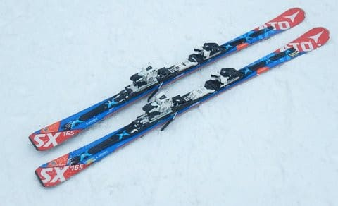
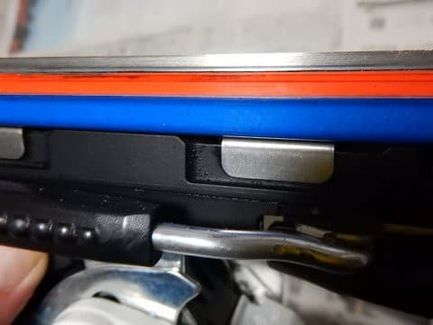
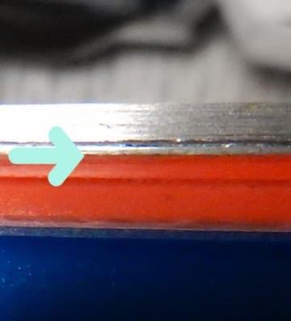
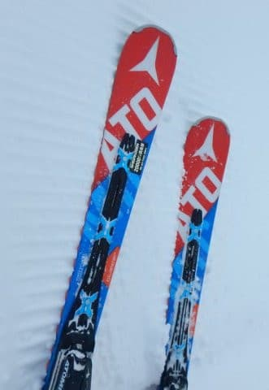

# なんと！？？昨シーズン3月から履いたSXが早くも…？？？　そしてスキージャーナル休刊

📅 投稿日時: 2018-01-12 01:59:07

本日．

志賀高原常連にして，昨シーズン志賀高原Skilineの

シーズン総滑走標高差4位の[まうちゅうさんのBlog](https://blogs.yahoo.co.jp/mouse_tyu/64463500.html)を見て．

　スキージャーナルが休刊

という[衝撃的ニュース](https://www.skijournal.co.jp/download/kyukan_sj.pdf)を知り．

驚くとともに，

ひとつの時代の終了を感じている，

Skier_Sです…

いやーー．

あまりにも突然で信じられませんが．

経営悪化で出版継続不可能とは…

スキーバブルのころは，ワールドカップ優勝クラスの

超有名選手を呼んでのスキーテストとかやっていたのに…

むしろ，グラフィックの方が部数が少なくてやばいかと

思っていたのに…

グラフィックは大丈夫かな！？？

…って，ちょっと寂しいニュースのあとは．

本題へ．

えー．

'16SXがヘタってきたように感じたので．

[昨年3月についポチってしまい](e922ef4eede2bd4d2b900bd4bf1b03156.md)．

[昨シーズン後半からデビューした，'17SX．](e27e2a7149d362e76794896614d0f18f3.md)

先日のスキーからの帰宅後．

12日間で10日滑るという酷使に耐え抜いた

SXの手入れをしていると…

うむ？？

なんだ，これはっ！？？？

分かりにくいので拡大すると．

SXのエッジが…

エッジが剥離しかけているんですが？？

この矢印部分，隙間が空いてます…

正常な部分はこんな感じで，

赤いボーダー部分とメタル部分の間に，

隙間は空いてません…

前回の'16SXも，わずか40日ちょいの滑走で

かつてSXだったなにか

というレベルにまで劣化したのですが．

今回の'17SXも，滑走40日にて剥離し

始めたみたいです…（涙）

なんてこった…

昨シーズンは3月～GWまでの約2か月しか履いておらず．

今シーズンも11月下旬からまだ1か月ちょいしか

履いてないのに…（涙）

まだ，トータルわずか3か月ちょいしか

滑ってないんですよ！？？

もう剥離しちゃうんですか…？？

ってことで．

[前回の反省](e56c11ebadfa98e86c1f0cbe36198f076.md)があるので．

今回はすぐにATOMICに問い合わせたいところですが…

この板．

[通販で買った板](eda7898d5cb5580b1871f3cbef83241ac.md)なので．

いつものお店に持っていくわけにいかず．

通販で買ったショップに，宅配便か

何かで送らないといけないんだろうか…？

うーむ．

しかし．

まだコアに水が入ってないからか，それほどの性能劣化は

感じなかったけど．

まさか，この板も40日で剥離するとは思わなかった…

やっぱり，新しいSXをいっぱい買っておいて

正解だったな！←考え方が間違っている

## 💬 コメント一覧

### 💬 コメント by (かず)
**タイトル**: Unknown
**投稿日**: 2018-01-12 17:43:18

昨日よりは良かったかもです　午前中は奥志賀滑ってたので不明ですが　午後のヤケビ固くコロコロがありました　一応13時頃から雪降ってきましたよ

### 💬 コメント by (タカ)
**タイトル**: 本日志賀高原
**投稿日**: 2018-01-12 22:16:38

朝一GSコースは朝５時位から降ってきた雪で下地が隠れてなかなか滑りやすかったですが、4,5本滑るとガリガリになりました。午後は奥志賀も行きましたがこちらもガリガリでエキスパートコースは苦労しました😅一ノ瀬より下は行かない方がいいと思いました

### 💬 コメント by (Skier_S)
**タイトル**: 志賀はアイスバーンか…
**投稿日**: 2018-01-13 05:19:03

＞かずさま

やはり固くコロコロでしたか…(;_;)

週末もドサドサ積雪はなさそうなので、

朝しばらくすると下地の固いのが出てきそう

です…（涙）

＞タカさま

夜のうちに降ってくれれば雪質も改善しそうですが、

せいぜい10cmなので、あまり期待できなさそう

です…

先週まで雪が良かっただけに、惜しすぎます…

この時期にあんな雨が降るとは（涙）

### 💬 コメント by (スキー二郎)
**タイトル**: エッジ剥離
**投稿日**: 2018-03-27 10:29:58

Skier_S様　はじめまして。

エッジ剥離で検索して、たどり着きました。

こちらは17シーズンに総滑走65日「11-12サロモン24Hr S5 170cm」で、ホットワックス時にうまく塗れなくて、良くみたら利き足スキーのセンター辺りに45cmの剥離を発見しました。

Web見るとアトミックのエッジ剥離の書込みが散見され、サロモンも同工場の為、剥離発生等の記載有りました。

メーカーに写真を送付したところ、修理不能でした。(発売後年数経ってますしねえ。)

17モデルSXも剥離しているとの事で、まだ改善されてないのかなあと思いました。その為、来シーズンの候補は、アトミックとサロモン外そうかと思っています。

もう片方はエッジ剥離無い為、定期的に左右履替えて滑れば、長持ちしたのかなと後悔しています。

### 💬 コメント by (Skier_S)
**タイトル**: スキー次郎さま
**投稿日**: 2018-03-28 04:49:06

始めまして～！

コメントありがとうございます．

いや，私もSALOMONを剥離させてます．

https://blog.goo.ne.jp/tsakamot2001/e/6302c5755708c26ad01f9cd7b82c90ae

やはり，ATOMICとSALOMONは剥離します…

ただ，HEADを激しく剥離させた方もいるので（笑）

http://red.ap.teacup.com/gokurakuskier/896.html

ATOMICとSALOMONじゃなくても，使いすぎると

やはり剥離するのかと…

ちなみに，私は板を左右決めずに適当に

入れ替えて滑ってます．

やはり，そちらの方が板のヘタリ，摩耗が

左右均等になるので…

### 💬 コメント by (スキー二郎)
**タイトル**: ご返事ありがとうございます
**投稿日**: 2018-03-29 10:49:55

Skier_S様へ

LMなら同世代ですね。その世代は剥離しやすかったのですね。(正確にはエッジの上のメタルですね。)Headも剥離が有ったのですね。

3シーズン前から雪国在住で、シーズン券でローカルスキー場で滑るようになってから、滑走日数が激増しました。それの影響も有りますね。70日位滑る退職シニアに聞いたら、特に不具合無くてもスキーの寿命は2シーズン位かなと言っておりました。今後はそんなもんだと思って滑ります。有益な情報有難うございました。

今後のご活躍を期待しております。

### 💬 コメント by (Skier_S)
**タイトル**: スキー二郎さま
**投稿日**: 2018-03-30 04:07:25

私のBlogのいろんな記事を読んでいただくと

分かると思うのですが，私の板はあっという間にヘタリます…

2シーズンもちません（笑）

ひどいと，1シーズンもたないことも…（涙）．

滑走日数は70日に満たないほどなんですが．

毎日その板ばっかり履いているとヘタリに

気づかないのですが．

私のように何セットかの板を状況によって

取り換えながら履くような使い方をすると，

ヘタリにすぐ気づいてしまいます…

とりあえず，私にとって，スキー板は

グローブなどの消耗品よりも寿命が短くて．

スキー用具の中で一番寿命が短い消耗品です（涙）．

