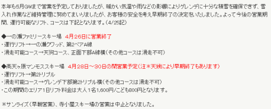
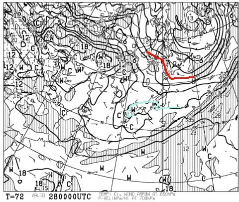
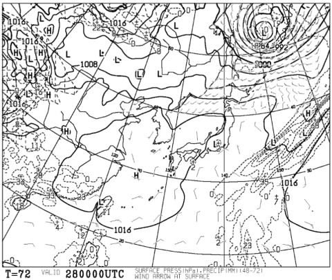
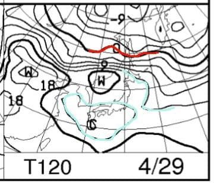
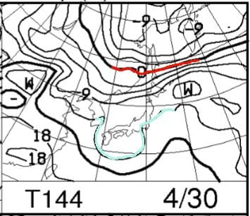
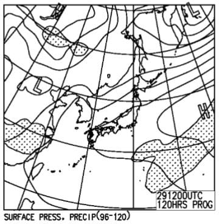
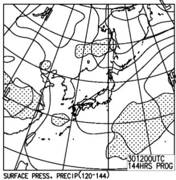

# GW前半，4月28，29，30日の志賀高原の天気を予想してみるが…え！？？一の瀬ファミリー＆寺子屋，営業終了！？？？

📅 投稿日時: 2018-04-26 01:58:20

えー．

そうです．

そうなんです．

火，水と．

この2日間続いた雨．

志賀高原にとって，かなり致命的だったらしく．

なんと！！

[志賀高原中央エリアのホームページ](http://www.shigakogen.co.jp/news/5027.php)に，

こんな案内が…（涙）

なぬーーーー！！

一の瀬ファミリーは，26日の木曜で営業終了だと！？？？

…22日の段階では，パノラマや天狗はまだ行けそうな

感じだったらしいのに…

…この雨．

破壊力抜群だったようです…（涙）

そして，寺子屋も営業終了（泣）

中央エリアで滑れるのは，高天ヶ原トリプル

のみですか…

奥志賀，横手，熊の湯はまだ特にGW営業縮小の

アナウンスはありませんが．

こちらもかなりの深手を負った様子…

焼額は…

平日営業していないので，まだ情報が

出てませんが…

おそらくGSコースは即死でしょう．

パノラマ-サウスが生き残っているのか？？

2ゴンが動いてくれればいいけど…

4ロマのみ営業…とかいうことになると．

さすがにそれはちょっと考えねばなるまい…

ってな感じなので．

このGWの天気予想をするモチベーションも

かなり低下しているのですが．

…でも，まだ滑れる．

高天ヶ原も残るし．

奥志賀，熊の湯もまだ行けるはず…！！

だもんで．

この週末，GW前半3連休のスキー天気予想，行くのだ！

…かなりテンション落ちてるけど…（ぼそ）

まずは，3連休初日．

土曜28日の850hpa気温ですが．

…いまさらどうのこうの言っても始まらない

レベルで．

水色の+9℃線が志賀に近づいてます…（激涙）

これは，朝から思いっきりプラス気温ですね（涙）．

まぁ，いまさらこんなことで驚かないぞ～！

土曜の地上天気図は．

まぁ，高気圧に覆われて．

概ね晴れそう．

…でも．

何度も言うけど，この時期の晴れ間は

あまりうれしくないですよね…

で．29，30日の850hpa気温図はこんな感じで．

どちらも，水色に塗った+12℃線が志賀に

近づいてます…

志賀高原は朝から+10℃近く．

最高気温は15度以上に上がりそうで．

かなり暑い一日になりそう…

そして，29，30日の地上天気図は

こんな感じなので．

高気圧に覆われ，どちらも晴れそう…

いや．

もう晴れてもどうでもいいよ…って気分に

なりつつあるんですが（泣）．

ってな感じで．

まとめると．

28日初日：朝から終日晴れ．気温は朝は+5℃程度

　昼間は+12～+13度程度まで上がる．

　雪は，早朝はかすかに固まってそうだけど，

　すぐに緩んで，通常営業にはザブザブの

　張り付く雪に…（涙）．

29，30日：朝から終日晴れ．

　気温は朝から+10℃近く．

　最高気温は+15度以上に上がるか…

　この日も，早朝はかすかに固まってそうだけど，

　すぐに緩んで，滑らない雪に…（泣）．

ってな感じですが．

なんだか．

もう．

これだけ高温＆強い日差しが続くと．

志賀高原，30日まで滑れるのか…？？？

という感じ…

うーーーむ．

奇跡は起きなかったか…（涙）．

## 💬 コメント一覧

### 💬 コメント by (yumi)
**タイトル**: 皆さんが気になってる？・・・
**投稿日**: 2018-04-26 15:01:52

Ｓさぁ～ん🎊🎊🎊

良いニュースかどうかは別にして・・・

今日、見かけた事だけお知らせしますね。

イチゴンの乗り場に、どっかりと雪が盛られてましたよ👍

私の個人的な想像では、イチゴンは動かすつもりなのでは❓

一昨日の渋ちゃんは、けっこう土ちゃんが🐒こんにちは👋😃してました。

🐻ちゃんは、どこ、滑るの❓って感じ💧でしたよ。

今日の奥志賀は、キレイでしたよ✨

日課のダウンヒルは終っちゃいましたけど💧💧💧

### 💬 コメント by (michi)
**タイトル**: Unknown
**投稿日**: 2018-04-26 15:13:07

GWの焼額山、4/30で終了とHPに出てました。

今週末行けないので強制終了です（涙）

### 💬 コメント by (はっち)
**タイトル**: GW直前に
**投稿日**: 2018-04-26 23:25:04

息絶えるゲレンデが続出。。。

5/1～3ぐらいで考えていましたが、今シーズンはやはり諦めます。　来シーズンゲレンデでまたお会いしましょう！

### 💬 コメント by (Skier_S)
**タイトル**: だめだ…今年はだめだ
**投稿日**: 2018-04-27 03:12:58

＞yumiさま

イチゴンは何とか3連休いっぱい営業するみたいですね．

一応，GSコースもまだ滑れるとか…（ほんとかな？）

かなり雪入れしてるんでしょうね…

奥志賀が一番コンディション良さそうでしょうか．

とりあえず，3連休+2日間で，志賀高原滑ってます～！

＞michiさま

あら…

3連休来れないのですね．

一応，奥志賀が4連休最後まで営業すると

宣言しています．

まだ奥志賀で滑れますよ～！

＞はっちさま

あら…

今シーズン終了ですか．

残念です…

また来シーズン，志賀でお会いしましょう！

