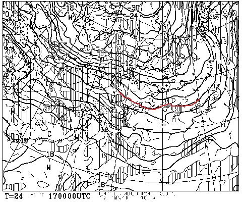
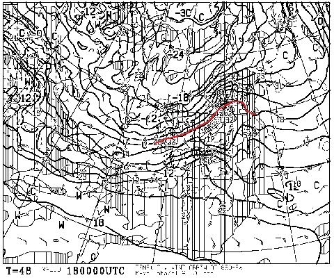
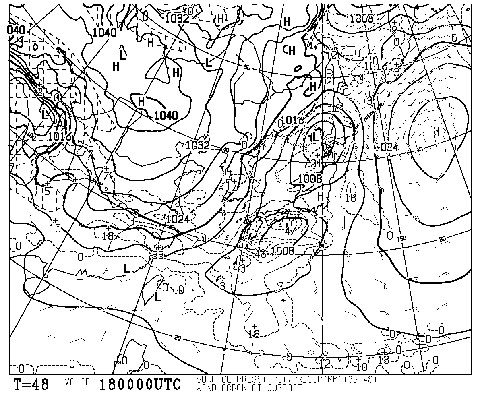
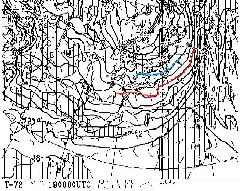
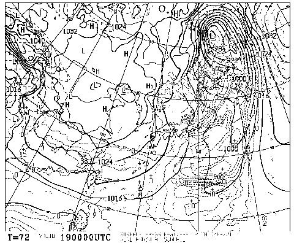

# 11月18，19日の週末のスキー場の天気は？…熊の湯オープンするかなぁ…

📅 投稿日時: 2017-11-16 20:56:58

🏷️ カテゴリ: [スキー天気予想](c6554f5c3c106093b511a8daae23757e8.md)

ということで．

相変わらず米国（米どころ新潟ではない）に滞在中の

Skier_Sです．

で．

いつもなら，水曜深夜が天気予想なのですが．

本日は，時差の関係で，木曜に天気予想更新！

（これを書いているのは米国時間の水曜深夜…というより早朝）

…はい．

そうですよね．

気になりますよね．

物欲選手権の結末が…

って．

…いや．

そっちじゃなくて．

このBlog読者には，

はたして今週末，熊の湯がオープンするかどうか

が大変気になると思うので．

物欲選手権の続きは明日にして，本日は天気予想です…！！

えー．

まず．

17日の金曜，オープン予定前日の

850hpa気温図を見ると…

うむ．

0度線が太平洋側まで下がって，

いい感じに冷えてますね～！！

これは，16日から17日にかけて，人工降雪機を

打ちまくれます．

あまり量はないものの天然雪も降って

くれそうだし，

熊の湯は，17日昼くらいまで

人工降雪打てるんじゃないかな？

ただ．

でも．

しかし．

18日の850hpa図を見ると，だ．

あうーーーーん．

0度線が東北まで上がっちゃってるよ…(涙）

志賀高原は，17日の夜9時ごろには気温が0度を上回り．

人工降雪機が打てなくなりそう…（涙）

肝心なオープン前日に人工雪を打てないのは，痛い．

それどころか．

土曜18日の地上天気図は．

きわどい．

すごくきわどい．

降水域がぎりぎり志賀高原にかかってます…

だもんで．

18日朝は，一瞬雨がぱらつくかも…

でも，おそらく．

昼ごろには雪に変わるんじゃないかな…

運が悪ければ，昼すぎまで雨で，

夕方まで雪に変わらないかも…

でも．

安心するのだ．

19日朝9時のの850hpa気温図は，すごいのだ！

見よ！

赤くマークした0度線が太平洋のはるか南まで下がるどころか…

志賀高原には水色の－6度線がかかっているのだ！

…これは．

真冬の天気図なのだ！！

日曜の朝は，-10度近くまで下がるかも！！

そして，19日の地上天気図は…

完全冬型ですね．

ただ…新潟の海沿いでは，平地まで

雪になりそうだけど．

志賀高原はあまり雪が降らなさそうな天気図かな～．

まぁ，土曜の夜から日曜にかけて，

超ギンギンに冷え込んでいるので．

土曜の夜はガンガン人工雪が打てます！

もし仮に土曜オープンが無理だった場合でも，

日曜は熊の湯はオープンできると思います…

ってことで．

まとめると．

志賀高原

土曜：朝は小雨がぱらつく．気温はプラス．

　前日夕方までにしっかり雪ができていなければ，オープンは

　きわどいけど…まぁオープンするんじゃないかな．

　昼前後から気温が冷え始め，雨は雪に変わる．

　雨→雪に変わるタイミングの見切りはまだ難しいけど…

　早ければ昼前．遅ければ夕方近く…

日曜：朝から激冷え！-10度近くまで冷え込む．

　前日からの冷え込みで，人工雪がガンガン打てるので

　おそらくこの日は確実にオープン．

　道路は凍結＆積雪なので注意！！

　天気は曇り時折雪がぱらつく程度か…

　時折雪雲の切れ間は日も差しそう．

　終日ひえひえなので，滑るなら日曜．

おまけ・Yeti

土曜：朝は雨．昼に向かって雨が上がり，午後はすっきり晴れてくる

日曜：終日晴れ！寒いよ！真冬の格好をしていったほうが吉．

　土曜の夜に人工降雪機が動いて，コースはちょっと広がるかも．

って感じでしょうか…

うーむ．

志賀高原，ついにオープンですね～．

そして．

18日夕方からは，日本海側，積もります．

21，22日の夜は気温が上がって人工降雪が打てなさそうなので．　

それまでの18，19，20日の3日間．

この，ガッツリ冷える期間にしっかり雪ができれば．

20日までに，ゲレンデが滑れるようなレベルで雪が作れれば．

かぐらの23日オープンも行けそうな感じ…

うむ．

このまま順調にシーズンインすることを祈るのだ！！

## 💬 コメント一覧

### 💬 コメント by (Unknown)
**タイトル**: Unknown
**投稿日**: 2017-11-16 21:27:18

いい感じのシーズンインになりそうですね。でも私の初滑りは12月16日あたりになりそう…日々祈ります！

ちなみに Skiline に代わって iski を展開するそうです。

http://blog.goo.ne.jp/olaf2125/e/5db42abef111b5e9fdc3211e48e9e554

### 💬 コメント by (olaf2125)
**タイトル**: 失礼しました
**投稿日**: 2017-11-16 21:29:25

失礼しました。

先程のコメント、olaf2125 でした。

### 💬 コメント by (タカ)
**タイトル**: かぐら
**投稿日**: 2017-11-17 00:08:59

かぐらは23日オープン確定情報が出ました。白馬周辺もいけそうですが、若干積もり方が弱いかも。

### 💬 コメント by (ほっぽ)
**タイトル**: Unknown
**投稿日**: 2017-11-17 06:55:36

Ｓさん

熊の湯ばかりでなくYetiの天気予報も予想して頂きありがとうございます。

知り合いの話では昨夜、御殿場側が白い何か、が降っていたそうです。

私は今夜と日曜日、一滑りしてこようと思っています。

ゲレンデコンディション、良さそうですね。

１６ＳＸですが、地元のショップに165cm、X12VARビンディング付で売っていました。

在庫処分の激安だったので、ラスト１本買ってしまいました。

どうするか？は暫く悩んでみます。

### 💬 コメント by (Skier_S)
**タイトル**: 今週日曜は最高のスキー日和
**投稿日**: 2017-11-17 22:54:22

＞olaf2125さま

情報ありがとうございます！

焼額にまで問い合わせたのですね…

すごく参考になりました！

iSKI…これからインストールしてみますが．

滑走標高差出るんでしょうか…？？

＞takaさま

かぐら23日確定ですね！

熊の湯も18オープン決定しましたし…

今シーズン，シーズンインは順調そうですね！

＞ほっぽさま

ををを！！

SX，いっちゃいましたか…

VARビンディング付きならGoodですね！

…ただ，最初はしばらく驚くと思います．

かなりテールを使う板で，谷回りで

トップを抑える必要がない…

というか，トップをたわませるような動きを

すると，板のグリップが抜けるように感じる

ので，谷回りでトップを抑えに行ってはダメです(笑)

SX，いい板ですので，楽しみにしててください！

