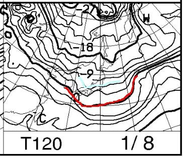
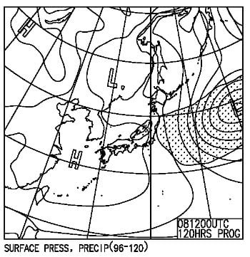

# 1月7,8,9日の3連休の志賀高原の天気は…雪は降ってもそんなに積もらない予想になってきた(泣)7日は雪がぱらつき，7日夜から8日は雪，9日は曇り~雪かな

📅 投稿日時: 2023-01-05 03:23:34

正月休みが終わったというのに．

本日も志賀高原に忠誠を誓っている

特派員から，写真が送られてきました～！！

今朝も気温は-10℃と，かなり冷え込んで

ますね～…

そして，あさイチの積雪は…

20～30cm近くあったようで，

非圧雪のオリンピックコースは

ブーツパフ＋αくらい．

圧雪済みのGSコースでも，軽い雪が

圧雪の上に5cmくらいの乗っていた

ようです…！

そして．

正月休みが終わったというのもあり．

全体的に空いていたようで…

焼額第1ゴンドラもほぼ待ちが無く．

終日雪が降り続いていたというのもあり．

人は少なかったようです…

午後からはさらに雪も強くなり．

昼間だけで10cmくらいは積雪があった

ようですが…

ただ．

終日雪が降り続いていたものの，

風が強めだったためか…

雪不足のGSコースにはそんなに雪が

積もらず．

まだ，小石エリアはごく一部が完全に

隠れきってないようです…（涙）

うーん．

今日は数字上は40cm以上積もったんだけどなぁ…

でも，-10℃の冷え冷え雪で，風で飛ばされる

軽い雪なので．

雪着きが悪い感じなのがちょっと残念…

そのかわり，冷え冷えなので雪質は

良いようなですよ～！！

ってなことで．

正月休み（と言っても，私は2日しか滑れず）が

終わったというのに．

また今週末は3連休です…

だもんで．

水曜深夜恒例，週末の天気予想，

行ってみましょう！

まず．

木曜5日の850hpa気温図ですが．

水色の-9℃線が志賀にかかってますね…

…これは冷えますよ！！

そして，この日の地上天気図は…

うーん．

水色の降水域が日本海側にあるものの，

志賀高原にかかってないので…

5日朝までも，そんなに積もらなさそう（涙）

5cmも積もらないかな…

そして，6日金曜の850hpa図を見ると．

この日も水色の-6℃線が志賀より南に

あるレベルなので…

この日もそこそこ冷えてくれますね．

一応，地上天気図ではわずかに水色の

降水域が志賀高原にかかってますが…

でも，日本海全域に雪雲がかかっている

わけでもなく．

降雪量はそんなにないですね…これは（涙）

で．

肝心な3連休初日，7日の850hpa図ですが．

うーん．

ちょっとだけ気温が上がりそうですが…

でも，水色の-3℃線が志賀より南にある

レベルなので．

雨になる心配はありません！

この日の地上天気図は…

一見，西日本から北陸にかけて，

すっぽり水色の降水域に覆われて．

志賀高原でも降りそうに見えますが…

残念ながら，志賀高原には降水域が

ほとんどかかってません（泣）

うーん．7日もそんなに積もらなさそう…

そして3連休中日，8日の850hpa気温は．

この日も水色の-6℃線が志賀よりかなり

南なので．

そこそこ冷え込みそう…

地上天気図を見ると．

弱い縦縞なので，北西の風で

志賀は20～30cmほど積もるかな？？

最後に三連休最終日，9日の850pa気温を

見てみると．

この日も水色の-6℃線が志賀にかかってます．

ボチボチの冷え込みです．

この日の地上天気図は…

弱い冬型だし，きれいな縦縞なので．

この地上天気図のままなら，志賀でも

10cm～20cmくらい積もってくれるかも？？

まとめると．

5日(木)：結構冷える．あさイチは-10℃以下．

　昼間も-5℃以下をキープ．終日曇り～小雪．

　雪はほとんど積もらない．数cm程度．

6日(金)：朝イチは-9℃程度．

　この日も小雪が舞う一日だけど，

　志賀はそんなに積もらない

7日(土)：この日の冷え込みは弱いけど，

　朝の気温は-5℃以下までは冷えそう．

　昼間もマイナスキープ．

　終日雪はぱらつくが，

　積もるほどではない．

8日(日)：朝の気温は-8～9℃．

　昨晩からの積雪は10～20cmほど．

　非圧雪バーンはブーツパフ．

　終日雪が降り，午前はゲレンデに

　積もるくらい強めに降るか．

　根性の無いスキーヤーは

　ふるい落とされる一日．

9日(月・祝)：朝イチは-8から9℃．

　あさイチまでの積雪は5～10cm程度．

　昼間も雪が降り続けるが，それほど

　積もらず

という感じでしょうか…

一応，ずっと冷えて，雪は降り続けて

くれますが．

積もりそうなのは，8日だけですね…

それもせいぜいブーツパフ．

上手くいって脛パフ程度．

もう一降り欲しいところ…

## 💬 コメント一覧

### 💬 コメント by (a-island4138　ゆうさん)
**タイトル**: Unknown
**投稿日**: 2023-01-05 19:40:33

いつも貴重な情報、誠に有り難いです!!　毎日、頼りにしております。　積雪量…なんとか増えてもらいたいところですよね。

### 💬 コメント by (Skier_S)
**タイトル**: ＞ゆうさんさま
**投稿日**: 2023-01-06 09:53:54

7，8日もドサドサと言わないまでも積もりそうなので．

まぁ，この3連休までには何とかなってほしいところです…

### 💬 コメント by (カンタロス)
**タイトル**: Unknown
**投稿日**: 2023-01-06 09:55:13

Sさま、こんにちは。

毎回、素晴らしい予報ありがとうございます。

必要な天気図をアップしていだだけるので志賀高原以外のスキー場の予想もSさまの予報を元にたてることができ、ありがたく使わせていただいております。

今年はリフト券の値上げ幅が大きいので、シーズン券買わない派のわたしにはつらい（笑）

### 💬 コメント by (Skier_S)
**タイトル**: ＞カンタロスさま
**投稿日**: 2023-01-07 04:20:48

参考になっているなら嬉しいです~！

しかし，シーズン券を持っていても，シーズン券がかなり値上がりしているのでつらいです（涙）

