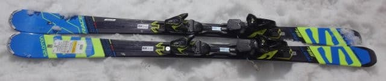
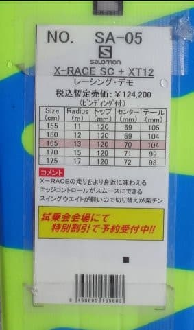
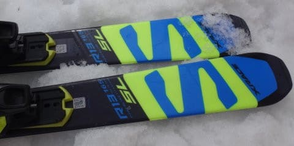
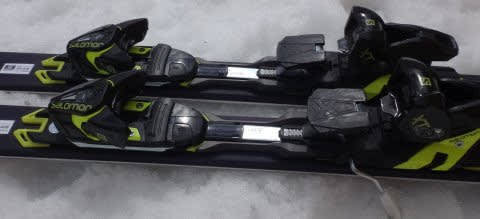
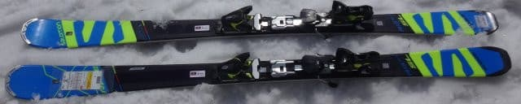
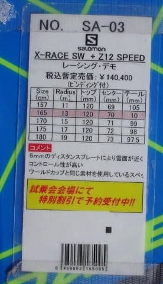
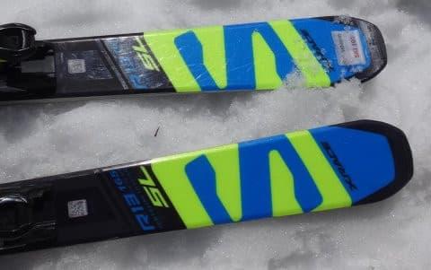

# 2018シーズンモデル，スキー試乗レポート第22回…SALOMON編その4

📅 投稿日時: 2017-06-28 02:21:03

ということで．

6月も最終週に入ったわけですが．

…月山は，先週のうちにリフト降り場からゲレンデに

出るコースが途切れ．

さらに，週末には，リフトに滑りこむ

コースも切れてしまったようで．

…ついに，リフトの乗り降りでそれぞれ数分間

徒歩コースの，最終形態になったようですね…

でも，そこを我慢すれば，まだ大斜面は

普通に滑れるようなので．

うーん．

今シーズンは恵まれてるなぁ…

…まだ，シーズン終わりって感じがしないんですが…

ってことで．

まだまだシーズンが続いているわけなので．

今日もスキーネタ，つづきますよ～！

スキー試乗レポート，サロモン編です．

X-RACE SCと，前回乗ったのと全く同じX-RACE SWを

試乗してみました．

では，どうぞ～！

----

◎SALOMON X-RACE SC +XT12 165cm

基礎小回り用…というより，小回りベースオールラウンド？

一応，SALOMONはSL競技＆エキスパート小回り用…

と言ってるようですが．

ビンディング自体も，X-MAXについてるのより弱い

XT12でプレートも無いなど．

どちらかと言えば中級者向けっぽい板の造りの

このモデル．

滑ってみたところ…

X-RACE SWと比べると，結構軽快に感じます．

しかし，この軽快さから受ける印象より，

スピード耐性も意外とある感じ…

基本的に，エッジに乗って走っていく，

カービング嗜好の板で．

あまり積極的にずらして行こう…という

板ではありませんが．

スピードを上げていくと，板のグリップが負けて

板がたらたらと流れ始めます…

返りも強くなく，決して速い返りが返ってくる

板でもないので．

比較的体力のない人でも履きやすいかな～．

あまりスピードを上げすぎず，中速域で

エッジなりに滑っていくと，

そこそこ気持ちよく滑れる感じの板でした．

◎SALOMON X-RACE SW +Z12 165cm（2回目）

SL競技用，基礎小回り用

[この時](ede1079b5d7ca74d9df9ab925f873f7b2.md)に試乗した，プレート無しの板と全く同じものに

なります．

前回は，一の瀬ダイヤモンドでしたが．

一の瀬ファミリーの正面バーンで試乗してみました…

やはり，前回の試乗と同様．

比較的ねっとりとした感じで板がたわんで，

強めのエッジグリップで，そのたわみに沿って

板が回っていく…

という感じの．

割とガッツリ目のエッジグリップで回っていく

板です．

ただ，プレートありに比べればかなりたわませやすく．

比較的すっとたわんで谷回りに入れます．

そのまま，山回りでテールがすっと抜けるような

切り替えに入れるので，

谷回りで板を動かしていくというより，

ひたすらエッジに乗って切っていく感じの板です．

谷回りの板のたわませ方で，かなり弧を

自由に作れる感じがあるので，

コントロール性はあります．

ガッツリカービング小回りが好きな人（含む私）が，

気に入る感じの板じゃないでしょうか…
