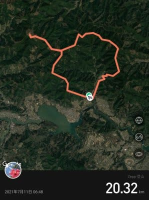

# 今シーズン初登山…そして，山登りで膝の痛みが出にくくなるサポーターとやらを試してみた

📅 投稿日時: 2021-07-14 03:34:04

🏷️ カテゴリ: [日記](cc4b5682fb7b8b144980957a978653fb0.md)

ついに．

月山も昨日でTバーリフトの営業が

終わってしまったようですね…

（[月山朝日観光協会サイト](https://www.gassan-info.com/news/)より）

…でも．

この案内によると，月山のあのリフト．

Tバーじゃなく，「テイバー」だったのか…！？

（知られざる事実）

ってなことで．月山も終わりゆくこの

時期．

さすがの私もスキーシーズンが

終わってしまっていて，

[6月12，13日の月山での今シーズン
ラストスキーを終えて](ef1f0d7a31674a34546de0d955ece99b0.md)から，全く

運動ができていない私．

平日は朝から晩まで椅子に座りっぱなしで

玄関から全く外に出ないのに．

これで土日も運動しないと，身体が

腐って死んでしまう…！！！

と，久しぶりに雨が降らなさそうな

予報になった日曜午前中を狙って，

昨日ちらっと書いたように，今シーズン初の

登山…というほどでもない，ハイキング

コースでの足慣らしに行ってきたわけ

ですが．

ただ．

気軽なお散歩のつもりだったのが．

我が愛用のAmazfit PACE君の

記録では歩行距離約20.32km．

スマホGPSでの記録は19.18kmと，

意外と結構な距離を歩いて…

そして，獲得標高差も

Amazfit PACE君は1101mと言っていて．

意外にも，そこそこの登山レベルの

獲得標高差になってますね…

ただ，スマホGPSでは1748mと，

とんでもない数字を言ってます…

地図を見ても，1000mちょい位の

獲得標高差のはずなので，

グラフがかなりギザギザになってるところ

から，おそらくこれはかなり細かな

上り下りをカウントしちゃったんじゃ

ないかな…

とりあえず．

行ってきたのは，裏高尾方面．

小仏峠登山口近辺からスタートして，

陣馬山⇒堂所山⇒景信山を巡って

下りてくる定番のハイキングコース．

そして，今回の山歩きの目的は．

ダイビングができそうもない今年は，

山に登ることでスキーに向けた体力を

維持するということなんですが．

ただ，一昨年から．

長い山歩をすると下りの時に膝が痛くなる

ようになってしまい（涙）

下りはコースタイムより遅い時間でしか

歩けないという，かなり悲しい状況に

なってるんです…

昨年の編笠山⇒西岳では，次々人に

抜かれて．

「違う…自分の実力はこんなものじゃない

はず…っ！」

と．

「まだ本気出してないだけだもんね」的な

言い訳をして自分をごまかしつつ下山した

ものでした…

（昨年の編笠岳登山時の写真）

まぁ，痛くなるのは山登りの時だけで．

スキーの時には全く痛くならないので，

自分的にはさほど致命的ではないのですが．

こんなことでは，山を歩いていても

楽しくないし．

コースタイムが長い山は避けなくては

ならず，行ける山が限られてしまう

じゃないか…！！

果たして，この痛みの原因は何なんだ？？

とりあえず，症状としては．

長く歩いていると曲げ伸ばしをする度に

膝の外側に痛みが走るようになり，

特に下り坂を歩くのが辛くなる…

という感じなんだけど．

一体これはなにが原因なのか，

いろいろ調べてみたところ…

…これは山を登る人やランナーが良くやる，

[腸脛靭帯炎](https://www.google.co.jp/search?q=%E8%85%B8%E8%84%9B%E9%9D%AD%E5%B8%AF%E7%82%8E)と，症状が完全に

一致しますね…

膝の外側の靭帯が，膝の骨と擦れて

炎症を起こすようで…

[このウエブページの図](https://www.zamst.jp/tetsujin/knee/runners-knee/)が分かりいいかな

果たして，腸脛靭帯を傷めないためには

どんな手があるのかな…？

と調べたところ．

究極の対策は，

「ランニングや山登りをしないこと」

まぁ，そうでしょうね．

ええ，それが一番の対策でしょうね．

…でも，それ，対策というより，いろんな

ものを放棄しろといってますね…

残念ながら，それは受け入れられませんね（断固たる態度）

そのほか，歩き方やらストレッチやら，

まぁいろいろ対策が書いてあるけど…

その中で気になった対策が，こいつ．

「膝のサポーターで痛みが出なくなった」

ええ？？

ホントに効くの？？

気休めじゃないの…？

まさかこんなサポーターで，あの痛みが

治まるとは思えないんだけど…

とりあえず．

お値段が3500円ほどもするので，

買って効果が無かったらもったいないな…

と，半信半疑ながらも，

効いたら儲けもの

って感じで通販で注文しちゃいました…

購入したのは，ZamstのRK-1Plusって

サポーター．

膝のサポーターでも，特に膝の外側，

腸脛靭帯の痛みに注目した商品

らしいのですが…

右足，左足用があって，私が痛くなるのは

右足だけなので，買ったのは右足用．

膝のねじれが起きないよう，

らせん状に膝を引っ張るようなバンドが

膝の裏側部分についていて…

こいつをゴムバンドで引っ張って，

膝の表側にマジックテープで

止める仕掛け．

赤く囲ってある部分に，ゴムひもが

見えます…

こんなので，ホントに効くのか？？

…と，半信半疑で装着して歩いてみたら…

最初は膝の曲げにくさを一瞬感じた

モノの．

数m歩いたら，気にならなくなりました…

で，最初はいつも通り，膝を傷めないよう

あまり膝を曲げない感じのゆっくりペースで

歩いていたんですが…

10kmを超えるあたり．

いつもなら痛くなるような下り坂でも，

全然痛みが出てきませんよ…！？？

これは効いているのかな？

うーむ．

良く分からんが，いつもなら

痛くなっても不思議じゃないところ…

効いているのかどうか，ちょっと

試してみようか…

と，最後の景信山からの小仏峠を

超えての下り．

17km以上歩いて膝に疲労がたまった，

ラストスパートの，そこそこの下り坂．

膝にかなり負荷がかかるところ，

小走りペースにチャレンジだ！

小仏峠～小仏登山口間，コースタイム

45分のところ．

こんな感じで，25分ほどで

駆け降りてみましたが…

…

あら．

全然痛くならない！

いつもなら，最後の疲労がたまった下りで

飛ばしたら，膝が痛くなるところ．

全然大丈夫だったよ！

最近は痛みが出るのでこんなペースで

飛ばせなかったところ．

以前のペースで歩けるようになった感じ！！

ということで．

今回はそれほど急登・急降のない比較的

緩やかなアップダウンの山道でしたが．

歩行距離20km近くあり，長く続く下り

でも全く痛くならなかったので．

どうやらこのサポーター．

山道の膝の痛み予防に効果がありそうです…

これで，また元のペースで山を

あるけたらありがたい限り．

また後日，もう少しヘビーな山に登って

試すので．

結果をまた報告しますね～！

## 💬 コメント一覧

### 💬 コメント by (ikkun)
**タイトル**: Unknown
**投稿日**: 2021-07-14 14:17:10

Σ(･ω･ﾉ)ﾉ以前同じスクールパイセン走る姿サボり？軽トラから眺めた先月(笑)  あこのメーカーの5000円左右持ってます(笑) 突っ込み左足膝やった時に買いました❗…そしてバランスよく反対側も❗揃ってしまいました❗不安完璧に消えますね❗  運動しないと(・・;)

### 💬 コメント by (Skier_S)
**タイトル**: ＞ikkunさま
**投稿日**: 2021-07-15 02:38:52

Zamstは割と有名なメーカーみたいですね…

初めて膝のサポーターってのをつけてみましたが，思った以上に

効果がありそうです…

