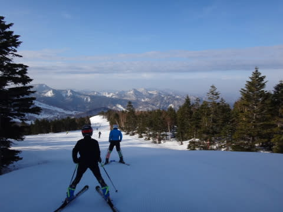
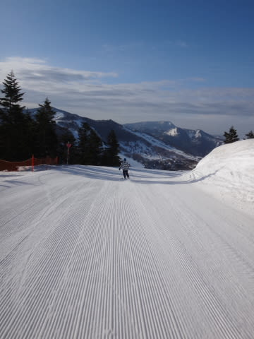
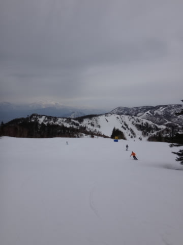
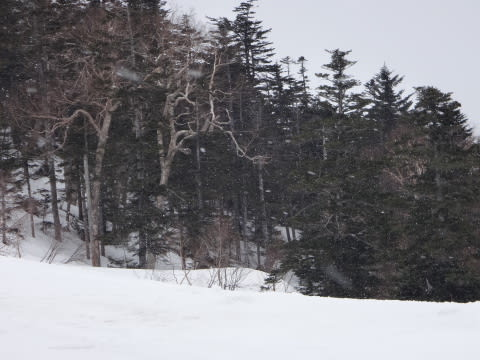
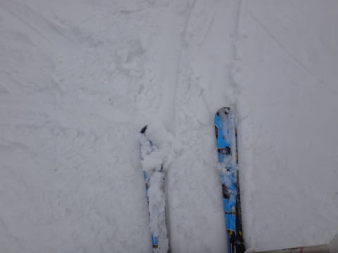

# 4月19日の志賀高原，速報モード…晴れのち曇りのち…雨（涙）．

📅 投稿日時: 2015-04-20 00:48:30

🏷️ カテゴリ: [2015スキー滑走日記](c09ea645cfc085f86dfcd80f49599dd89.md)

ということで．

いつも通り，今日も帰宅が深夜なので…

日曜夜定番の，速報モードで…

えー．

本日．

天気予想，外しました　←外した時は控えめ表現　

…夕方までは降らずにもちそうだな～，

と，思ってたんですが．

…昼前から，降り始めました（涙）．

でも．

早朝スタート時は，もうすっきりしゃっきり晴れの，

絶好の早朝スキー日和！

いやー！最高の天気だねっ！

…って感じで，

もう，早朝営業中は，よもや今日天気が崩れるとは

とても信じられない最高天気．

…そして，バーン状況は．

かなり締まり気味でガンガンスピードが出せる，

快楽シマシマバーンっ！！！！

いやー！

シアワセっ！！！

…と，最高の早朝スキーを楽しんだわけですが．

…なぜか，午前10時ごろには完全に曇りはじめ…

…あれれ？えらく早く曇り出したなぁ…

と，思っていたところ．

なんと．11時前には．

なに？

雪？？？

ちらちらと，雪が降りはじめ…

…そして．

12時前には．

バラバラと，雨になっちゃいました…（涙）

雪も，水を吸った重い雪に…．

そのあと，夕方まで，雨は降ったりやんだり（悲）．

ザーザーぶりにならなかったとはいえ．

ウェアはぐっしょりしっとりするほどの降りっぷり（落涙）．

ってことで．

朝からは想像もつかない大どんでん返し的な天気となった，

今日一日だったのでした…

また，詳細レポートは明日！

## 💬 コメント一覧

### 💬 コメント by (はなげ親分)
**タイトル**: け、携帯が！
**投稿日**: 2015-04-20 18:37:56

マナーモードになっていて、目が覚めたのが6:30でした(涙)

仕方なく悔し紛れに、通常営業をリフトスタートからストップまで、カッパを着てトイレのみで白樺コース専門にで滑りました。

リフトストップ間際は、かなり雨足来てましたよね。

来週は、遅刻しないぞ～!!

### 💬 コメント by (Goku)
**タイトル**: Unknown
**投稿日**: 2015-04-20 22:31:52

昨日はご挨拶だけでしたけど

早朝サイコーでしたね♪

来週も冷え冷えな志賀高原だと良いですね

### 💬 コメント by (Skier_S)
**タイトル**: 早朝は良かったですよ～
**投稿日**: 2015-04-21 00:58:33

＞はなげ親分さま

あららららら．

それは残念でした…

というか，起きたらショックだったでしょうね（＾＾；

さらに，午後の天気が崩れたからなおさらでしょうか…

来週も，冷え冷えバーンだといいですね！

＞Gokuさま

いやーーー．

やっぱり早朝，良かったですね～．

トップシーズンの朝イチもいいけど，

固くてスピードが出る分，この時期の

早朝もトップシーズン朝イチに負けない

気持ちよさがありますね～．

来週も冷え冷え晴天だといいなぁ…

＃今のままの予報だと，冷えなさそう（涙）．

