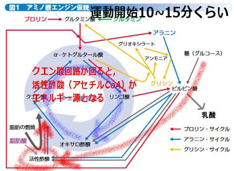

# なぜ登山でVAAMを試してみようと思ったのか？その3…VAAMが効く理由を詳しく説明してみる

📅 投稿日時: 2022-09-05 01:07:34

えー．

今日は，夜10時ごろに某所出張から帰宅

したのですが…

寝るまでちょっと時間があるので，久しぶりに

長めの記事を投稿！

今日も朝早くに家を出たし，明日も朝早いのに…

帰りの新幹線で少し寝ることができからちょっと元気

皆さん待ちに待った，VAAMのお話の

続きです！！←いや…待ってる人いるの？？

かなりレアな一部の人しかついてきてないと思うぞ…

ってなことで．

[前回](e57f7e152440954d9758a907381a39e42.md)は，VAAM発見の経緯について，

RIKEN NEWSの記事を基に簡単に

説明しましたが…

これから，かなりマニアックな

「なんでVAAMが効くのか？」

というところを．

素人なりに簡単に説明してみようと思って

ます…！

まず，最初に．

基本となるこの図．

（[RIKEN NEWS No.293 (Nov. 2005)　11月 「スズメバチに学んだスポーツ飲料VAAM」](https://www.riken.jp/medialibrary/riken/pr/publications/news/2005/rn200511.pdf)より引用）

まずはこの図を簡単に説明できるよう，

頑張ってみましょう…

生物の体では，エネルギー生成や

エネルギー運搬，不要物の排出などに，

アミノ酸が巧みに使われているのですが．

この図は，そのアミノ酸サイクルを

すごいシンプルに，上手く表しています．

体内で多数あるアミノ酸の代謝サイクルの中で，

クエン酸回路（TCAサイクル）と，

それを取り巻く

アラニンサイクル，

そして糖・脂肪の分解経路を上手く一枚の図に

まとめてます．

とりあえず．

この図の中心にあるクエン酸回路（TCAサイクル）

が最も重要なんですが．

このクエン酸回路ってのは，

ミトコンドリアの中で

αケトグルタル酸→リンゴ酸→オキサロ酢酸→クエン酸→αケトグルタル酸…

と，アミノ酸の炭素骨格がグルグル化学変化を繰り返させて，

活性酢酸（アセチルCoA…エネルギー源）を酸化，分解して，

二酸化炭素を出しながら，

酸素を使ってエネルギー源(ATP)を生成する

ために必要なものを作り出す，

という大事な役割を果たしてます．

…つまり，クエン酸回路ってのは酸素呼吸による代謝…

「有酸素でのエネルギー生成」

の中核をなす，大事な回路なんです！！

ちなみに．

運動を始めた直後で，クエン酸回路がまだ

本格的に動いてない間は，

糖→ピルビン酸→乳酸の無酸素経路で

エネルギーを作り出すしかなくて．

脂肪はエネルギーに変えられず，

乳酸が溜まっていきます…

これが，無酸素運動です．

（クエン酸回路が十分動いてないと，無酸素経路でエネルギー生成するしかない）

そして．

運動がしばらく続くと，糖分解が進み．

糖→ピルビン酸→オキサロ酢酸のルートで

クエン酸回路に原料が投入され，

クエン酸回路が回り出します！

（Sparking効果）

5~10分程度の運動を続けると

クエン酸回路が十分始動し，

糖→ピルビン酸→活性酢酸（アセチルCoA）→クエン酸回路

で有酸素での代謝が始まり，

無酸素の乳酸生成経路は抑えられます．

クエン酸回路が動き出すと，活性酢酸

（アセチルCoA）がエネルギー源として

使えるようになり．

また，実は活性酢酸は脂肪からも作れるので，

クエン酸回路が動き出すと糖分解より

脂肪からの活性酢酸供給がメインに

なっていきます！

…という経緯を経るので．

脂肪を消費するには，その前に糖が

分解されて，クエン酸回路が始動して

いないといけない…

という図なんです．

ってな感じで．

この図をさらに見ると．

アラニンは，糖を分解するより手軽に

ピルビン酸が作れるので，

（糖からピルビン酸を生成するにはすごい複雑な反応がいるが，

　アラニンからならアミノ基を抜くだけでピルビン酸になる）

アラニンをつっこめば手っ取り早く

アラニン→ピルビン酸→オキサロ酢酸と

いうルートでオキサロ酢酸が作れ，

クエン酸回路をより早く

始動できそうに見えるし．

後は，アラニン→ピルビン酸の変換に

グリオキシラートとの相互作用が

必要なので．

グリシンを投入すれば，

グリシン⇔グリオキシラートが

グルグル回ってアラニンが効率よく

ピルビン酸になってくれるので

（以上の図は，[RIKEN NEWS No.293 (Nov. 2005)　11月 「スズメバチに学んだスポーツ飲料VAAM」](https://www.riken.jp/medialibrary/riken/pr/publications/news/2005/rn200511.pdf)より引用，一部加工）

アラニンやグリシンなどにより，

クエン酸回路を

効率よく始動させられる

という図に見えますね…

これは．

…ところが．

実態はそれほど簡単じゃないのだ…

おそらく．

普通の解説記事なら，この図を出して

「だから，通常ならしばらく運動を続けて糖を

燃やさないと脂肪が燃焼しないけど．

VAAMはクエン酸回路を効率よく

立ち上げるので，運動の最初から

脂肪燃焼させられるんです！」

とか書いて．

「素人向けには，このレベルの

　説明で勘弁しておいてやるか…」

となるのですが．

このBlogはそんなに甘くないのだ

（[続く](e26fa556a58d7c9a042bfa6398d94baa7.md)．一体ここからどう発展するのか？…しかし，濃い．濃すぎる…）

## 💬 コメント一覧

### 💬 コメント by (スシネコ)
**タイトル**: Unknown
**投稿日**: 2022-09-05 14:44:18

えっ、よく巷で言われているように、「運動後20分ぐらいしないと脂肪が燃焼しないよ。脂肪を燃やすためには着火が必要だから糖分も必要なんだよ。」の補完としてVAAM回路が役に立っているのかと思っていましたが、そんな簡単な話じゃないようですね。回路の中にも複雑な相関関係がある様子。

すでに理解の限界を超えて脱落してしまいましたが、どこまで読者を落とし込むのか、別の興味が湧いてきましたｗ

### 💬 コメント by (かず)
**タイトル**: Unknown
**投稿日**: 2022-09-05 15:13:47

なんですかこれ！  すごいブログになってますね笑 ヨコハマ何年周期ですか  山が先に無くなるのかな？ シーズン券情報遅いですね 値上げ確実でしょうけど…

### 💬 コメント by (副院長)
**タイトル**: Unknown
**投稿日**: 2022-09-05 17:28:11

解説楽しみにしています。

そして、結論は１ゴンぐるぐる回路になるのでしょうね。

### 💬 コメント by (アリス)
**タイトル**: 驚きブログ
**投稿日**: 2022-09-05 20:44:47

S様

ご無沙汰しております。

猛暑続きでしばらく雪の事を忘れておりました。

Sさんこういった解説するんですね♪

驚きました。

私は専門がケミストですが、人間の体内の臓器の動きはすべて化学反応と分解によるものです。

### 💬 コメント by (Skier_S)
**タイトル**: やはり読者を振り切ってしまったか…
**投稿日**: 2022-09-06 04:49:30

＞スシネコさま

だいたいその理論は正しいんですが，どうも人体では，単にスズメバチのアミノ酸が直接

クエン酸回路を加速しているわけではないみたいなんです…

いや，次回はもう少し分かりやすくなるよう頑張ってみます

＞かずさま

すごいBlogになっちゃいました…

ヨコハマタイヤ，私のようにスキーシーズンで2万km以上走ると2シーズン．

コロナで1.5万km程度しか走らなくなると3シーズンです．

5万kmくらいはもちます！

シーズン券，ヤケオク券の値段は出ているのですが値上がり方向ですね…

＞副院長さま

今回の記事はちょっと面白くなかったですね（涙）

そして，私にはVAAMは1ゴングルグル回路になりそうですね（笑）

＞アリスさま

あ，こっちが専門関係に近かったですか…

私は全くの専門外ですが，改めて勉強して，生体の化学反応のすごさに

感動しています…

