# 10月26日のイエティは…晴れのち曇りのち雨（涙）

📅 投稿日時: 2014-10-28 00:25:47

🏷️ カテゴリ: [2015スキー滑走日記](c09ea645cfc085f86dfcd80f49599dd89.md)

えー．

昨日速報しましたように．

日曜に日帰りで，Yetiに行ってきたわけですが．

その，詳細レポートをば…

えー．

まず．今回．

いろいろ大人の理由で．

ゲレンデに到着したのは，

オープン1時間半後の9時半（涙）．

で．

駐車場に入る前．

係員に車を止められて．

「？？？なんじゃいな？」

と，思ったら．

「水のポンプが止まっていて，タンクに溜まった

　水でしのいでるので，トイレが一部しか使えず，

　レストランも限定営業です．

　タンクの水が空っぽになったら，営業途中で

　終了するかもしれません…」

と，やってきた人にお知らせしていたのでした．

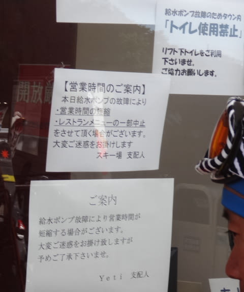

うむ．

しかし．

ここまで来て，

「んじゃ，帰ります」

…ってわけにいかんでしょ．．．

と，何のためらいもなくゲレンデへ，Go!

＃10時ごろにはポンプも直り，

＃トイレも普通に使えるようになりました

いやー．

天気も良く．

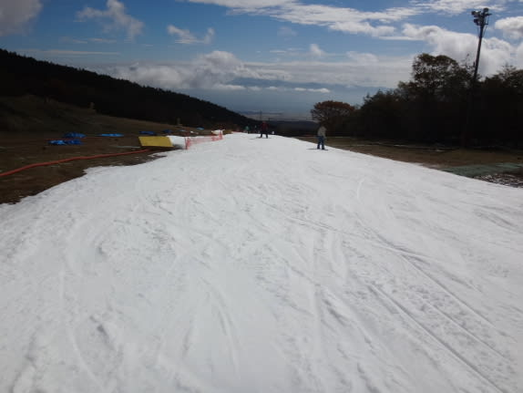

秋晴れのゲレンデだなっ！！

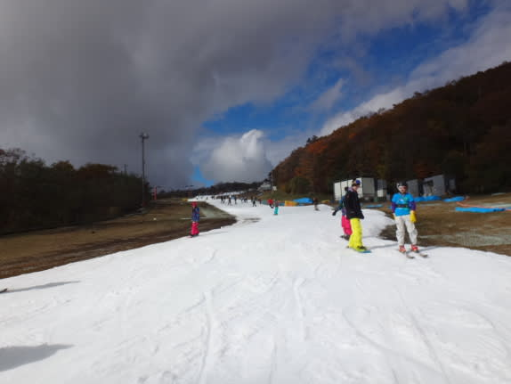

…でも．

8時のゲレンデオープンから，すでに1時間半

経っているわけで．

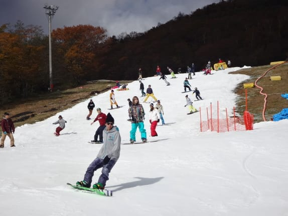

あー．

やっぱり，もう混んでますね…（ちょっと涙）．

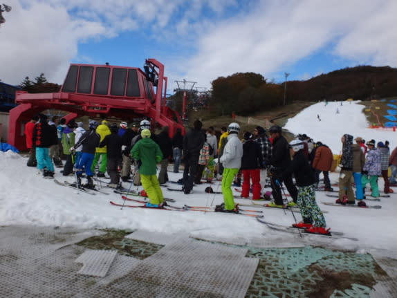

もう，リフトもこんなに待ってます…（かなりの涙）

でも，

10時前には，クワッドと並行する，青いほうの

ペアリフトが運行開始！

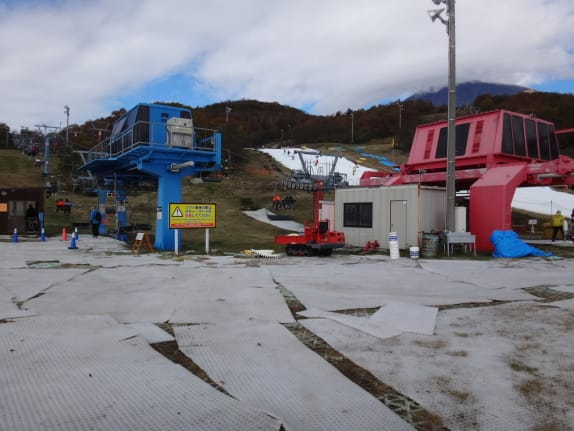

ペアリフトは，乗り降りにスキーを脱いで，

結構歩かなくてはならないものの．

終日待ち0で快適！

クワッド側も，並行するペアが動き出したので，

昼前まではこの程度の待ち時間．

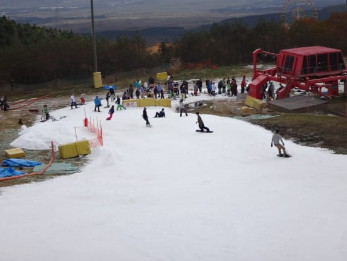

うむ．

リフト待ち自体は，減った．

リフト待ちは，そこそこまともになった．

…でも．

クワッドに加え，ペアの輸送力が

追加されてしまった分，コース上の人は

増加するわけで．

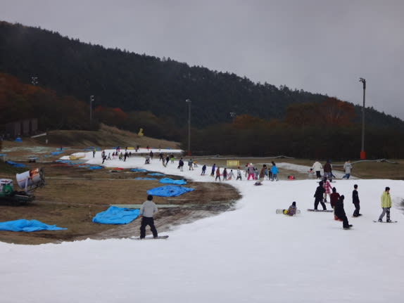

あうーん．

すごい人口密度になっちゃったよ…（悲）．

そして．

なんだか，昼に向かって，雲が多くなってきましたね…

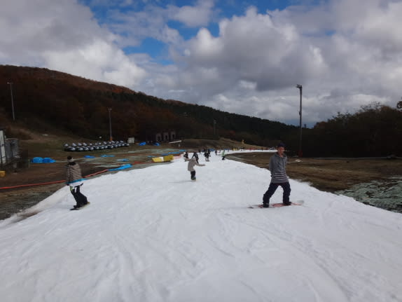

気温は15度近く，ウエアのジャケットを着るほどは

無かったのですが．

で．

午後の方が人が多くなるという，このスキー場．

午後1時ごろには…

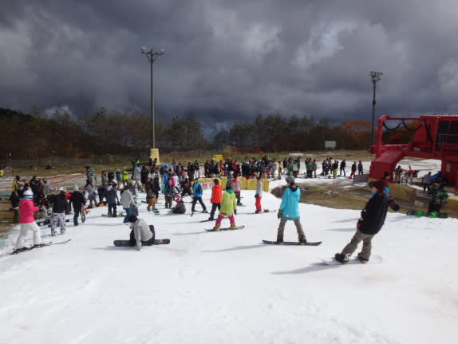

あらら．

リフトの列が，ここまで行っちゃったよ…

…でも．

ペアリフトはこの程度なので．

まだ許せる範囲ですが…

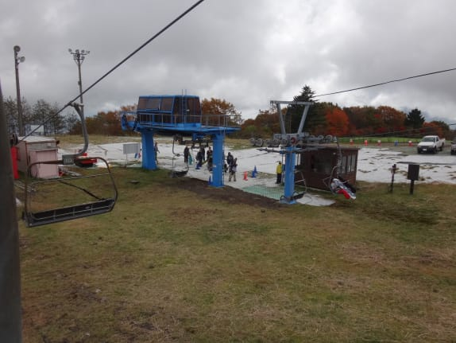

…で．

人が多くて，気温がちょっと高めで．

さらに，ポンプ故障の影響か，新しい雪を

ばらまいてなかったので．

午後には，リフト乗り場手前の30mほどの区間だけ，

一部雪が薄くなってきたところが…

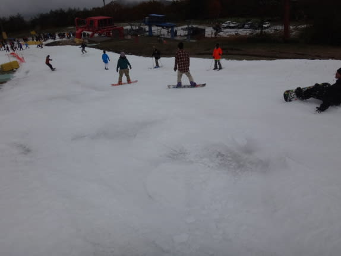

係員が一生懸命雪を入れて，状況改善に

努めていたのですが．

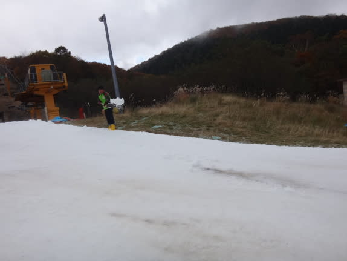

…なのに．

追い打ちをかけるように．

午後2時ごろには…

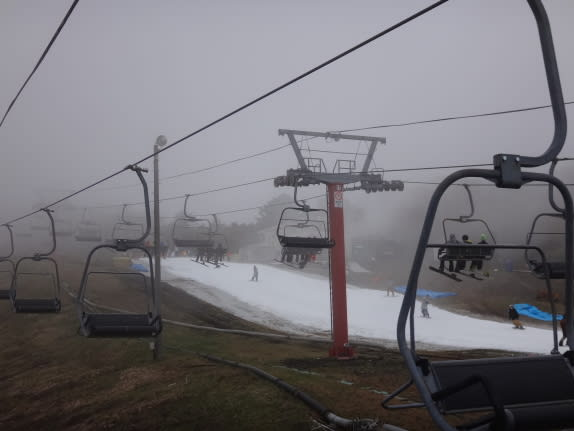

え？

なんか，コースの上に，ガスが出てきたのですが？？

そして，2時半には．

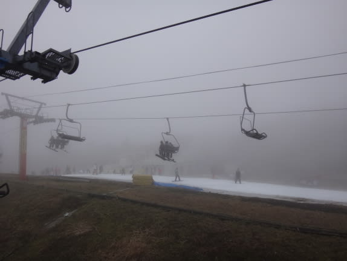

…雨がぽつぽつ

降りだしてきたのですが！！！

えええ～っ！！

朝はあんなに晴れていたのに…

なんだか，[雨が降るかもって予想](e560150c22d7c11189e9ebec837303b31.md)はしてたけど．

こーゆー予想は当たらなくてもいいのに…（泣）．

もともと，この日は早めに切り上げて帰らねばならぬ

理由があったので．

雨が降ってきたこともあり，私にしては珍しく．

この日は2時半に切り上げましたが．

午後3時過ぎには，帰り道で

かなりの降りになってました…

3時から3時半ごろは，ゲレンデもかなり降って

雪も悪化しちゃったんじゃないかな～？？？

ってことで．

朝は晴天，夕方雨降りのイエティでしたが．

…先週と比べ，結構混みだしてきましたね．

うーむ．そろそろ，人がいないゲレンデを

かっ飛ばして来たくなったな～．

…この時期，滑れるだけでもありがたいんですけどね…
